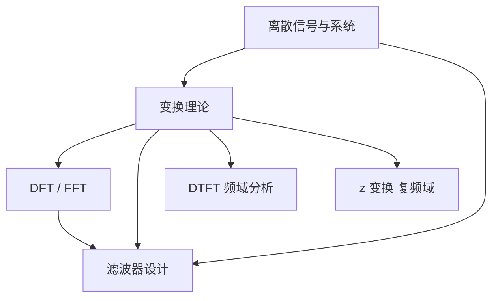

# 数字信号处理

> 教科书级系统笔记，完整覆盖数字信号处理课程知识体系。基于 [[1-笔记规范/数字信号处理-笔记规范|数字信号处理-笔记规范]] 整理。

## 课程信息

- **教材**：《数字信号处理》（第四版），高希全、丁玉美，西安电子科技大学出版社
- **参考书**：《数字信号处理》（第五版），陈佩青，清华大学出版社
- **总学时**：48 学时

## 知识体系

本课程以**三类变换**为核心骨架，以**滤波器设计**为应用落脚点：

1. **离散信号与系统**（第 01–09 讲）：从连续域过渡到离散域，建立序列、卷积、差分方程等基本概念。
2. **变换理论**（第 10–21 讲）：DTFT → z 变换，从频域到复频域的完整分析工具链。
3. **DFT 与 FFT**（第 22–30 讲）：将理论变换落地为可数值计算的算法。
4. **滤波器设计**（第 31–44 讲）：系统实现结构 → IIR 设计 → FIR 设计。

## 目录

### 第一章　离散信号与系统

| 讲次 | 标题 | 核心内容 |
|------|------|----------|
| [[第01讲 绪论\|第01讲]] | 绪论 | 数字信号定义、三大来源、课程全景 |
| [[第02讲 序列的表示\|第02讲]] | 序列的表示 | 三种表示法、$\delta(n)$、$u(n)$、$R_N(n)$ |
| [[第03讲 常用典型序列及基本运算\|第03讲]] | 常用典型序列及基本运算 | 六种序列、周期判定、五种基本运算 |
| [[第04讲 序列卷积和\|第04讲]] | 序列卷积和 | 卷积定义、图解/公式/对位相乘三法 |
| [[第05讲 系统的分类\|第05讲]] | 系统的分类 | 线性/非线性、时不变/时变判据 |
| [[第06讲 线性时不变系统与卷积和\|第06讲]] | 线性时不变系统与卷积和 | $y(n)=x(n)*h(n)$、级联/并联 |
| [[第07讲 系统的因果性和稳定性\|第07讲]] | 系统的因果性和稳定性 | 因果性充要条件、BIBO 稳定性 |
| [[第08讲 离散LTI系统的数学模型——差分方程\|第08讲]] | 差分方程 | N 阶线性常系数差分方程、递推法 |
| [[第09讲 模拟信号数字化——采样的数学过程\|第09讲]] | 模拟信号数字化 | 理想采样、奈奎斯特定理、信号恢复 |

### 第二章　变换理论

| 讲次 | 标题 | 核心内容 |
|------|------|----------|
| [[第10讲 序列傅里叶变换\|第10讲]] | 序列傅里叶变换（DTFT） | DTFT 定义、基本性质 |
| [[第11讲 傅里叶变换的性质——对称性\|第11讲]] | 傅里叶变换的性质——对称性 | 共轭对称/反对称分解、实序列频谱规律 |
| [[第12讲 z变换的定义\|第12讲]] | z 变换的定义 | 双边 z 变换、等比级数求和法 |
| [[第13讲 z变换的收敛域\|第13讲]] | z 变换的收敛域 | 时域支撑类型 ↔ ROC 几何形态 |
| [[第14讲 z变换解差分方程\|第14讲]] | z 变换解差分方程 | 单边 z 变换时移性质、系统函数 $H(z)$ |
| [[第15讲 z变换的性质\|第15讲]] | z 变换的性质 | 九条基本性质、移位/卷积/初值终值定理 |
| [[第16讲 z反变换（一）—— 观察法\|第16讲]] | z 反变换（一）观察法 | 已知变换对 + 性质逐项识别 |
| [[第17讲 z反变换（二）——留数法\|第17讲]] | z 反变换（二）留数法 | 留数定理、围线积分 |
| [[第18讲 Z反变换（3）——部分分式展开法\|第18讲]] | z 反变换（三）部分分式展开法 | 留 z → 展开 → 还原三步流程 |
| [[第19讲 系统函数的极点分布与系统因果稳定性\|第19讲]] | 极零点与因果稳定性 | ROC 含单位圆 ⇔ 系统稳定 |
| [[第20讲 z变换与系统频响分析\|第20讲]] | z 变换与系统频响 | $H(e^{j\omega}) = H(z)\|_{z=e^{j\omega}}$ |
| [[第21讲 频响特性的几何确定法\|第21讲]] | 频响特性的几何确定法 | 零极点几何位置 → 幅频/相频曲线 |

### 第三章　离散傅里叶变换

| 讲次 | 标题 | 核心内容 |
|------|------|----------|
| [[第22讲 离散傅里叶变换的定义\|第22讲]] | DFT 的定义 | 四类傅里叶变换对偶、$W_N$ 旋转因子 |
| [[第23讲 周期延拓与主值序列\|第23讲]] | 周期延拓与主值序列 | 三种延拓情况、模运算 |
| [[第24讲 周期序列的傅里叶级数及旋转因子计算技巧\|第24讲]] | DFS 与旋转因子 | DFS 展开、$W_N$ 几何计算技巧 |
| [[第25讲 离散傅里叶变换的线性特性与循环移位特性\|第25讲]] | DFT 线性与循环移位 | 变换区间统一、时频域对偶移位 |
| [[第26讲 循环卷积定理\|第26讲]] | 循环卷积 | 循环卷积矩阵法、与线性卷积关系 |
| [[第27讲 复共轭的DFT和DFT的共轭对称性\|第27讲]] | DFT 共轭对称性 | 实序列 DFT 计算量减半 |
| [[第28讲 频率域采样定理\|第28讲]] | 频率域采样定理 | $N \geq M$ 无失真恢复条件 |

### 第四章　快速傅里叶变换

| 讲次 | 标题 | 核心内容 |
|------|------|----------|
| [[第29讲 时域抽取基2FFT算法原理及运算流图\|第29讲]] | 时域抽取基-2 FFT | 蝶形运算、倒序、$O(N\log N)$ |
| [[第30讲 频域抽取的基2-FFT算法原理及运算流图\|第30讲]] | 频域抽取基-2 FFT | DIF 蝶形、与 DIT 全面对比 |

### 第五章　离散时间系统实现

| 讲次 | 标题 | 核心内容 |
|------|------|----------|
| [[第31讲 离散时间系统的模拟及基本原理\|第31讲]] | 系统模拟原理 | 框图 ↔ 差分方程 ↔ $H(z)$ 等价转换 |
| [[第32讲 系统框图及其结构形式\|第32讲]] | 系统框图结构 | 直接型、级联型、并联型 |
| [[第33讲 信号流图\|第33讲]] | 信号流图 | 梅森公式、自环消除、流图化简 |

### 第六章　IIR 数字滤波器设计

| 讲次 | 标题 | 核心内容 |
|------|------|----------|
| [[第34讲 巴特沃斯模拟低通滤波器设计\|第34讲]] | 巴特沃斯模拟低通 | 归一化设计表、四步设计流程 |
| [[第35讲 数字滤波器及原理\|第35讲]] | 数字滤波器原理 | $\omega = \Omega T_s$、频率归一化 |
| [[第36讲 脉冲响应不变法设计IIR数字滤波器\|第36讲]] | 脉冲响应不变法 | $z = e^{sT}$ 极点映射 |
| [[第37讲 双线性变换法设计IIR滤波器\|第37讲]] | 双线性变换法 | 非线性压缩、频率预畸变 |
| [[第38讲 频率变换法设计高通滤波器\|第38讲]] | 频率变换法——高通 | 归一化参数交换 |
| [[第39讲 频率变换法设计带通滤波器\|第39讲]] | 频率变换法——带通 | 二阶频率变换、几何对称 |
| [[第40讲 IIR滤波器的基本网络结构\|第40讲]] | IIR 网络结构 | 直接型、典范型、级联型、并联型 |

### 第七章　FIR 数字滤波器设计

| 讲次 | 标题 | 核心内容 |
|------|------|----------|
| [[第41讲 FIR滤波器的基本原理\|第41讲]] | FIR 基本原理 | 数学模型、零极点分布、稳定性 |
| [[第42讲 FIR滤波器的频响特性与分类\|第42讲]] | FIR 频响特性 | 偶对称/奇对称、线性相位条件 |
| [[第43讲 窗函数法设计FIR滤波器\|第43讲]] | 窗函数法 | 理想原型截断、六种窗函数、吉布斯效应 |
| [[第44讲 频率采样法设计FIR滤波器\|第44讲]] | 频率采样法 | 频域采样 → IDFT → $h(n)$ |

## 三大变换对比

三种变换的关系是贯穿全课程的核心线索。DTFT 是 z 变换在单位圆上的特例；DFT 是 DTFT 在单位圆上等间隔采样的结果。

| 维度 | DTFT | z 变换 | DFT |
|------|------|--------|-----|
| 变换符号 | $X(e^{j\omega})$ | $X(z)$ | $X(k)$ |
| 定义域 | 单位圆 $\|z\|=1$ | 复平面 | 单位圆上 $N$ 点等间隔采样 |
| 自变量 | $\omega$（连续，周期 $2\pi$） | $z$（连续复变量） | $k$（离散整数，$0 \sim N-1$） |
| 收敛要求 | 序列绝对可和 | ROC 存在 | 有限长序列自动收敛 |
| 适用序列 | 绝对可和序列 | 更广泛的序列 | 有限长序列 |
| 逆变换 | 积分 | 围线积分 / 部分分式 / 幂级数 | IDFT 公式 |
| 主要用途 | 理论频域分析 | 系统分析、解差分方程 | 数值计算、频谱分析 |
