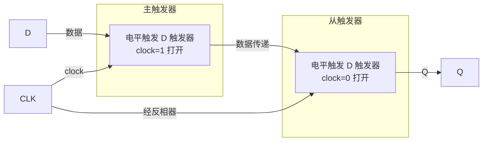

---
tags:
  - 数字电子技术基础
  - 课程笔记
  - 触发器
---

# 电平触发与主从触发器

> [!abstract] 本讲定位
> 在基本 SR 锁存器的基础上引入时钟控制，构成电平触发的 SR 和 D 触发器。分析电平触发的局限性——有效电平期间数据可多次变化——进而引出主从结构的脉冲触发方式，使输出仅在时钟跳变沿变化。

## 时钟控制的 SR 触发器

基本 SR 锁存器利用正反馈实现了数据存储，但缺少控制写入时机的机制——输入端的任何变化都会直接影响存储内容。在数字系统中，组合电路的输出需要时间才能稳定，必须避免不稳定的数据被存入存储器。

为此，在基本 SR 锁存器的输入端各增加一个受 **时钟信号 clock** 控制的与非门，构成电平触发的 SR 触发器：

- **clock = 1**：两个与非门打开，S 和 R 信号可经门传递至后级锁存器，影响输出 Q
- **clock = 0**：两个与非门输出被固定为 1，后级锁存器处于保持态，外部数据被屏蔽

时钟信号是**触发信号**而非数据信号——它决定何时允许写入，而写入什么值仍由 S 和 R 决定。

> [!note] 门电路的屏蔽原理
> 与非门具有一个核心特性：只要有一个输入端能确定逻辑值，其余端的变化就不会影响输出。clock = 0 将与非门的一个输入固定为 0，强制输出为 1，从而屏蔽 S、R 端的任何干扰。clock = 1 时该输入端为 1，门的输出由 S、R 决定，数据通道打开。这一特性使门电路对输入干扰具有一定的容差能力。

### 状态表

时钟控制 SR 触发器的行为用状态表描述。与真值表的关键区别在于：Q 同时出现在输入端和输出端——输入端的 Q 为现态 $Q^n$，输出端的 Q 为次态 $Q^{n+1}$。

| clock | S | R | $Q^n$ | $Q^{n+1}$ | 功能 |
|:-----:|:-:|:-:|:-----:|:---------:|:----:|
| 0 | × | × | 0 | 0 | 保持 |
| 0 | × | × | 1 | 1 | 保持 |
| 1 | 0 | 0 | 0 | 0 | 保持 |
| 1 | 0 | 0 | 1 | 1 | 保持 |
| 1 | 0 | 1 | × | 0 | 置零 |
| 1 | 1 | 0 | × | 1 | 置一 |
| 1 | 1 | 1 | × | 不定 | 禁止 |

clock = 0 时，触发器保持原有状态不变；clock = 1 时，S 和 R 的组合决定次态。电平触发的 SR 触发器在逻辑功能上与基本 SR 锁存器完全相同——引入时钟不改变功能，只改变**动作时刻**。

### 约束条件

SR 触发器要求 S 和 R 不能同时为 1。当 S = R = 1 时，Q 和 $\overline{Q}$ 同为零（或同为一，取决于具体实现），违反互补关系。

> [!warning] clock 使约束条件更易触发
> 引入 clock 后约束条件不仅未解除，反而更容易触发。即使 S 和 R 并非同时有效，clock 从 1 跳回 0 时会**同时关闭**两个与非门的通道，效果等同于 S 和 R 同时撤除。只要 S = R = 1 的状态曾在 clock = 1 期间出现过，clock 下降沿就会出现不定态。

### 电路符号与信号标注

在电路符号中，时钟控制 SR 触发器的各端按以下规则标注：

- **C1**：时钟端，数字 1 为关联编号
- **1S**、**1R**：与 C1 配合的同步数据端，前缀 1 表示受 C1 控制
- 异步端不带关联编号，独立标注，表示不受 clock 控制

若时钟端加有圆圈，表示低电平有效——此时内部用或门控制，clock = 0 时打开数据通道。无圆圈则表示高电平有效。

## 同步信号与异步信号

触发器中的信号按与时钟的关系分为两类：

| 类型 | 定义 | 特点 | 示例 |
|:----:|------|------|------|
| **同步信号** | 受 clock 控制，仅在 clock 有效时才能影响输出 | 按节拍配合动作 | S、R（标为 1S、1R，与 C1 配合） |
| **异步信号** | 不受 clock 控制，直接操作触发器 | 优先级高于同步信号 | 异步置一 $S_D$、异步置零 $R_D$ |

异步信号的优先级高于同步信号——只要异步置一或置零有效，无论 clock 处于什么状态，Q 都会被直接改写。但异步置一和置零之间仍存在约束条件，不宜同时有效。

## 电平触发的 D 触发器

### 电路改进

SR 触发器的约束条件根源在于 S 和 R 可以同时为 1。观察功能表可知，写 1 时 R 应为 0，写 0 时 S 应为 0——S 和 R 天然应互为反相。因此，在时钟控制 SR 结构的基础上加入一个反相器，将 S 和 R 合并为单一数据端 **D**：

- **D = 1**：内部生成 S = 1、R = 0，写入 1
- **D = 0**：内部生成 S = 0、R = 1，写入 0

D 触发器的功能表：

| clock | D | $Q^{n+1}$ |
|:-----:|:-:|:---------:|
| 0 | × | $Q^n$（保持） |
| 1 | 0 | 0 |
| 1 | 1 | 1 |

### 收益与代价

| 收益 | 代价 |
|------|------|
| 约束条件彻底解除，输出始终确定 | 失去电平期间的保持功能——clock = 1 期间 Q 必须跟随 D 变化，无法原地保持 |
| 电路结构简单直观，只需一个反相器 | 增加一个反相器，占用芯片面积 |

D 触发器在 clock 有效期间不具备保持能力：若要维持原值，只能让 clock 无效，或通过外部电路将原值重新送入 D 端。

### 基于数据选择器的实现

D 触发器还有另一种等价的实现方式——用**二选一数据选择器**加反馈线构成：

- **G = 0**：选择器将当前 Q 值送回 D 端，构成自保持
- **G = 1**：选择器将外部数据 D 送入，写入新值

这一设计从功能上与前述 D 触发器完全一致，核心同样在于反馈线使电路具备了存储能力。按电路符号标注规则，该器件的时钟端标为 **G1**，数据端标为 **1D**。

### 时序分析

clock 有效期间（以高电平有效为例），数据通道打开，Q 在经历传输延迟 $t_{PD}$ 后跟随 D 变化。若 D 在 clock 有效期间跳变，该变化经 $t_{PD}$ 后同样反映到 Q。

clock 无效期间，Q 保持 clock 变为无效前一时刻的最后数据。

> [!important] 电平触发的动作特点
> - clock 有效期间，输入 S、R 或 D 的变化会直接反映到输出 Q
> - clock 无效期间，Q 保持 clock 有效最后时刻的值
> - 分析工作波形时，只需关注 clock 有效的那段时间；clock 无效期间均为保持段

### 时钟极性

时钟的有效电平取决于内部电路结构：

| 门类型 | 有效电平 | 符号标记 |
|--------|:------:|:------:|
| 与非门 | 高电平（clock = 1） | 无圈 |
| 或非门 | 低电平（clock = 0） | 加圈 |

符号中时钟端加圈表示低电平有效，此时分析波形只需关注 clock = 0 的时段，其余规则不变。

## 电平触发的问题

电平触发的根本缺陷在于：clock 有效期间，输入的变化会**持续**影响输出。如果输入信号在 clock 有效期间发生多次跳变，Q 也会随之多次翻转，导致 clock 结束后存储的值不可预测。

> [!example] D 触发器控制灯翻转
> 用一个电平触发的 D 触发器和一个反相器实现按钮控制灯翻转：Q 经反相后接回 D 端，按钮产生的脉冲作为 clock。按下按钮时 clock = 1，松开后 clock = 0。分析该电路是否存在问题。
>
> **解：** 按钮是机械开关，按下时间远大于门电路的传输延迟。clock = 1 期间，反馈回路持续工作——Q 经反相器送回 D 端，写入后使 Q 翻转，翻转后的 Q 再经反相器送回，再次写入再次翻转，形成持续振荡。松开按钮时 Q 的状态取决于振荡被中断的瞬间，完全不可预测。
>
> 根源在于 clock 的有效电平由按钮按压时间决定，这一时间不可控，而电平触发特性使得 clock 有效期间的任何输入变化都会逐次反映到输出。

## 主从触发器（脉冲触发）

### 结构原理

将两个电平触发的触发器串联，前后使用**相反的触发电平**：

1. **主触发器**：前级，与 clock 相同的电平触发
2. **从触发器**：后级，与 clock 相反的电平触发，通过反相器实现

### 工作过程

1. **clock = 1**：主触发器打开，从触发器关闭。主触发器接收输入数据并存储，Q 不变
2. **clock 从 1 → 0**：主触发器关闭，从触发器打开。数据从主触发器传递到从触发器，Q 更新
3. **clock = 0**：从触发器保持，主触发器被封锁。输入变化无法进入

核心机制：**任意时刻总有一个触发器是关闭的**。主触发器打开时从触发器关闭，Q 不受主触发器变化影响；从触发器打开时主触发器关闭，数据来源被锁死，从触发器只能传出一个固定数据。因此从触发器虽然处于电平触发状态，数据却不会反复变化。

### 动作特点

- Q 仅在 clock 的**跳变沿**发生变化
- 变化时刻略滞后于时钟沿，需经过从触发器的传输延迟 $t_{PD}$
- 变化发生在哪个沿取决于电平分配：

| 主触发器电平 | 从触发器电平 | Q 变化时刻 |
|:----------:|:----------:|:--------:|
| 高电平有效 | 低电平有效 | **下降沿** |
| 低电平有效 | 高电平有效 | **上升沿** |

### 主从 RS 触发器

主从结构不限于 D 触发器，同样适用于 RS 触发器。将一个电平触发的 RS 触发器作为主触发器，另一个作为从触发器，在从触发器前加反相器使二者触发电平相反，即构成主从 RS 触发器。

> [!note] 功能不变，动作时刻改变
> 主从 RS 触发器的 S、R 与 Q、$\overline{Q}$ 之间的逻辑关系与电平触发 RS 触发器**完全相同**——主从结构不改变功能表，只改变动作时刻。输出仅在 clock 边沿发生变化，而非整个电平期间。

## 本讲小结

### 电平触发与主从触发

| 对比维度 | 电平触发 | 主从触发（脉冲触发） |
|---------|---------|-----------------|
| 写入时机 | clock 有效电平期间持续可写 | clock 跳变沿写入一次 |
| 核心问题 | 有效电平期间输入变化会导致输出多次翻转 | 利用两级串联和相反极性，杜绝电平振荡 |
| 实现方式 | 基本锁存器前端加时钟控制门 | 两个电平触发器串联，时钟相位相反 |
| 对外表现 | 输出跟随输入 | 输出仅在边沿变化 |

### 触发器类型

| 类型 | 功能 | 约束 |
|------|------|------|
| SR | 置零、置一、保持 | S 和 R 不能同时有效 |
| D | clock 有效时 $Q^{n+1} = D$ | 无，约束条件被电路结构彻底解除 |

### 其他知识点

| 知识点 | 要点 |
|--------|------|
| 同步与异步 | 同步信号受 clock 控制，按节拍动作 异步信号直接操作触发器，优先级高于同步信号 |
| D 触发器的代价 | 解除约束条件换取输出确定性 代价是 clock 有效期间失去原地保持功能 |
| 主从结构的关键 | 任意时刻总有一个触发器关闭 主打开从关闭（存数），主关闭从打开（传数），杜绝回环振荡 |
| 时钟极性 | 与非门控制 → 高电平有效，符号无圈 或非门控制 → 低电平有效，符号加圈 |
