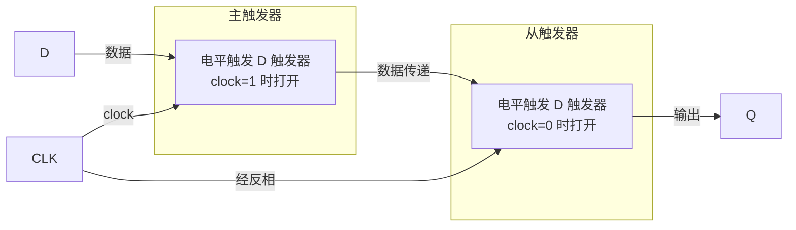

---
tags:
  - 数字电子技术基础
  - 课程笔记
  - 触发器
---

# 触发器逻辑功能的分类

> [!abstract] 本讲定位
> 在基本锁存器的基础上引入时钟控制端，进而逐步演化出门类多样的触发器结构。本讲从电平触发的 SR 和 D 触发器出发，分析其局限，引出主从结构的脉冲触发方式，完成从电平触发向边沿触发的过渡。

## 从基本锁存器到时钟控制

上节课讨论的基本锁存器依靠正反馈实现数据存储，能够稳定地保存 0 或 1。但它没有控制端——外部信号随时可以改变存储的数据，这在数字系统中是不可接受的。因为组合电路的输出需要时间稳定，我们不希望不稳定的数据被写入存储器。

为解决这一问题，需要引入一个 **load 控制端**（也称 **时钟端 clock**），仅在 load 有效时才允许数据写入，其余时间存储内容保持不变。

### 时钟控制的 SR 锁存器

在基本 SR 锁存器的两个输入端各增加一个受 clock 控制的与非门（或或非门），便构成了电平触发的 SR 触发器：

- **clock = 1**：数据通道打开，S 和 R 信号可影响输出 Q
- **clock = 0**：数据通道被屏蔽，锁存器保持当前状态

时钟信号的本质是一个**触发信号**而非数据信号——它决定"什么时候"允许数据写入，而数据本身仍由 S 和 R 决定。

> [!note] 门电路的容差特性
> 与非门（或或非门）只要有一个输入端能确定逻辑值，其他端的变化就不会影响输出。clock = 0 时将与非门的一个输入固定为 0，正是利用这一特性屏蔽外部干扰。

### 状态表

时钟控制 SR 触发器的功能可用状态表描述。状态表与真值表的区别在于：Q 同时出现在输入（现态 $Q_n$）和输出（次态 $Q_{n+1}$）中。

| clock | S | R | $Q_n$ | $Q_{n+1}$ | 功能 |
|-------|---|---|------|----------|------|
| 0 | x | x | 0 | 0 | 保持 |
| 0 | x | x | 1 | 1 | 保持 |
| 1 | 0 | 0 | 0 | 0 | 保持 |
| 1 | 0 | 0 | 1 | 1 | 保持 |
| 1 | 0 | 1 | x | 0 | 置 0 |
| 1 | 1 | 0 | x | 1 | 置 1 |
| 1 | 1 | 1 | x | 不定 | 禁止 |

### 约束条件

SR 触发器最突出的问题是 **S 和 R 不能同时为 1**。当 S = R = 1 时，Q 和 Q' 会变成相同值；而当 S 和 R 同时从 1 撤走（或 clock 从 1 回到 0 同时关闭两个通道），次态无法确定。

引入 clock 后约束条件不仅没有解除，反而更易触发——clock 撤走时会同时切断 S 和 R 的通道。

## 同步信号与异步信号

在触发器中，信号分为两类：

| 类型 | 特点 | 示例 |
|------|------|------|
| **同步信号** | 受 clock 控制，与时钟配合动作 | S、R（与 clock 配合） |
| **异步信号** | 不受 clock 控制，直接操作 | 异步置一/置零端（直接写入） |

异步信号的优先级高于同步信号，只要异步置一或置零有效，无视 clock 状态直接改变 Q。但异步置一和置零之间仍然存在约束条件，不宜同时有效。

电路符号中，clock 端标为 **C1**（或 clock1），同步数据端标为 **1S**、**1R**（数字 1 表示与 C1 配合）。异步端则不与 clock 关联，独立标注。

## 电平触发的 D 触发器

### 电路改进

SR 触发器的约束条件源于 S 和 R 可以同时为 1。观察发现，写 1 时 R 应为 0，写 0 时 S 应为 0——S 和 R 天然应互为反相。因此，在 SR 结构的基础上加入一个反相器，将 S 和 R 合并为一个数据端 **D**：

- **写 1**：D = 1 → 内部自动生成 S = 1、R = 0
- **写 0**：D = 0 → 内部自动生成 S = 0、R = 1

D 触发器的功能表：

| clock | D | $Q_{n+1}$ |
|-------|---|----------|
| 0 | x | $Q_n$（保持） |
| 1 | 0 | 0 |
| 1 | 1 | 1 |

### 代价与收益

| 收益 | 代价 |
|------|------|
| 解除约束条件，输出永远确定 | 失去"保持"功能——D 触发器在 clock 有效时只能写入，无法原地保持（除非 clock 无效或重新写入原值） |
| 电路简单直观 | 增加一个反相器（芯片面积代价） |

### 基于数据选择器的实现

D 触发器还有另一种等价的实现方式——使用 **二选一数据选择器** 加反馈线：

- **G = 0**：选择器输出当前 Q 值，构成保持
- **G = 1**：将新数据 D 写入

这一设计从功能上与前述 D 触发器完全一致，核心在于反馈线使电路具备了存储能力。

### 时序分析

在 G = 1 期间，数据通道打开，Q 跟随 D 变化（经过传输延迟 $t_{PD}$）。在 G = 0 期间，Q 保持 G 变为 0 前一时刻的最后一个数据。

> [!important] 电平触发的动作特点
> - clock 有效期间（如高电平），S 和 R（或 D）的变化会直接反映到 Q
> - clock 无效期间，Q 保持 clock 有效最后时刻的值
> - 分析工作波形时，只需关注 clock 有效的那段时间

## 电平触发的问题——"小猴子"示例

> [!example] 例：用 D 触发器控制灯
> 设计一个电路：用一个按钮（开关）控制灯，按一次灯亮，再按一次灯灭。使用 D 触发器和一个反相器实现：将 D 触发器的输出 Q 经反相后接回 D 端，按钮作为时钟控制。
>
> 当按钮按下时，clock 变为高电平，Q 取反后的新值写入触发器，灯的状态翻转。松开按钮后 clock 回到低电平，触发器保持。
>
> **分析问题：**
>
> **解：** 上述电路存在严重缺陷。按钮是机械开关，其按下时间远大于逻辑门的传输延迟（纳秒级）。当 clock 保持高电平时：
>
> 1. Q 的当前值经反相器送回 D 端
> 2. D 的新值写入触发器，Q 翻转
> 3. 翻转后的 Q 再次经反相器送回 D 端
> 4. 只要 clock 保持高电平，该回环就会持续振荡
>
> 因此，在 clock 高电平期间 Q 会不断翻转，松开按钮时 Q 的状态完全不可预测。系统不合格的根本原因在于：**clock 是一个电平信号**，而我们需要的是一个**边沿信号**——只关心按钮是否有按下动作（上升沿），而不关心按下的时长。

## 主从触发器（脉冲触发）

### 结构原理

将两个电平触发的触发器串联，前后使用相反的触发电平：

1. **主触发器**：前级，与 clock 相同的电平触发（如高电平有效）
2. **从触发器**：后级，与 clock 相反的电平触发（如低电平有效）

工作过程：

1. **clock = 1**：主触发器打开，从触发器关闭。主触发器读取数据并存储
2. **clock 从 1 → 0**：主触发器关闭，从触发器打开。数据从主触发器传递到从触发器
3. **clock = 0**：从触发器保持，主触发器被封锁

任意时刻总有一个触发器是关闭的：
- 主触发器打开时，从触发器关闭，Q 不会随主触发器变化
- 从触发器打开时，主触发器关闭，数据来源被锁死
- 因此从触发器虽然处于电平触发状态，但数据不会多次变化

### 动作特点

- Q 只在 clock 的**跳变沿**发生变化（对外表现为边沿触发）
- 具体在哪个沿变化取决于主从触发器的电平分配
  - 主触发器高电平有效、从触发器低电平有效 → **下降沿**变化
  - 主触发器低电平有效、从触发器高电平有效 → **上升沿**变化
- 变化时刻略滞后于时钟沿（因为经过从触发器的传输延迟）

### 主从 RS 触发器

主从结构不仅适用于 D 触发器，同样适用于 RS 触发器。将一个电平触发的 RS 触发器作为主触发器，另一个作为从触发器，在从触发器前加反相器使二者触发电平相反，即构成主从 RS 触发器。

> [!note] 主从 RS 触发器的逻辑功能
> 主从 RS 触发器的 S、R 与 Q、Q' 之间的逻辑关系与电平触发 RS 触发器完全相同——主从结构不改变功能表，只改变**动作时刻**。输出仅在 clock 边沿变化，而非整个电平期间。

## 本讲小结

| 知识点 | 要点 |
|--------|------|
| 时钟控制 | clock 作为触发信号，决定数据写入时机 |
| 电平触发 SR | 有约束条件（S、R 不能同时为 1），clock 撤走时会同时撤离 |
| 同步与异步 | 同步信号受 clock 控制；异步信号直接操作，优先级更高 |
| 电平触发 D | 合并 S、R 解除约束，但失去保持功能 |
| 电平触发的问题 | 电平时段内数据可多次变化，导致不可预测的振荡 |
| 主从结构 | 两个电平触发器串联，用相反时钟；输出仅在边沿变化 |
| 脉冲触发 | 主从结构的别称，对外表现为边沿触发特性 |

### 核心公式/结论

- **SR 触发器特征方程**：$Q_{n+1} = S + \overline{R}Q_n$，约束条件 $SR = 0$
- **D 触发器特征方程**：$Q_{n+1} = D$（clock 有效时）
- 主从结构将电平触发转化为边沿触发，彻底解决了电平期间数据反复变化的问题
