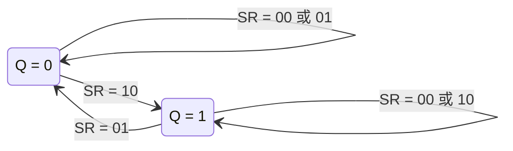
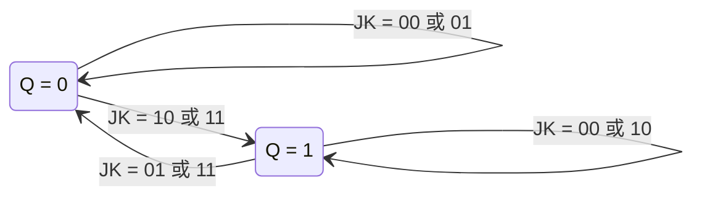
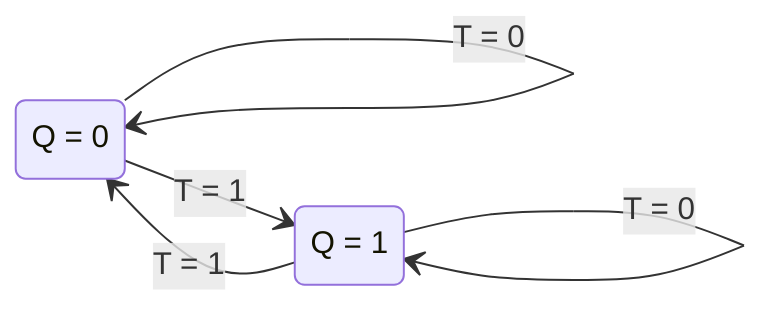

---
tags:
  - 数字电子技术基础
  - 课程笔记
  - 时序电路模块
---

# 典型的时序电路模块 第一讲

> [!abstract] 本讲定位
> 本讲在触发器电路结构的基础上，按逻辑功能对触发器进行分类总结，引入状态转换图（FSM）的描述方法，并介绍触发器的动态特性参数（建立时间、保持时间）。核心任务是从电路结构层面的分析上升到逻辑功能层面的抽象。

## CMOS 传输门边沿触发器回顾

### TCD 不为零的假设

CMOS 传输门边沿触发器在工作的关键假设是：传输延迟时间 TCD 不等于零。当反馈回路闭合时，输入信号变为无效，而此无效信号需要依靠正反馈推向两个稳定点之一。若 TCD = 0，则无效信号无法确定地推向稳定点。在组合电路中，信号是单向传输的，TCD = 0 不会造成问题，但在具有反馈的时序电路中，TCD ≠ 0 是必要条件。

### 主从结构与边沿特性

触发器工作过程分为两个阶段：

- **Clock = 0**：前级（主触发器）打开，从 D 端取数；后级（从触发器）与前级断开，输出 Q 保持稳定。
- **Clock = 1**：后级打开，从前级取数，此时前级已与 D 端断开，数据不变，因此后级仅取一次数据。

输出的变化仅发生在两组开关切换的瞬间，形成边沿触发特性。

### 上电状态

触发器上电后，若无触发信号，Q 和 Q' 会被反馈回路推向两个稳定点之一，但具体为哪一侧是随机的。为使初态确定，需要加入异步置零/置位信号。

> [!note] 异步信号的处理
> 异步置零/置位信号必须同时作用于主触发器和从触发器两级。若仅修改后级输出，当前级打开时仍会从主触发器取数，将覆盖异步设置的状态。只有两级同时被置为一致状态，才能确保在下一个触发信号到来前状态不变。

## 触发器的逻辑功能分类

触发器的描述由两个维度共同决定：**逻辑功能**和**触发方式**。两者无固定绑定关系，描述一个触发器时必须同时说明这两个方面。

### SR 触发器

在触发条件满足时，SR 触发器的次态由 S 和 R 决定：

| S | R | Q* |
|---|---|---|
| 0 | 0 | Q（保持） |
| 0 | 1 | 0（置零） |
| 1 | 0 | 1（置一） |
| 1 | 1 | 约束条件（不允许） |

**特性方程：**

$$Q^* = S + \overline{R}Q \quad (\text{约束条件：} SR = 0)$$

**状态转换图：**

> [!info] 状态转换图的含义
> 状态转换图关注两个问题：电路有多少个状态，以及状态之间转换需要什么条件。起点表示现态 Q，终点表示次态 Q*。波形图由于有时间轴，现态和次态天然区分；状态转换图则用箭头方向表明时间顺序。

### JK 触发器

在触发条件满足时，JK 触发器的次态由 J 和 K 决定：

| J | K | Q* |
|---|---|---|
| 0 | 0 | Q（保持） |
| 0 | 1 | 0（置零） |
| 1 | 0 | 1（置一） |
| 1 | 1 | $\overline{Q}$（取反） |

JK 触发器解除了 SR 触发器中 SR = 1 的约束条件，当 J = K = 1 时执行取反操作。

**特性方程：**

$$Q^* = J\overline{Q} + \overline{K}Q$$

**状态转换图：**

### T 触发器

T 触发器是单输入触发器，在触发条件满足时的行为：

| T | Q* |
|---|---|
| 0 | Q（保持） |
| 1 | $\overline{Q}$（取反） |

**特性方程：**

$$Q^* = \overline{T}Q + T\overline{Q} = T \oplus Q$$

**状态转换图：**

> [!note] 分频特性与二进制计数
> 将 T 触发器的 T 端接恒 1，其输出 Q 的频率与 Clock 的频率之间是什么关系？若 Clock 频率为 f，当 T = 1 时，Clock 每来一个有效边沿（如下降沿），Q 翻转一次。两个下降沿之间 Q 保持不动，因此 Q 的周期是 Clock 周期的两倍，频率为 f/2，即实现二分频。将第一级 T 触发器（T = 1）的输出 Q0 作为第二级 T 触发器的 Clock，则 Q1 的频率为 f/4，以此类推可得到 f/8、f/16 等分频信号。这一级联结构与二进制计数各位的权重（8、4、2、1）完全对应，因此 T 触发器最常用于计数器。石英表的计时原理即是如此：晶体振荡器产生稳定时钟，后端用触发器级联计数，表的精度取决于晶体振荡器的稳定性而非计数电路。

JK 触发器可通过将 J 和 K 短接转换为 T 触发器（T = J = K）。这体现了触发器命名的灵活性——名称标识的是输入与输出的关系，而非固定的电路结构。

### D 触发器

D 触发器是最简单的单输入触发器：

| D | Q* |
|---|---|
| 0 | 0 |
| 1 | 1 |

**特性方程：**

$$Q^* = D$$

**状态转换图：**

> [!important] 逻辑功能与触发方式的关系
> 描述一个触发器时，**逻辑功能**和**触发方式**两个维度缺一不可。例如：
> - "这是一个边沿触发器"→ 应追问："是 D 边沿还是 JK 边沿？"
> - "这是一个 JK 触发器"→ 应追问："是什么触发方式？主从脉冲还是边沿？"
>
> 两者之间没有固定的绑定关系。同一种逻辑功能的触发器（如 SR）可以有电平触发、主从触发、边沿触发等多种实现方式。

## 触发器的动态特性

动态特性的核心是几个时间参数，它们源自门电路的传输延迟与器件内部结构的组合。

### 传输延迟时间

沿用组合电路中的两个参数：
- **TPD**：传输延迟时间（从输入到输出）
- **TCD**：输出无效时间

以基本 RS 触发器为例，要将信号写入 Q，至少需要经过两个门的传输延迟时间（一级将信号写入，一级形成反馈锁定）。从低到高和从高到低的变化时间通常不同，取较长值作为参数。

### 建立时间与保持时间

引入 Clock 触发信号后，数据与时钟之间需要满足时序配合关系，由此引入两个新参数：

- **建立时间（T_setup）**：在 Clock 有效边沿到来前，数据需要提前保持稳定的最短时间。
- **保持时间（T_hold）**：在 Clock 有效边沿到来后，数据需要继续保持稳定的最短时间。

Clock = 1 时数据通道打开可写入，Clock = 0 时数据被锁存。数据必须在锁存之前放置好，且在整个建立和保持窗口内保持稳定。

### 最高时钟频率

引入触发器后，触发信号直接决定了电路的工作频率。最高时钟频率由电路的具体构成和上述时间参数共同决定。

> [!warning] 关于教材中的具体分析
> 教材（243-247 页）中对不同内部结构的电路进行了时间参数分析，但由于以下原因，这些定量结果仅供参考：
> 1. 实际集成触发器中每个门的传输延迟时间不相同（教材中的等延迟假设是强假设）
> 2. 内部逻辑门采用各种形式的简化电路，传输时间比标准结构小得多
> 3. 每个集成触发器产品的动态参数最终需要通过实验测定
>
> 学习的重点在于理解各参数的物理意义及相互间的制约关系，而非对具体电路的定量计算。

## 本讲小结

| 知识点 | 要点 |
|--------|------|
| CMOS 传输门触发器的前提 | TCD ≠ 0，主从结构产生边沿触发特性 |
| 异步信号的处理 | 必须同时作用于主触发器和从触发器两级 |
| SR 触发器 | 置一、置零、保持，SR = 1 为约束条件 |
| JK 触发器 | 解除 SR 约束，J = K = 1 时取反 |
| T 触发器 | T = 1 时翻转，用于分频和二进制计数 |
| D 触发器 | Q* = D，最简单的触发器 |
| 状态转换图 | 描述状态数和状态转移条件，引入 FSM 思想 |
| 动态参数 | T_setup（建立时间）、T_hold（保持时间） |

### 核心公式

- **SR 触发器**：$Q^* = S + \overline{R}Q$，约束 $SR = 0$
- **JK 触发器**：$Q^* = J\overline{Q} + \overline{K}Q$
- **T 触发器**：$Q^* = T \oplus Q$
- **D 触发器**：$Q^* = D$

### 课后作业

自行查找一个边沿触发的 JK 触发器的内部结构图，标注芯片型号，附在下次作业中。
