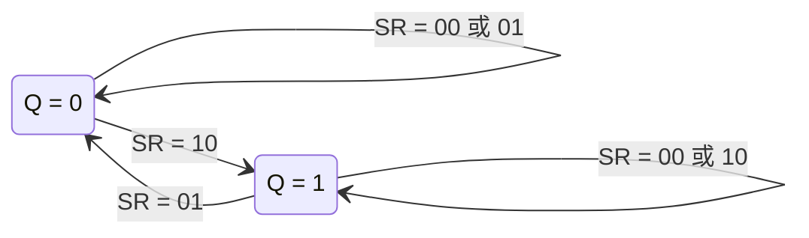
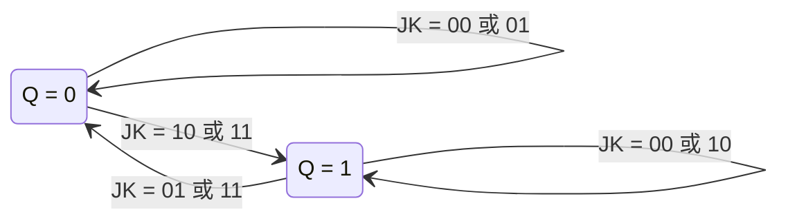
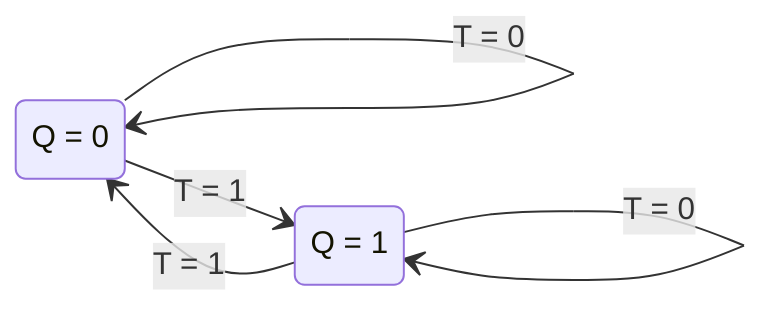

---
tags:
  - 数字电子技术基础
  - 课程笔记
  - 触发器
  - 动态特性
---

# 触发器综合与动态特性

> [!abstract] 本讲定位
> 本讲从电路结构层面的讨论转入逻辑功能层面的抽象总结：按逻辑功能对触发器进行分类（SR、JK、T、D），引入状态转换图（FSM 思想）作为新的描述工具，并首次介绍触发器的动态特性参数——建立时间和保持时间。本讲是第四章（电路结构）与第五章（逻辑功能）之间的桥梁。

## CMOS 传输门触发器的关键前提

### TCD 不为零——反馈回路工作的必要条件

CMOS 传输门边沿触发器在开关切换时，需要依赖正反馈将中间电平推向两个稳定点之一。这一过程有一个隐含前提：**传输延迟时间 TCD 不等于零**。

当反馈回路闭合、输入端断开时，中间节点上是一个"无效信号"。若 TCD = 0（输入无效则输出即刻无效），这个无效信号无法被正反馈捕捉并放大——它就消失了。只有 TCD ≠ 0，无效信号才来得及被正反馈捕获并推向确定的稳态。

> [!note] 组合电路中 TCD = 0 为什么不构成问题
> 组合电路信号单向传输，输入端无效则输出端随之无效，下一拍有效信号到来时重新计算即可。但在具有反馈的时序电路中，回路内部的信号必须在输入端断开后仍维持一段时间，TCD ≠ 0 是反馈结构稳定工作的必要条件。

### 主从开关切换产生边沿特性

CMOS 传输门边沿触发器的两组传输门控制端相位相反，交替通断：

- **Clock = 0（绿色闭合，红色断开）**：前级（主触发器）打开，从 D 端取数；后级（从触发器）与前级断开，输出 Q 保持稳定。
- **Clock = 1（红色闭合，绿色断开）**：后级打开，从前级取数；此时前级已与 D 端断开，数据固定不变，后级仅取一次数据。

输出的变化仅发生在两组开关切换的**瞬间**——这就是边沿触发特性的来源。切换之后，电路重新进入稳态。

### 上电初态与异步信号

上电后，若时钟边沿尚未到达，Q 和 $\overline{Q}$ 的状态由正反馈环推向两个稳态之一，但具体落在哪一侧是**随机**的。

为使初态可控，需要引入**异步置零/置位信号**（$\overline{S}_D$ / $\overline{R}_D$）。关键设计原则：**异步信号必须同时作用于主触发器和从触发器两级**。若仅修改后级输出，当下一时钟周期前级打开时，主触发器的旧值将覆写从触发器，异步操作失效。只有两级同时置为一致状态，异步操作才能持续到下一个触发边沿到来之前。

> [!important] 异步信号的设计法则
> 对后级置零/置位时，必须将前级也置为相同状态。原因：异步信号撤离后，后级仍受前级影响——若前级未同步修改，前级数据将在下一触发周期覆写后级。这一法则适用于所有含主从结构的触发器。

## 触发器的逻辑功能分类

描述一个触发器需要两个维度：**逻辑功能**（写入什么数据）和**触发方式**（何时写入）。两者之间没有固定的绑定关系——同一种逻辑功能（如 SR）可以有电平触发、主从触发、边沿触发等多种实现；同一种触发方式（如边沿触发）也可以实现 SR、JK、D、T 等多种功能。拿到一个触发器，必须同时明确这两个方面，描述才算完整。

### SR 触发器

凡在触发条件满足时能完成以下真值表的触发器，均称为 SR 触发器：

| S | R | $Q^*$ |
|---|---|------|
| 0 | 0 | $Q$（保持） |
| 0 | 1 | 0（置零） |
| 1 | 0 | 1（置一） |
| 1 | 1 | 约束项（不允许出现） |

**特性方程推导**：将真值表中 $Q^* = 1$ 的行写出最小项之和（同时考虑现态 $Q$ 的取值）——

$$Q^* = S\overline{R} \cdot 1 + \overline{S}\overline{R} \cdot Q$$

利用约束条件 $SR = 0$（即 $S$ 与 $R$ 不能同时为 1），化简得：

$$Q^* = S + \overline{R}Q \quad (\text{约束条件：} SR = 0)$$

**状态转换图**将关注点从输入/输出的逻辑关系转移到电路状态的变迁：电路有几个状态？状态之间在什么条件下跳转？起点为现态 $Q$，终点为次态 $Q^*$，箭头旁标注跳转所需的输入条件。

### JK 触发器

JK 触发器解除了 SR 触发器中 $SR = 1$ 的约束：当 $J = K = 1$ 时执行取反操作。凡在触发条件满足时能完成以下真值表的触发器，均称为 JK 触发器：

| J | K | $Q^*$ |
|---|---|------|
| 0 | 0 | $Q$（保持） |
| 0 | 1 | 0（置零） |
| 1 | 0 | 1（置一） |
| 1 | 1 | $\overline{Q}$（取反） |

前三行与 SR 触发器完全相同，仅第四行由约束项变为取反操作。**特性方程**同样由最小项之和化简得到：

$$Q^* = J\overline{Q} + \overline{K}Q$$

> [!tip] 考试提示
> 老师说：不用死记 JK 方程，但必须清楚 JK 触发器具备四种功能——保持（00）、置零（01）、置一（10）、取反（11）。知道这些功能，方程可以从真值表当场推出。

**状态转换图：**

> [!note] 逻辑符号中的触发沿信息
> 逻辑符号上的三角标记和圈号直接给出了触发方式。以**边沿触发 JK 触发器**为例：若符号中 clock 端为三角（上升沿触发），则只需在边沿时刻查 $J$、$K$ 的组合即可，无需追踪前半周期的中间过程。若符号中 clock 端为三角加圈（下降沿触发的主从结构），则主触发器在 Clock = 1 期间打开，变化发生在下降沿——此时需要关注 half-cycle 内的翻转历史。符号给出的触发方式决定了分析时要追踪的时间范围。

### T 触发器

T 触发器是单输入触发器，行为简洁：$T = 0$ 时保持，$T = 1$ 时取反。

| T | $Q^*$ |
|---|------|
| 0 | $Q$（保持） |
| 1 | $\overline{Q}$（取反） |

**特性方程：**

$$Q^* = \overline{T}Q + T\overline{Q} = T \oplus Q$$

**状态转换图：**

#### 分频特性

将 T 端恒接 1，触发器的输出频率与时钟频率是什么关系？

设 Clock 频率为 $f$，有效边沿为下降沿。当 $T = 1$ 时，Clock 每来一个下降沿，Q 翻转一次；两个下降沿之间 Q 保持不动。因此 Q 的周期是 Clock 周期的两倍，频率为 $f/2$——实现**二分频**。

将第一级 T 触发器（$T = 1$）的输出 $Q_0$ 作为第二级 T 触发器的 Clock，则 $Q_1$ 的频率为 $f/4$；级联下去可得到 $f/8$、$f/16$ 等。这一级联结构与二进制计数各位的权重（8-4-2-1）完全对应——这正是 **T 触发器最常用于计数器**的原因。

石英表的工作原理即是如此：晶体振荡器产生稳定的基准时钟，后端用 T 触发器级联计数。表的精度取决于晶体振荡器的稳定性，计数电路本身一般不会出错。

#### JK 转 T 的方法

只需将 JK 触发器的 $J$ 和 $K$ 短接，改名为 $T$，即得到 T 触发器（$T = J = K$）。

| J | K | $Q^*$（JK） |对应的 T | $Q^*$（T） |
|---|---|-----------|-------|----------|
| 0 | 0 | $Q$ | 0 | $Q$ |
| 1 | 1 | $\overline{Q}$ | 1 | $\overline{Q}$ |

这种做法与之前将 SR 触发器的 $S$ 和 $R$ 经反相器接在一起得到 D 触发器，思路完全一致——触发器的名称本质上是**输入与输出之间关系**的标识，而非固定电路结构的代号。设计者完全可以自己定义新的输入-输出关系并为之命名。

### D 触发器

D 触发器是最简单的单输入触发器，次态恒等于输入：

$$Q^* = D$$

| D | $Q^*$ |
|---|------|
| 0 | 0 |
| 1 | 1 |

**状态转换图：**

> [!important] 逻辑功能与触发方式必须同时声明
> 以下两种说法都是不完整的：
> - "这是一个边沿触发器" → 应追问：D 边沿？JK 边沿？SR 边沿？
> - "这是一个 JK 触发器" → 应追问：主从脉冲触发？边沿触发？什么边沿？
>
> 拿到完整信息才能正确使用触发器进行电路分析和设计。

## 触发器的动态特性

动态特性描述触发器在时间维度上的行为约束。这些参数根源于门电路的传输延迟和电路结构中的反馈路径——并没有引入新器件，所有时间参数都是从门电路时间特性推导出来的。

### 传输延迟时间

沿用组合电路中的两个参数：

- **$t_{PD}$**（传输延迟时间）：信号从输入变化到输出建立所需的时间。
- **$t_{CD}$**（污染延迟/输出保持时间）：输入变化后输出仍维持原值的最短时间。

以基本 RS 触发器为例：将信号写入 Q 至少需要经过**两个**门的传输延迟时间——一级将输入信号传到 Q，另一级形成反馈锁定。

> [!warning] 教材中的分析可以商榷
> 教材在分析 RS 触发器输出变化时，只关注了 Q 端，认为 Q 从低变高只需要 1 个 $t_{PD}$（因为 Q 直接与置一信号连接）。但实际上，要想让写入的值稳定"待住"，反馈回路也必须完成——需要把 $\overline{Q}$ 置为 0 并锁住另一侧的门。这一反馈路径同样需要 1 个 $t_{PD}$，合计至少 2 个 $t_{PD}$。因此老师说教材那一段分析「可以商榷，有一些值的取法有问题」，应以课堂分析为准。
>
> 此外，教材在 243–247 页对不同内部结构的电路进行了定量时间分析，但基于的假设（所有门传输延迟相等）在实际集成触发器中并不成立——不同门的传输时间差异很大，且内部逻辑门采用简化电路后传输时间远小于标准结构。因此**每个集成触发器产品的实际动态参数最终通过实验测定**。学习的重点在于理解各参数的**物理意义**及相互间的制约关系，而非对具体电路的定量计算。

### 建立时间与保持时间

引入时钟触发信号后，数据与时钟之间需要满足时序配合约束，由此引入两个新参数：

- **建立时间（$t_{setup}$）**：在时钟有效边沿到达**之前**，数据信号必须提前稳定存在的最短时间。
- **保持时间（$t_{hold}$）**：在时钟有效边沿到达**之后**，数据信号必须继续保持稳定的最短时间。

这两个参数的物理本质：Clock = 1 时数据通道打开，数据可以写入；Clock = 0 时数据被锁存。数据必须在锁存之前已经放好（建立时间），且在锁存完成的瞬间还不能被撤走（保持时间）。建立时间和保持时间构成了一个以时钟边沿为中心的"数据稳定窗口"，数据在这个窗口内必须保持不变。

> [!note] 下讲预告：最高时钟频率
> 引入触发器后，触发信号直接决定了电路的工作节拍。最高时钟频率由 $t_{PD}$、$t_{CD}$、$t_{setup}$、$t_{hold}$ 四个参数共同约束。老师明确指出这部分详细分析安排在下一讲，届时将讲解四个参数之间的定量配合关系。

## 本讲小结

### 四种触发器的逻辑功能

| 类型 | 输入端数 | 核心功能 | 特性方程 | 约束条件 |
|------|---------|---------|---------|---------|
| SR | 2（S, R） | 置一、置零、保持 | $Q^* = S + \overline{R}Q$ | $SR = 0$ |
| JK | 2（J, K） | 置一、置零、保持、取反 | $Q^* = J\overline{Q} + \overline{K}Q$ | 无 |
| T | 1（T） | 保持（T=0）、取反（T=1） | $Q^* = T \oplus Q$ | 无 |
| D | 1（D） | 跟随输入 | $Q^* = D$ | 无 |

### 状态转换图

引入 FSM（有限状态机）思想，描述电路有多少个状态以及状态之间在什么条件下跳转。起点代表现态 $Q$，终点代表次态 $Q^*$，箭头方向表示时间顺序。

### 其他知识点

| 知识点 | 要点 |
|--------|------|
| CMOS 传输门的前提 | TCD ≠ 0——反馈回路的有效性依赖于传输延迟不为零 |
| 异步信号处理法则 | 异步置零/置位必须同时作用于主触发器和从触发器，否则异步信号撤离后旧值将覆写新值 |
| 边沿触发特性 | 输出仅在时钟边沿跳变，对电平期间的输入变化天然不敏感 |
| 逻辑功能与触发方式 | 两者无固定绑定关系，描述触发器必须同时声明两个维度 |
| 建立时间 | 时钟有效边沿到达前数据需稳定存在的最短时间 |
| 保持时间 | 时钟有效边沿到达后数据需继续维持的最短时间 |
| 动态参数的本质 | 源自门电路传输延迟与电路反馈结构，实际值由实验测定 |
| 教材分析 | 等延迟假设在实际 IC 中不成立，课堂分析修正了教材中 RS 触发器延迟的部分结论 |

### 课后作业

自行查找一个边沿触发的 JK 触发器的内部结构图（维持阻塞结构或其他），标注芯片型号，附在下次作业中。
