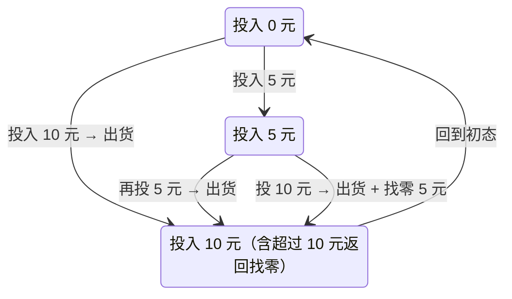

---
tags:
  - 数字电子技术基础
  - 课程笔记
  - 建立时间
  - 保持时间
  - 时序电路
---

# 建立时间与保持时间

> [!abstract] 本讲定位
> 本讲通过 D 锁存器和主从触发器的电路结构分析，推导建立时间与保持时间的物理来源和定量要求，总结触发器的四个动态参数，最后引出时序电路与有限状态机的基本概念。

## 触发器的动态参数回顾

触发器的动态特性根源于其内部的门电路。门电路具有传输延迟时间，由此产生了一系列时间参数。这些参数分为两类：

- **传输延迟时间**（$t_{PD}$）：信号从输入端到达 $Q$ 和 $\overline{Q}$ 所需的时间。
- **建立时间**（$t_{setup}$）与**保持时间**（$t_{hold}$）：描述数据信号与触发信号之间的配合关系。

触发信号虽然列在输入信号中，但并不出现在触发器的逻辑方程里——它只控制**何时**写入，至于写入什么内容，由数据端决定。因此建立时间和保持时间描述的是**数据信号与触发信号之间的时间配合**，与逻辑运算无关，但与能否稳定实现逻辑功能密切相关。

## 建立时间与保持时间——"早来晚走"

建立时间和保持时间描述的是同一个核心要求：数据信号早来晚走，触发信号夹在中间。

- **建立时间**（$t_{setup}$）：在触发信号到达**之前**，数据信号必须提前建立并保持稳定的最短时间。
- **保持时间**（$t_{hold}$）：在触发信号到达**之后**，数据信号必须继续保持稳定的最短时间。

> [!tip] 记忆技巧
> 跑步——发令枪响之前要提前做好准备（建立），枪响之后身体需要保持一段稳定姿态才能冲出（保持）。触发信号相当于发令枪，数据信号相当于运动员的准备状态。

对于边沿触发方式，触发被视为一个时钟边沿的**时刻**，而数据则需要在时间轴上**跨在触发边沿的两端**。

教材中对触发器内部结构的分析，目的仅在于说明这两个时间参数**客观存在且必要**。实际参数值并非通过理论推导得出，而是通过**实验测量**获得。下文以 D 锁存器为例进行定性分析，证明建立时间和保持时间为什么是必需的。

## D 锁存器的时间参数分析

### 电路结构

D 锁存器由一个二选一数据选择器（MUX）加上反馈回路构成：

- 当 $G = 1$ 时，数据 $D$ 写入 $Q$（透明状态）。
- 当 $G = 0$ 时，电路保持原有状态（锁存状态）。

特性方程为 $Q^* = D$，但该式成立的前提是 $G$ 和 $D$ 之间满足时间配合。

### 容差能力

CMOS 和 TTL 器件具有容差能力。其含义是：当门电路的某一输入端已使输出锁定在确定值时，其他输入端的变化不会影响输出。例如与门有一端为 $0$ 时其他输入端的变化不会改变输出，或门有一端为 $1$ 时同理。这使得真值表中的若干行可以合并为一行——输入即便从有效变为无效，输出端也反映不出来。

### 时间配合的推导

将数据写入 D 锁存器并锁存，需要经过真值表中的**三行**（以写入 $D = 1$ 为例）：

| $G$ | $D$ | $Q_M$ | $Q$ | 阶段说明 |
|:---:|:---:|:-----:|:---:|----------|
| 1 | 1 | $\times$ | 1 | 写入阶段：$G = 1$，$D$ 传送至 $Q$，耗时 1 个 $t_{PD}$ |
| 1 | 1 | 1 | 1 | 准备阶段：确保 $Q_M$ 与 $Q$ 一致，为锁存做准备，再耗 1 个 $t_{PD}$ |
| 0 | 1 | 1 | 1 | 锁存阶段：$G$ 变 $0$，数据锁入 |

写 $D = 0$ 时对应另外三行，分析过程完全对称。

真值表中每一行之间的跳变都需要一个 $t_{PD}$ 的传输延迟时间才能稳定建立。从写入到锁存共经过三次行间跳变，由此得出时间配合要求：

- **$G = 1$ 期间（建立）**：数据需要提前建立至少 **2 个 $t_{PD}$**。第一个 $t_{PD}$ 用于数据从 $D$ 传到 $Q$，第二个 $t_{PD}$ 用于为 $Q_M$ 做好准备。
- **$G$ 从 $1$ 变 $0$ 之后（保持）**：数据需要继续保持至少 **1 个 $t_{PD}$**。若 $D$ 和 $G$ 同时变化，组合电路中必然出现竞争冒险，在输出端产生尖峰毛刺。保持一个 $t_{PD}$ 确保了 $G$ 变化时 $Q_M$ 不变，数据稳定锁入。

> [!important] 定性分析结论
> 以上用 $t_{PD}$ 的倍数给出的建立和保持时间，是**定性分析**的结果，旨在说明这两个参数为什么是必需的。实际器件的具体数值通过**实验测量**获得，不同型号的触发器具有不同的 $t_{setup}$ 和 $t_{hold}$ 参数。

## 主从结构边沿 D 触发器的时间参数

### 边沿触发特性

主从结构构成的边沿 D 触发器，$Q$ 与 $D$ 之间的关系仅在时钟上升沿发生变化——上升沿到达时读取 $D$ 的值并更新 $Q$。在时序波形图上，$D$ 信号应**跨在**时钟边沿的两端，而非对齐于边沿。

### 主触发器的要求

主从触发器的前半部分是主触发器，它本身是一个电平触发的锁存器。因此主触发器的 $D$ 与 Clock 之间同样需要满足"早来晚走"：

- 上升沿**之前**：$D$ 提前 2 个 $t_{PD}$ 建立。
- 上升沿**之后**：$D$ 保持 1 个 $t_{PD}$。

在画时序图时，可以人为让 $D$ 跨在 Clock 边沿上，保证主触发器稳定工作。但主触发器的输出同时是从触发器的数据输入——从触发器内部的时间配合无法从外部直接控制，必须依靠电路本身的参数来保证。

### 从触发器的难题与 $t_{CD}$ 的作用

从触发器在 Clock 的**下降沿**锁存，要求它的数据（即主触发器的输出）跨在下降沿两端。

早来（下降沿之前数据就绪）容易满足：Clock = 1 的整个半周期内主触发器输出不变，数据早已准备好。但**晚走**成了难题：下降沿到达后，主触发器随之开始工作，其输出很快发生变化，从触发器的数据无法继续保持。

解决方案依靠 **$t_{CD}$**（Contamination Delay，污染延迟）：

> [!note] $t_{CD}$ 的物理意义
> 即使输入信号发生变化，输出仍然能保持原来的值一小段时间——相当于电路的"惯性"。$t_{CD}$ 来源于门电路本身的传输特性，不是零，这是反馈回路能稳定工作的必要条件。

从触发器稳定工作的条件：

$$t_{CD} > t_{hold}$$

即主触发器的 $t_{CD}$ 必须大于从触发器要求的保持时间。若实测 $t_{CD} < t_{hold}$，可通过在电路中增加门级来延长 $t_{CD}$。例如在 $Q$ 反端加一级反相器，每级引入一个 $t_{CD}$，累加至满足条件为止。这是数字电路中"性能不足就加模块"的典型做法。

## 四个动态参数总结

触发器的动态参数共四个，分为两大类：

| 参数 | 含义 | 类别 |
|------|------|------|
| $t_{PD}$ | 传输延迟时间——信号从输入变化到输出建立所需的时间 | 信号传输延迟 |
| $t_{CD}$ | 污染延迟——输入变化后输出仍维持原值的最短时间 | 信号传输延迟 |
| $t_{setup}$ | 建立时间——触发前数据需提前稳定的最短时间 | 信号配合要求 |
| $t_{hold}$ | 保持时间——触发后数据需继续稳定的最短时间 | 信号配合要求 |

信号传输延迟（$t_{PD}$、$t_{CD}$）由门电路本身的物理特性决定，信号配合要求（$t_{setup}$、$t_{hold}$）是为保证器件稳定工作而对数据与触发信号之间提出的时间约束。

> [!important] 边沿触发器的时间起点
> 对于边沿触发器，所有四个时间参数的起点都是**触发信号（Clock）的边沿**，而非输入信号的变化时间。这与组合电路不同——组合电路的时间起点是输入信号发生变化的时刻。原因在于：对于边沿触发器，只有触发信号到达之后，输出端才可能出现变化。若没有触发信号，$D$ 端再变化也不会在 $Q$ 端产生反应，传输延迟也就无从谈起。

## 最高时钟频率的初步讨论

单个触发器的最高工作频率由两次触发之间的最小间隔决定：

$$T_{clk} \geq t_{PD} + t_{setup}$$

触发信号到达后，需经过 $t_{PD}$ 才能完成输出更新；同时在下一次触发到达之前，数据必须提前 $t_{setup}$ 建立好。两者共同限制了时钟周期的最小值。本讲仅给出结论，详细推导将在后续时序电路分析中展开。

## 从触发器到时序电路

### 触发器解决记忆问题

组合电路的最大局限在于没有记忆能力——输出仅取决于当前输入，过去发生的事情无法影响当前输出。触发器的引入提供了记忆元件，使得电路能够记住过去的状态。

### 电路状态与有限状态机

若电路中有 $n$ 个触发器，则电路具有 $2^n$ 个可能的状态。有了记忆元件之后，对电路的描述方式发生了根本变化：从关注单一的方程和真值表，转向关注**电路有多少个状态**以及**状态之间如何跳变**。

有限状态机（FSM）是描述时序电路的主要工具。状态转换图中，组合电路里的逻辑方程隐藏于状态跳变的转移条件之中——从一个状态到另一个状态需要满足什么输入条件，这就是组合逻辑在做的事情。

### 自动售货机：为什么需要状态

一台自动售货机只收 5 元和 10 元纸币，饮料售价 10 元。如果使用组合电路控制，会出现严重问题：组合电路只取决于当前输入。投入 5 元后选择 10 元饮料，机器不会记住已投的 5 元——前面投入的钱"不算数"，必须一次性投够 10 元才能出货。

时序电路则不同：它能记住过去发生的事件。用三个状态表示已投入的金额：

工作过程：初态 $\text{S}_0$（已投 0 元）→ 投入 5 元 → 进入 $\text{S}_1$（记住已投 5 元）。若再投 5 元，累计 10 元，出货并回到 $\text{S}_0$。若投 10 元，累计 15 元，出货找零 5 元，回到 $\text{S}_0$。由于投币种类和商品种类都是有限种，所有可能的组合情况都可以用有限状态机描述，并通过电路设计予以实现。

## 本讲小结

### 核心对比：建立时间 vs 保持时间

| 对比维度 | 建立时间 $t_{setup}$ | 保持时间 $t_{hold}$ |
|----------|---------------------|---------------------|
| 时间位置 | 触发信号到达**之前** | 触发信号到达**之后** |
| 描述对象 | 数据需提前稳定多长时间 | 数据需继续维持多长时间 |
| D 锁存器定量 | 至少 2 个 $t_{PD}$ | 至少 1 个 $t_{PD}$ |
| 违反后果 | 数据来不及传到输出端，写入失败 | 竞争冒险产生尖峰毛刺，写入值不确定 |

### 核心对比：组合电路 vs 时序电路

| 对比维度 | 组合电路 | 时序电路 |
|----------|---------|---------|
| 记忆能力 | 无（输出仅取决于当前输入） | 有（触发器提供记忆） |
| 状态概念 | 无状态，无历史 | $n$ 个触发器产生 $2^n$ 个状态 |
| 主要描述工具 | 逻辑方程、真值表 | 状态转换图（有限状态机） |
| 时间起点 | 输入信号变化时刻 | 触发信号（Clock）边沿 |

### 其他知识点

| 知识点 | 要点 |
|--------|------|
| "早来晚走"原则 | 建立时间和保持时间的通俗表达——数据信号提前建立、推迟撤除，触发信号居中 |
| 容差能力 | CMOS/TTL 器件在输出被某输入端锁定时，其他输入端的变化不影响输出 |
| $t_{CD}$ 的工程意义 | 主触发器的 $t_{CD}$ 必须大于从触发器的 $t_{hold}$；不足时可通过增加门级补足 |
| 四个动态参数分类 | $t_{PD}$ 和 $t_{CD}$ 属于传输延迟（物理特性）；$t_{setup}$ 和 $t_{hold}$ 属于配合要求（时间约束） |
| 参数来源 | 定性分析说明必要性，实际值由实验测定 |
| 最高时钟频率 | $T_{clk} \geq t_{PD} + t_{setup}$；详细分析见后续章节 |
