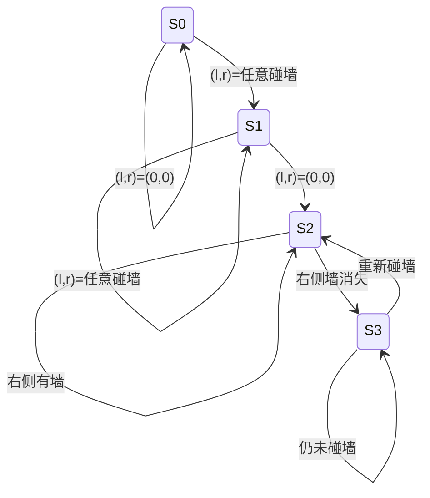

---
tags:
  - 数字电子技术基础
  - 课程笔记
  - 时序电路
  - 动态特性
---

# 时序电路的动态特性分析 第一讲

> [!abstract] 本讲定位
> 本讲通过两个完整的设计实例（数字密码锁和蚂蚁走迷宫），深入讲解同步时序电路从逻辑抽象到电路实现的全过程，涵盖米利型与摩尔型两种电路的设计方法、状态化简、状态编码、卡诺图求方程、触发器选择以及自启动检查等关键环节。

## 时序电路设计的基本步骤

同步时序电路的设计遵循一套规律性的方法：

1. **逻辑抽象** — 将实际问题转化为状态转换图（最关键的一步）
2. **状态化简** — 合并等效状态，减小电路规模
3. **状态编码** — 为每个状态分配二进制代码
4. **触发器选型** — 选择 D 或 JK 等触发器类型
5. **求驱动方程和输出方程** — 通过卡诺图化简得到
6. **画电路图**
7. **检查自启动能力**

> [!important] 核心思想
> 先学会设计"对的"电路，再追求"好的"电路，最后追求"巧的"电路。规律性的方法是基础。

## 数字密码锁设计（米利型）

### 问题描述

> [!example] 例：数字密码锁（米利型）
> 设计一个数字密码锁，输入为 1 位二进制串行数据。当连续输入 3 个或 3 个以上 1 时，锁打开（输出为 1）；否则锁保持关闭。如果在开锁状态下输入 0，则锁重新闭合。
>
> **解：**
>
> **1. 逻辑抽象**
>
> 问题分析：输入只有 1 位（串行输入 x），输出只有 1 位（y = 1 表示开锁，y = 0 表示闭锁）。由于需要记忆已输入的连续 1 的个数，组合逻辑无法实现，必须用时序电路。
>
> 采用 **米利型** 电路（输出取决于现态和输入），定义状态如下：
>
> - **S0**（初始态）：已输入 0 个连续 1，锁关闭
> - **S1**：已输入 1 个连续 1，锁关闭
> - **S2**：已输入 2 个连续 1，锁关闭
>
> 状态转换规则：
> - S0 时输入 1 → S1（记住已输入一个 1）；输入 0 → 留在 S0
> - S1 时输入 1 → S2（记住已输入两个 1）；输入 0 → 回到 S0
> - S2 时输入 1 → 留在 S2，**输出 y = 1**（开锁，米利型输出写在转移上）；输入 0 → 回到 S0
>
> ```mermaid
> stateDiagram-v2
>     direction LR
>     S0 --> S0 : x=0 / y=0
>     S0 --> S1 : x=1 / y=0
>     S1 --> S0 : x=0 / y=0
>     S1 --> S2 : x=1 / y=0
>     S2 --> S0 : x=0 / y=0
>     S2 --> S2 : x=1 / y=1
> ```
>
> **2. 状态化简**
>
> 检查等效状态：两个状态在相同的输入下具有相同的次态和相同输出，则可合并为一个状态。
>
> 观察发现，S2 和 S3（已输入 3 个或以上连续 1）在输入为 0 时次态均为 S0，输入为 1 时次态均为自身，输出相同，因此 S3 可合并到 S2。最终保留 3 个状态：S0、S1、S2。
>
> **3. 状态编码**
>
> 3 个状态需要 2 个触发器。编码方案：
>
> | 状态 | Q1 | Q0 |
> |:---:|:---:|:---:|
> | S0 | 0 | 0 |
> | S1 | 0 | 1 |
> | S2 | 1 | 0 |
> | （无效） | 1 | 1 |
>
> **4. 状态转换表**
>
> | Q1 | Q0 | x | Q1\* | Q0\* | y |
> |:--:|:--:|:--:|:---:|:---:|:---:|
> | 0 | 0 | 0 | 0 | 0 | 0 |
> | 0 | 0 | 1 | 0 | 1 | 0 |
> | 0 | 1 | 0 | 0 | 0 | 0 |
> | 0 | 1 | 1 | 1 | 0 | 0 |
> | 1 | 0 | 0 | 0 | 0 | 0 |
> | 1 | 0 | 1 | 1 | 0 | 1 |
> | 1 | 1 | 0 | 0 | 0 | 0 |
> | 1 | 1 | 1 | 1 | 0 | 0 |
>
> **5. 求状态方程和输出方程**
>
> 将状态转换表拆分为三张卡诺图，分别对应 $Q_1^*$、$Q_0^*$ 和 $y$。
>
> 化简得到：
>
> $$
> Q_1^* = Q_1 x + Q_0 x
> $$
>
> $$
> Q_0^* = \overline{Q_1}\ \overline{Q_0}\ x
> $$
>
> $$
> y = Q_1 \overline{Q_0}\ x
> $$
>
> **6. 选择触发器**
>
> **方案一：D 触发器**
>
> D 触发器的特性方程为 $Q^* = D$，因此驱动方程即状态方程：
>
> $$
> D_1 = Q_1 x + Q_0 x
> $$
>
> $$
> D_0 = \overline{Q_1}\ \overline{Q_0}\ x
> $$
>
> **方案二：JK 触发器**
>
> 将状态方程整理为 $Q^* = J\overline{Q} + \overline{K}Q$ 的形式，从中提取 J 和 K。
>
> **7. 自启动检查**
>
> 由于编码时未使用状态 11（无效态），需检查电路上电后若落入无效态能否自行回到有效循环。
>
> 代入 $Q_1 Q_0 = 11$：
> - 若 $x = 0$，则 $Q_1^* = 0$，$Q_0^* = 0$（回到 S0），$y = 0$
> - 若 $x = 1$，则 $Q_1^* = 1$，$Q_0^* = 0$（进入 S2），$y = 0$
>
> 无效态能够自动回到有效状态。
>
> > [!warning] 设计建议
> > 在设计时，应主动将无效态的次态指向初始态，避免依赖化简时的无关项。虽然这样做可能使驱动方程稍复杂，但能确保电路可靠地自启动。推荐的策略是：在设计阶段就将所有无效态的次态填为 00（初始态），而不是画为无关项。

## 迷宫蚂蚁设计（摩尔型）

### 问题描述

> [!example] 例：迷宫蚂蚁（摩尔型）
> 设计一个蚂蚁机器人的控制电路，使其能够走出迷宫。蚂蚁有左、右两个触角传感器（碰到障碍物输出 1，否则输出 0），以及三个执行机构：前进（Forward）、左转（Turn Left）、右转（Turn Right）。采用**右墙法则**导航策略——让右触角始终贴着墙走。
>
> **解：**
>
> **1. 导航策略分析**
>
> 右墙法则的核心思想：墙是连续的，出口在墙上。蚂蚁通过以下方式实现右墙跟随：
>
> 1. **找墙**：一直向前走，直到任意触角碰到墙
> 2. **调整**：碰到墙后左转，直到左右触角都不碰墙（调整到与墙平行的位置）
> 3. **前行 + 右探**：向前走的同时定期向右探测，确认墙在右侧
>    - 若右墙存在 → 向左微调后继续前行
>    - 若右墙消失（遇到拐角）→ 持续右转直到重新找到墙
>
> > [!note] 策略限制
> > 右墙法则要求迷宫中不能有孤岛（独立的封闭障碍物）。墙必须是连续的，出口在墙上。
>
> **2. 逻辑抽象**
>
| 端口 | 方向 | 含义 |
|:---:|:----:|:----|
| l | 输入 | 左触角传感器（1 = 碰到） |
| r | 输入 | 右触角传感器（1 = 碰到） |
| f | 输出 | 前进 |
| tl | 输出 | 左转 |
| tr | 输出 | 右转 |

采用 **摩尔型** 电路（输出仅取决于当前状态）：



各状态定义：

| 状态 | 含义 | 输出（f, tl, tr） |
|:---:|:----|:----------------:|
| S0 | 初始态，未碰墙，一直向前走 | 1, 0, 0 |
| S1 | 碰墙后左转调整，直到触角都离开墙 | 0, 1, 0 |
| S2 | 与墙平行，向前走并维持与墙的接触 | 1, 0, 0 |
| S3 | 遇到拐角或墙消失，持续右转 | 0, 0, 1 |

状态转换规则：
- **S0**：左右触角均不碰 → 留在 S0；任一侧碰墙 → S1
- **S1**：持续左转；触角仍有接触 → 留在 S1；两侧均不碰 → S2（已调整平行）
- **S2**：向前走；右侧有墙 → 维持 S2（可间歇性左转微调）；右侧无墙（拐角）→ S3
- **S3**：持续右转；仍未碰墙 → 留在 S3；重新碰墙 → S2

> [!note] 状态化简
> 初始设计有 5 个状态，需要 3 个触发器。检查发现其中两个状态在相同输入下具有相同的次态和输出，可以合并。化简后得到 4 个有效状态，仅需 2 个触发器。
>
> 状态化简的意义在于减少触发器数目，缩小电路规模。

**3. 状态编码**

4 个状态用 2 个触发器编码：

| 状态 | S1 | S0 |
|:---:|:--:|:--:|
| S0 | 0 | 0 |
| S1 | 0 | 1 |
| S2 | 1 | 0 |
| S3 | 1 | 1 |

**4. 状态转换表**

输入为 S1、S0（现态编码）、l（左触角）、r（右触角）；输出为 S1\*、S0\*（次态编码）和 tl、tr、f（执行机构）。

| S1 | S0 | l | r | S1\* | S0\* | f | tl | tr |
|:--:|:--:|:-:|:-:|:---:|:---:|:-:|:--:|:--:|
| 0 | 0 | 0 | 0 | 0 | 0 | 1 | 0 | 0 |
| 0 | 0 | 0 | 1 | 0 | 1 | 0 | 1 | 0 |
| 0 | 0 | 1 | 0 | 0 | 1 | 0 | 1 | 0 |
| 0 | 0 | 1 | 1 | 0 | 1 | 0 | 1 | 0 |
| 0 | 1 | 0 | 0 | 1 | 0 | 1 | 0 | 0 |
| 0 | 1 | 0 | 1 | 0 | 1 | 0 | 1 | 0 |
| 0 | 1 | 1 | 0 | 0 | 1 | 0 | 1 | 0 |
| 0 | 1 | 1 | 1 | 0 | 1 | 0 | 1 | 0 |
| 1 | 0 | 0 | 0 | 1 | 0 | 1 | 0 | 0 |
| 1 | 0 | 0 | 1 | 1 | 0 | 1 | 0 | 0 |
| 1 | 0 | 1 | 0 | 1 | 0 | 1 | 0 | 0 |
| 1 | 0 | 1 | 1 | 1 | 1 | 0 | 0 | 1 |
| 1 | 1 | 0 | 0 | 1 | 1 | 0 | 0 | 1 |
| 1 | 1 | 0 | 1 | 1 | 0 | 1 | 0 | 0 |
| 1 | 1 | 1 | 0 | 1 | 1 | 0 | 0 | 1 |
| 1 | 1 | 1 | 1 | 1 | 1 | 0 | 0 | 1 |

**5. 卡诺图化简与驱动方程**

将状态转换表按输出变量拆分为多张 4 变量卡诺图（输入为 S1、S0、l、r），化简得到状态方程和输出方程。

以 D 触发器实现为例，驱动方程即为状态方程。

输出方程由摩尔型定义，仅与现态有关：

$$
f = \overline{S_1}\ \overline{S_0} + S_1\ \overline{S_0}
$$

$$
tl = \overline{S_1}\ S_0
$$

$$
tr = S_1\ S_0
$$

**6. 电路实现**

按照驱动方程连接 D 触发器、组合逻辑门和传感器输入端口，即可构成蚂蚁的控制电路。该电路的规模与密码锁电路相当，仅用 2 个触发器即可实现迷宫导航的"智能"行为。

> [!tip]
> 不同的导航策略会导致完全不同的内部电路。若采用左墙法则，只需将左右传感器的角色互换，但推导出的状态方程和输出方程将不同。

## 本讲小结

| 知识点 | 要点 |
|--------|------|
| 逻辑抽象 | 将实际问题转化为状态转换图，明确输入、输出和状态的含义 |
| 状态化简 | 等效状态（相同输入下次态和输出相同）可以合并，减少触发器数量 |
| 米利型 vs 摩尔型 | 米利型输出写在状态转移上，摩尔型输出写在状态内部 |
| 自启动检查 | 确保无效态能回到有效循环，建议直接将无效态次态设为初始态 |
| 触发器选择 | D 触发器驱动方程直接由状态方程得到；JK 触发器需整理为 $Q^* = J\overline{Q} + \overline{K}Q$ 形式 |

### 核心结论

- 时序电路设计的关键第一步是 **逻辑抽象**，它决定了电路的规模和功能是否正确
- 状态化简可以 **减少触发器数量**，但不应为了化简而牺牲自启动的可靠性
- 米利型电路输出响应更快（不依赖时钟沿），而摩尔型电路输出更稳定（仅与状态相关）
- 两个触发器足以实现具有一定"智能"的控制逻辑（如密码锁、迷宫导航）
