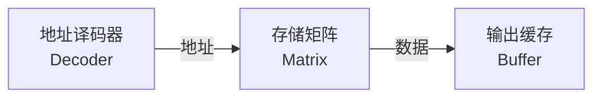

---
tags:
  - 数字电子技术基础
  - 课程笔记
  - 时序电路扩展
---

# 时序电路扩展 第二讲

> [!abstract] 本讲定位
> 深入分析流水线交错结构的时序细节与工作原理，解决前次遗留的关键问题；回顾第六章核心知识点与复习要点；讨论有限状态机的局限性与图灵机的提出背景；开启半导体存储器的学习，介绍分类、基本概念与掩模ROM。

## 流水线工艺的交错结构详解

### 电路结构与工作原理

流水线交错（Interleaving）设计是将有限状态机与数据选择器（MUX）相结合，通过交替切换实现计算单元的复用。其核心在于：输入端的数据切换与输出端的数据切换正好**相反**——当一侧在接收新数据时，另一侧正在完成之前的计算。

电路中采用**电平触发D触发器**保存中间结果，使得组合逻辑电路可以在多个时钟周期内持续计算。若某一计算单元C的传输延迟为8 ns，在无交错设计时，时钟周期必须不小于8 ns；采用交错设计后，两个相同的计算单元交替工作，时钟周期可缩短至4 ns。

> [!example] 例：交错结构的时序与数据流动分析
> 电路由两个相同的组合逻辑块C0和C1（每块延迟8 ns）、数据选择器、电平触发D触发器以及一个控制状态机（FSM）构成。分析该电路的数据流动过程与时钟周期选取。
>
> **解：**
>
> **分析步骤：**
>
> 1. **状态机控制**：有限状态机的输出q在01之间交替切换，控制数据选择器的选通方向。
>
> 2. **数据流动**：
>    - 时钟第一个上升沿：FSM输出q=0，数据x0经数据选择器进入C0开始计算。
>    - 此时C1处于空闲或完成上一轮计算的状态。
>    - 时钟第二个上升沿：q=1，数据选择器切换，新数据x1进入C1，同时C0中的结果尚未输出，由电平触发D触发器保存中间值。
>    - 第三个时钟上升沿：q=0，C0继续计算上一周期保存的中间结果，C1开始接收新数据。
>
> 3. **结果输出时机**：每个数据在两个时钟周期后输出。x0在第一个上升沿输入，在第三个上升沿时结果才能稳定输出。
>
> 4. **时钟周期**：选定$T_{clk} = 4\ \text{ns}$。虽然每个计算单元的工作时间仍然是8 ns，但由于两个单元交替工作，新的输入可以每4 ns启动一次。
>
> 5. **电平触发D触发器的作用**：在数据选择器切换时，D触发器保存当前计算单元的中间结果。组合逻辑在切换后继续计算，而不需要等待数据重新输入。
>
> **结论**：
> - 延迟（Latency）：每个数据从输入到输出需要2个时钟周期，即$2 \times 4 = 8\ \text{ns}$。
> - 吞吐率（Throughput）：每4 ns可以启动一个新的数据输入，吞吐率相对于8 ns设计提高一倍。

### 从两级到多级流水线

上述设计构成一个**两级底层流水线**。若希望进一步提升吞吐率（例如从4 ns压缩至2 ns），可以采用4个相同的计算单元，配合一个**四选一数据选择器**。控制状态机则需要设计为**4个状态的循环**（由两个触发器实现）。

多级流水线的设计思路完全一致：计算单元数量增加，数据选择器的选通端口数增加，FSM状态数相应增加。

### 流水线的性能权衡

流水线工艺提高了数据的吞吐能力，但需要注意以下两点：

- **吞吐率提高不等于单个数据的传输延迟降低**：流水线级数越多，单个数据从输入到输出经历的时钟周期数越多，其延迟（Latency）为流水线级数与时钟周期的乘积。
- **面积换速度**：流水线付出的代价是重复的计算硬件（多个相同的组合逻辑单元）。每增加一级流水线，电路面积和触发器数量随之增加。

$$
\text{Latency} = N \times T_{clk}
$$

其中$N$为流水线级数，$T_{clk}$为时钟周期。

> [!important] 核心结论
> 流水线通过增加硬件面积来换取工作频率的提升。虽然整体数据处理速度加快，但针对**某一个数据**而言，其传输延迟并不会减少，反而可能因级数增加而增大。

## 作业：串行加法器的流水线设计

> [!note] 作业一：串行加法器流水线
> 给定一个4位串行加法器电路，其中每一位全加器的传输延迟为20 ns。要求：
>
> 1. 为串行加法器设计流水线，在电路图中画出一条贯穿所有原始输出的切割线。
> 2. 制作表格，列出不同流水线级数下的吞吐率，直到增加级数后吞吐率不再变化为止。
> 3. 在表格中增加一列，记录每种方案所使用的触发器个数。
>
> **提示**：流水线的切割线应贯穿所有你关心的输出，切割位置不同会导致所需的触发器数量不同。

## 第六章知识点回顾

### 时序逻辑电路的核心要点

- **时序逻辑电路的特点**与逻辑功能的描述方法（三组方程：两个组合方程 + 一个状态方程）。
- **同步时序电路的分析方法**：写好三组方程，注意其中两个是组合逻辑，只有一个与时序相关，避免陷入迭代循环。
- **同步时序电路的设计方法**：难点在于**逻辑抽象**——状态转换图的设计是关键。状态数过多往往意味着抽象层次出了问题，没有抓住问题的核心。

### 流水线工艺

流水线是触发器在数字电路中的典型应用，不同于有限状态机的设计方法，需要独立掌握。

### 动态特性

时序电路稳定工作的核心前提是满足动态特性（时序约束）。只有满足了动态特性，才能进一步分析方程和状态图。

### 异步时序电路

分析时不需要写方程，将每个触发器视为独立元件，看其工作触发边沿，逐个分析波形变化。

> [!important] 第六章重点
> - 同步时序电路的分析与设计
> - 流水线工艺
> - 动态特性（时序约束）
> - 典型时序电路模块的应用（如任意进制计数器）

## 从有限状态机到图灵机

### 有限状态机的局限性

有限状态机虽然可以完成一些看似智能的任务（如上一讲的迷宫蚂蚁算法、售货机控制），但其核心局限在于**有限性**——FSM的状态数量是固定的。

以括号匹配判别器为例：若要判断输入的左右括号是否匹配，FSM的设计者必须先知道最多可能有多少个括号。括号的嵌套深度决定了所需状态的数量。如果输入规模不确定，FSM就无法通用地解决该问题。

这说明FSM能够解决的问题是有限的，它依赖于对问题规模的先验知识。

### 图灵机的思想

阿兰·图灵（Alan Turing）提出了解决FSM有限性的根本方案——**图灵机**。其核心思想是：

1. 用一个**有限状态机**完成读写控制功能。
2. 所有信息存储在**一个无限长的纸带**上（无限存储空间）。
3. 当前处理时只关注**有限的当前信息**，不需要把所有信息同时展现。

类比于人类解复杂题目时使用演算纸——不会因为解决不同的问题而需要不同颜色的演算纸。图灵机通过**无限存储**扩展了FSM的有限性，是现代计算机的理论原型。

### 冯·诺依曼结构与哈佛结构

基于图灵机的思想，计算机体系结构分为两大经典类型：

- **冯·诺依曼结构**：指令和数据共用同一存储空间和总线。
- **哈佛结构**：指令存储和数据存储分离，典型应用如ARM系统、嵌入式系统。

两种结构中，**控制单元（Control Unit）** 均由有限状态机实现，而**存储器部分**负责海量数据的存储。

> [!info] 课程后续
> 后续学习中，将用可编程逻辑器件配置实现这些计算机结构，将开发板变为一个微处理器（MPU）。

## 半导体存储器导论

### 存储系统的层次结构

不同存储技术在速度、容量、价格之间存在权衡：

| 存储层次 | 速度 | 容量 | 价格 |
|---------|------|------|------|
| CPU内部Cache | 最快 | 最小 | 最贵 |
| SRAM | 快 | 小 | 贵 |
| 主存（Main Memory） | 中等 | 中等 | 中等 |
| 硬盘 | 慢 | 大 | 便宜 |
| 光盘/磁带 | 最慢 | 最大 | 最便宜 |

存储系统的设计目标是：**用起来体量大、访问速度快**——通过对层次结构的组合调度，使得用户感知到的是一个又大又快又便宜的存储系统。课程重点讨论的是**半导体工艺实现的存储器**。

### 存储器的基本概念

| 术语 | 含义 |
|------|------|
| 存储单元（Memory Cell） | 用于存储一个二进制位的电路单元 |
| 字节（Byte） | 8个二进制位 |
| 字（Word） | 由若干个字节构成 |
| 容量（Capacity） | 存储系统能够存储的二进制数据总量 |
| 密度（Density） | 表示容量的另一种术语 |
| 地址（Address） | 用于确定某个字在存储系统中的位置 |

地址与数据的类比：存储器类似一个仓库，每个房间（存储单元）有门牌号（地址），但所有房间不会直接与系统出口相连——任何时候只需访问有限的数据，无需将所有数据接口同时引出。

### ROM与RAM

半导体存储器按功能分为两大类：

**只读存储器（ROM）**：
- 正常使用中以读数据为主，不对数据进行改变
- **非易失性**：掉电后数据仍然保存
- 写入速度远慢于读取速度
- 常见应用：相机记忆棒、MP3播放器
- **本质是组合电路**——任何时刻的输出仅取决于当前的地址输入，掉电后重新上电仍然给出同样的输出

**随机读写存储器（RAM）**：
- 正常使用中读写频繁发生
- **易失性**：掉电后数据丢失
- 读写时间基本相等、速度相仿
- 常见应用：内存条

从工艺上又可分为双极型（TTL工艺）和MOS型（CMOS工艺）。

### ROM的基本结构

ROM由三部分组成：
1. **地址译码器**：将输入的地址信号译码为字选通信号，访问指定的存储单元。
2. **存储矩阵**：存储大量数据的核心阵列。
3. **输出缓存**：将选中的数据稳定地输出。

存储器的数据接口和地址接口是公用的——任何时候访问的数据量有限，无需将所有数据同时引出。

> [!note] ROM的电路本质
> ROM实际上是**组合电路**的一种应用。任何时刻的输出仅取决于当前的地址输入，这完全符合组合逻辑的定义。将ROM归类为存储器是因为其存储大量数据的功能特性，但从电路原理上看，它符合组合电路的全部特征。

### 掩模ROM

掩模ROM（Mask ROM）是在半导体制造过程中通过**光刻工艺**写入数据的ROM。

- **掩模（Mask）**：一张决定光线是否能照射到晶圆表面的模板，用于控制光刻胶的腐蚀区域。
- **精度**：现代工艺已达纳米级。举例来说，一个指甲盖大小的面积可以通过掩模技术绘制包含北京市及周边区县所有街道的地图。
- **数据写入**：数据在制造时通过掩模图案一次性写入，无法更改。

> [!info] 参观推荐
> 北京市青少年科技馆（北三环木偶剧院对面）设有半导体生产工艺流程的展台，可直观了解掩模与光刻工艺。

## 本讲小结

| 知识点 | 要点 |
|--------|------|
| 流水线交错结构 | 通过数据选择器和电平触发D触发器交替使用两个计算单元，时钟周期可减半 |
| 流水线的代价与收益 | 提高吞吐率（缩短时钟周期），但增加硬件面积；单个数据的延迟（Latency）随级数增加 |
| FSM的局限性 | 有限状态机状态数固定，无法处理输入规模不确定的问题 |
| 图灵机 | 有限状态机 + 无限存储纸带，解决了FSM的有限性，是现代计算机的理论模型 |
| 计算机结构 | 冯·诺依曼结构（统一存储）与哈佛结构（分离存储）；控制单元为FSM，存储部分可扩展 |
| 半导体存储器分类 | ROM（只读、非易失、本质是组合电路）与RAM（随机读写、易失） |
| ROM结构 | 地址译码器 + 存储矩阵 + 输出缓存 |
| 掩模ROM | 通过光刻掩模工艺在制造时写入数据，精度达纳米级 |

### 核心公式/结论

- 流水线吞吐率 $\approx \dfrac{1}{T_{clk}}$，Latency $= N \times T_{clk}$
- ROM的本质是**组合电路**——输出仅取决于地址输入，掉电不丢失数据
- 存储系统层次结构：速度越快、容量越小、价格越贵
