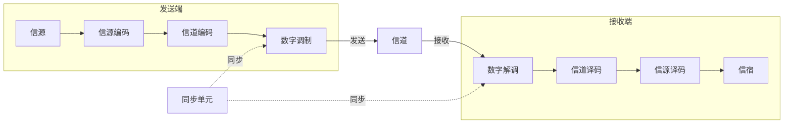

---
tags:
  - 通信原理
  - 绪论
  - 期末速成
  - 课程笔记
---
# 通信原理 EP1 — 绪论

---

> [!abstract] 课程概述
> 本课程共 11 章，面向期末考试重点和难点，精选习题并带做。需要的信号与系统、概率统计知识会在课程中穿插复习。

| 章节 | 内容 |
|------|------|
| 1 | 绪论 |
| 2 | 确知信号（信号与系统复习） |
| 3 | 随机过程 |
| 4 | 信道 |
| 5 | 模拟调制系统 |
| 6 | 数字基带传输系统 |
| 7 | 数字带通传输系统 |
| 8 | 数字信号的最佳接收 |
| 9 | 信源编码 |
| 10 | 差错控制编码（信道编码） |
| 11 | 同步原理 |

---

## 1.1 通信的基本概念

### 三个核心名词辨析

| 名词 | 定义 | 关键点 |
|------|------|--------|
| **消息** | 通信系统所要传输的对象 | 文字、语音、图片等本身就是消息 |
| **信息** | 消息中蕴含的真正有效内容 | 只有人才能理解的具体含义 |
| **信号** | 传输能量的物理实体 | 声信号、电信号、光信号等 |

> [!note] 三者关系
> 消息是信息的物理表现形式，信息是消息的内涵，信号是传递消息/信息的传输载体。

> [!example] 举例
> 对象给你发了一张晚安图片 → **消息**是图片本身 → **信息**是「他在给你说晚安」→ **信号**是电磁波/电信号

### 模拟信号 vs 数字信号

> [!note] 定义
> - **模拟信号**：时间上连续 **且** 幅度上连续的信号
> - **数字信号**：载荷消息的信号参量只有 **有限个取值**

> [!tip] 识别要点
> 数字信号看幅度或相位是否有有限个取值。例如二电平信号、二相位信号都是数字信号。

**相位补充**：
- 零相位：sin 波（正半周先上后下）
- π 相位：-sin 波（负半周先下后上），即关于横轴对称

### 码元（Symbol）⭐ 贯穿全课的核心概念

> [!note] 定义
> 一个码元周期内的独立符号波形，是数字通信系统中传输的**最小信号单元**。

- **码元周期** $T_b$：一个码元持续的时间长度，又称码元长度
- **几进制码元**：总共有几种最小信号单元就称为几进制码元
  - 2 种最小信号单元 → 二进制码元
  - 4 种最小信号单元 → 四进制码元

---

## 1.2 通信系统模型

### 一般模型

- **信源** ↔ **信宿** 对应关系（「宿」= 宿主）
- **信道**：物理媒质，分有线和无线，常引入噪声和衰落（第 4 章详讲）

### 模拟通信系统模型

- 发射机：**调制** + **上变频**
- 接收机：**下变频** + **解调**

> [!question] 简答题常考：为什么要调制和上变频？
> 1. **适宜天线设计**：天线长度 ≈ λ/10。以人声 3kHz 为例，λ = c/f = 100km → 天线需 10km，不现实。调制到高频可缩短波长。
> 2. **避免多路信号频率重叠干扰**：实现**频分复用**，提高频带利用率。

### 数字通信系统模型

#### 信源编码（两个作用）
1. **压缩去冗余** → 提高**有效性**（压缩编码）
2. **模数转换**（A/D 转换）：Analog → Digital

#### 信道编码
- 人为**加入冗余**（保护成分）→ 提高**可靠性**
- 又称**差错控制编码**
- 本质：通过加冗余对抗信道噪声和干扰

> [!question] 信源编码去冗余 vs 信道编码加冗余 矛盾吗？
> 不矛盾。信源编码去掉的是**无用的废话**（无效冗余），信道编码加入的是**有保护作用的冗余**（有效冗余）。

#### 数字调制与解调
- 把数字基带信号频谱搬移到高频，形成适合信道传输的带通信号
- 基本方式：**ASK**（振幅键控）、**FSK**（频移键控）、**PSK**（相移键控）、**DPSK**（差分相移键控）
- 解调方式：**相干解调**、**非相干解调**

#### 同步单元
- 让收发两端信号在时间上保持步调一致
- 是数字通信系统有序、准确、可靠工作的**前提条件**

### 数字通信的特点

| 优点 | 缺点 |
|------|------|
| 抗干扰能力强 | 需要较大的传输带宽 |
| 传输差错可控 | 对同步要求高 |
| 便于处理、变换、存储 | |
| 便于多信源综合传输 | |
| 易于集成 | |
| 易于加密、保密性好 | |

#### 为什么数字通信需要较大带宽？

1. 数字信号本身是**矩形脉冲**，波形跳变陡峭 → 含丰富高频分量
2. 高速通信要求脉宽越来越窄 → **带宽 = 1/脉宽**，脉宽越小带宽越大

---

> [!warning] 必背公式：矩形脉冲的傅里叶变换
> 强度为 $E$、脉宽为 $\tau$ 的矩形脉冲，其傅里叶变换为：
> $$E\tau \cdot \mathrm{Sa}\left(\frac{\omega\tau}{2}\right)$$
> 带宽 $= \frac{1}{\tau}$（Hz）

- 为**低通信号**（频谱集中在 $\omega=0$ 附近）
- 第一个零点位置：$\omega = \frac{2\pi}{\tau}$，即 $f = \frac{1}{\tau}$

#### 低通信号 vs 带通信号

| 类型 | 频谱位置 | 带宽 |
|------|----------|------|
| 低通信号 | 集中在 y 轴（ω=0）附近 | 从 0 到第一个零点（或等效宽度） |
| 带通信号 | 不在 y 轴附近，两边对称 | 正频率部分的有效宽度 |

---

## 1.3 通信方式

### 按消息传递方向与时间关系

| 方式 | 特点 | 例子 |
|------|------|------|
| **单工** | 消息只能单方向传输 | 广播、遥控 |
| **半双工** | 双方都能收发，但不能同时 | 对讲机 |
| **全双工** | 双方能同时收发 | 打电话 |

### 按线路数量（并行 vs 串行）

| 方式 | 特点 |
|------|------|
| **并行传输** | 多条线路同时传，速度快，成本高 |
| **串行传输** | 一条线路依次传，速度慢，成本低 |

---

## 1.4 信息及其度量  计算题来源

### 信息量公式

$$I = \log_a \frac{1}{P} = -\log_a P$$

> [!tip] 记忆口诀
> 信息量 = 事件发生概率的负对数

**概率越小 → 信息量越大**（例如「特朗普遇刺」比「太阳从东方升起」信息量大得多）

### 信息量单位

| 底数 $a$ | 单位 |
|----------|------|
| 2 | **比特**（bit / b） |
| $e$ | 奈特（nat） |
| 10 | 哈特莱（hartley） |

> [!info] 只需记住
> $a=2$ 时单位为比特

### 等概 M 进制码元的信息量

每个码元信息量：$I = \log_2 M$ 比特

| 进制 M | 每码元信息量 |
|--------|-------------|
| 2 | 1 bit |
| 4 | 2 bit |
| 8 | 3 bit |
| 16 | 4 bit |

### 信源熵（平均信息量）

$$H(X) = \sum_{i=1}^{M} P(x_i) \cdot I(x_i) = -\sum_{i=1}^{M} P(x_i) \log_2 P(x_i)$$

- 单位：**比特/符号**（bit/symbol）
- 含义：信源中平均每个符号所蕴含的信息量

> [!info] 重要结论
> **等概时熵最大**

### 码元传输速率 vs 信息传输速率

| 名称 | 符号 | 定义 | 单位 |
|------|------|------|------|
| 码元传输速率（传码率/波特率） | $R_B$ | 单位时间传输的码元个数 | **波特**（Baud）= 符号/秒 |
| 信息传输速率（传信率/比特率） | $R_b$ | 单位时间传输的信息量 | **比特/秒**（bps） |

$$R_B = \frac{1}{T_b}$$

$$R_b = R_B \cdot \log_2 M \quad \text{（等概 M 进制）}$$

---

## 1.5 通信系统性能指标  计算题来源

### 有效性：频带利用率

$$\eta_B = \frac{R_B}{B} \quad \text{（单位：Baud/Hz）}$$

$$\eta_b = \frac{R_b}{B} \quad \text{（单位：bps/Hz）}$$

### 可靠性：误码率 / 误信率

$$P_e = \frac{\text{错误码元数}}{\text{传输总码元数}} \quad \text{（误码率）}$$

$$P_b = \frac{\text{错误比特数}}{\text{传输总比特数}} \quad \text{（误信率）}$$

> [!warning] 有效性与可靠性的矛盾
> **二者不可兼得**。可靠性高 → 占用带宽大 → 有效性差；有效性好 → 可靠性下降。通信系统设计就是在这两者之间折中。

---

## 重要易混淆点

### 码元 vs 比特

| | 码元（Symbol） | 比特（bit） |
|------|------|------|
| 本质 | 数字通信系统中传输的最小信号单元，是**电波形** | **信息量的单位**（概率的负对数） |
| 单位 | 波特（Baud） | bit |
| 关系 | 一个 M 进制码元可携带 $\log_2 M$ 比特信息 | — |

> [!warning] 注意
> 工程上习惯把「一个二进制码元」称为「一比特」，但心里要清楚这是**两个不同的概念**。

---

## 例题选讲

### 例 1-3：码速率与信速率
- 二进制系统，$T_b = 0.4\text{ms}$ → $R_B = 2500$ 波特，$R_b = 2500$ bps
- 改为 16 进制（$R_B$ 不变）→ $R_b = 2500 \times 4 = 10000$ bps

### 例 1-4：最大信源熵
- 8 个独立符号 → 等概时熵最大 → $H = \log_2 8 = 3$ 比特/符号

### 例 1-7：混合进制分析（四进制码元用二进制编码传输）
- 每个二进制码元宽度 5ms → 一个四进制码元宽度 = 10ms → $R_B = 100$ 波特
- 等概：$R_b = 100 \times 2 = 200$ bps
- 不等概：先求 $H$，再乘以 $R_B$

---

> [!abstract] 本章小结
> 1. **消息-信息-信号**三者要辨析清楚
> 2. **模拟 vs 数字信号**的区别在于参量取值是否有限
> 3. **码元**是贯穿全课的核心概念，要理解其与比特的关系
> 4. **矩形脉冲傅里叶变换** $E\tau\text{Sa}(\omega\tau/2)$ 必背
> 5. **信息量 = 概率的负对数**；**等概时熵最大**
> 6. **传码率 $R_B$** 与 **传信率 $R_b$** 的换算：$R_b = R_B \cdot \log_2 M$
> 7. **有效性与可靠性**是一对矛盾，需折中设计
