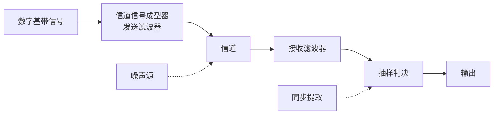

---
tags:
  - 通信原理
  - 通信原理/EP6
  - 数字基带
  - 期末速成
  - 课程笔记
---

# 通信原理 EP6 数字基带传输系统

> [!abstract] 本章定位
> 数字基带信号是不经载波调制、直接传输的数字信号（频谱从零频或低频开始）。本章重点：基带波形与码型、码间串扰的成因与消除、奈奎斯特第一准则、余弦滚降特性与频带利用率计算、眼图、均衡与部分响应技术。

| 小节 | 内容 | 重点 |
|------|------|:--:|
| 6.1 | 数字基带系统与基带信号波形 | 波形辨识 + 功率谱特征 |
| 6.2 | 基带传输常用码型 | HDB3 编码 |
| 6.3 | 系统模型与码间串扰 | 概念理解 + 数学推导 |
| 6.4 | 无码间串扰的基带传输特性 | 奈奎斯特第一准则 |
| 6.5 | 理想低通与余弦滚降 | 计算题来源 |
| 6.6 | 基带系统抗噪声性能 | 单/双极性对比 |
| 6.7 | 眼图 | 定性估计系统性能 |
| 6.8 | 均衡技术 | 时域均衡 + 迫零算法 |
| 6.9 | 部分响应技术 | 相关编码 + 第一类部分响应 |

## 数字基带系统与信号波形

### 数字基带信号

数字基带信号是信息码元序列的电脉冲表示，用数学表达式描述：

$$s(t) = \sum_{n=-\infty}^{\infty} a_n \cdot g(t - nT_b)$$

其中 $a_n$ 为第 $n$ 个码元的电平取值（二进制时取 $0/1$ 或 $-1/+1$），$T_b$ 为码元持续时间，$g(t)$ 为脉冲波形。

### 数字基带传输系统模型

由于是基带传输，**不含调制解调装置**，在信道中直接传输基带信号。



- **信道信号成型器（发送滤波器）**：将原始基带信号转化为适合信道传输的波形
- **接收滤波器**：滤除带外噪声，均衡信道特性
- **抽样判决**：对接收波形在特定时刻抽样，根据门限判定发送码元
- **同步提取**：提取用于抽样的定时脉冲

**传输实例**（以单极性非归零信号为例）：原始信号经码型变换使波形更适合信道传输 → 经信道传输后叠加噪声，产生失真 → 接收滤波平滑 → 抽样判决。若抽样值因噪声扰动导致正负反转，则发生错判（误码）。

### 常用脉冲波形

| 波形    | 特点            |
| ----- | ------------- |
| 矩形脉冲  | 最常用，频谱为 Sa 函数 |
| 三角脉冲  | 频谱为 Sa² 函数    |
| 高斯脉冲  | 时频域均为高斯形状     |
| 升余弦脉冲 | 拖尾衰减快         |

### 常见数字基带信号波形（六种）

以矩形脉冲为例：

| 波形 | 特点 |
|------|------|
| **单极性不归零**（NRZ） | 0→0 电平，1→+1 电平，占满 $T_b$。有直流，长连 1/0 时无同步信息 |
| **双极性不归零**（NRZ） | 0→-1 电平，1→+1 电平，占满 $T_b$。无直流，当 0/1 等概时无稳态分量 |
| **单极性归零**（RZ） | 1→+1 电平持续 $\tau$ 后归零。有直流，有定时分量 |
| **双极性归零**（RZ） | 1→+1 电平持续 $\tau$ 后归零，0→-1 电平持续 $\tau$ 后归零。无直流 |
| **差分波形** | 信息反映在相邻码元的**变化**上（变→1，不变→0），与电平绝对值无关 |
| **多电平波形** | 多进制，如 4 电平，每个码元携带 $\log_2 M$ 比特 |

不归零简称 NRZ，归零简称 RZ。占空比定义为 $\tau / T_b$。

### 二进制基带信号的功率谱密度

#### 分析思路

任意数字基带信号可分解为**稳态信号** $v(t)$ 和**交变信号** $u(t)$ 两部分。

- **稳态信号 $v(t)$**：确知的周期信号（周期 $T_b$），功率谱 $P_v(f)$ 为**离散谱**（一系列冲激，间隔 $f_b = 1/T_b$）
- **交变信号 $u(t)$**：功率型随机信号，功率谱 $P_u(f)$ 为**连续谱**

总功率谱 = 离散谱 + 连续谱。

设二进制基带信号中，码元以概率 $p$ 取脉冲 $g_1(t)$，以概率 $1-p$ 取脉冲 $g_2(t)$。$G_1(f)$ 和 $G_2(f)$ 分别为两者的傅里叶变换。

**双边功率谱密度**：

$$P_s(f) = f_b \cdot p(1-p)|G_1(f) - G_2(f)|^2 + \sum_{m=-\infty}^{\infty} |f_b[p G_1(mf_b) + (1-p)G_2(mf_b)]|^2 \cdot \delta(f - mf_b)$$

第一项为连续谱，第二项为离散谱。

**单边功率谱**：除直流（$m=0$）不乘 2 外，其余正频率部分均乘 2，限定在 $f \geq 0$。

#### 连续谱的性质

连续谱能否为零？只有当 $p=0$ 或 $p=1$（传确定信号，不再随机），或 $G_1(f) = G_2(f)$（两种脉冲波形完全相同）时连续谱才为零——实际中这两种情况都不会发生，因此**连续谱始终存在**。

#### 四种 NRZ/RZ 波形的功率谱特征（0/1 等概）

| 特征 | 说明 |
|------|------|
| 连续谱 | 始终存在，呈 Sa 函数形状 |
| 离散谱 | 可能存在，可能不存在 |
| 带宽（谱零点） | NRZ：$B = 1/T_b = R_B$；RZ（50% 占空比）：$B = 2/T_b = 2R_B$ |
| 直流分量 | 单极性波形有（$f=0$ 处有冲激），双极性波形无 |
| 定时分量 | **仅单极性归零波形**有（$f = R_B$ 处的离散谱线） |

> [!tip] 直观理解
> 单极性波形的均值不为零（有直流），双极性均值为零（无直流）。单极性归零每个码元内含有一个向下的跳变沿，可提取 $f = R_B$ 的定时信息；双极性归零中正负跳变沿等概抵消，无法提取定时分量。

## 基带传输常用码型

### 线路码选择原则

原始消息代码需经**码型变换**变为适合传输的线路码（传输码），目的是抑制低频和直流分量。六大选择原则：

1. **功率谱**：无直流分量、带宽受限、高低频分量少
2. **定时**：含与定时分量相关的离散谱，便于提取同步信息
3. **透明性**：码型变换与信源统计特性无关
4. **性能监测**：具有内在检错能力
5. **传输可靠性**：差错概率尽可能小
6. **设备复杂度**：编译码设备尽可能简单

### AMI 码（传号交替反转码）

编码规则：**1 交替编为 +1 和 -1，0 保持不变**。

例：原始序列 `1 0 1 1 0 0 0 1` → AMI：`+1 0 -1 +1 0 0 0 -1`

**特点**：无直流、高低频分量少；编译码电路简单；通过观察极性是否交替可判断误码。

**缺点**：长连零时电平不跳变，无法提取定时信息。

AMI 码是一种 **1B/1T 码**（1 位二进制 → 1 位三进制，取值 +1/0/-1）。

### HDB3 码（三阶高密度双极性码）

HDB3 码是对 AMI 码的改进，旨在解决长连零问题。

**编码规则**：

1. **连零不超过 3 个**：按 AMI 规则编码。
2. **连零达到 4 个**：用取代节 **000V** 代替 0000。其中 V 为**破坏脉冲**——极性与前一非零符号**相同**（违背了 AMI 极性交替规则，因此称为破坏脉冲）。
3. **相邻 V 码极性必须交替**。
4. 若两相邻 V 码之间有**偶数个**非零码（V 码也计入），则后一个 V 的极性与前一个非零符号极性相反，不满足规则 2 → 将后一个取代节改为 **B00V**。B 为**调节脉冲**，极性与前一非零符号极性**相反**。节内 B 与 V 同符号。
5. **V 码后的传号极性也要与 V 码相反**。

> [!warning] HDB3 编码是高频考点。口诀：先编 AMI → 找四连零分节 → 每节结尾写 V → V 前同 V 交替 → 不满足则添 B（节内 BV 同符号）→ V 后符号也相反。

> [!example] 例：HDB3 编码
> 原始序列 `1 0 0 0 0 1 1 0 0 0 0 1`
>
> AMI：`+1 0 0 0 0 -1 +1 0 0 0 0 -1`
>
> 编码过程（逐节处理，序列对齐）：
>
> ```
> 原始:   1  0  0  0  0  1  1  0  0  0  0  1
> AMI:   +1  0  0  0  0 -1 +1  0  0  0  0 -1
> 第1节: +1  0  0  0 +V -1 +1  0  0  0  0 -1   ← 前非零 +1 → V=+1
> 第2节: +1  0  0  0 +V -1 +1 -B  0  0 -V -1   ← 规则冲突 → B00V, B=-1, V=-1
> 最终:  +1  0  0  0 +V -1 +1 -B  0  0 -V +1   ← V后符号反转: 末尾 -1→+1
> ```
>
> 第一个 0000 → 取代为 000V，前一个非零是 +1 → V = +1。
>
> 第二个 0000 → 先判定是否需要 B00V。从上一个 V（+V）到第二个取代节之前，非零脉冲共有 **3 个**：+V、-1、+1。规则 2 要求第二 V 与前一非零（+1）同号 → 应为 +V；规则 3 要求相邻 V 交替（上一 V 为 +V）→ 应为 -V。**两规则直接冲突**，无法同时满足 → 改取代节为 B00V。
>
> 添 B：B 极性与前一非零（+1）相反 → B = -1；节内 BV 同符号 → V = -1：
>
> `+1 0 0 0 +V -1 +1 -B 0 0 -V -1`
>
> V 后符号也相反：+V 后的 -1 与 +V 相反 ✓；-V 后的 `-1` 与 -V **符号相同**，违反规则 → 将最后的 `-1` 翻转为 `+1`：
>
> 最终 HDB3：`+1 0 0 0 +V -1 +1 -B 0 0 -V +1`

### 其他常见码型

| 码型 | 特点 |
|------|------|
| **双向码**（曼彻斯特码） | 0→01（低-高），1→10（高-低），无直流，含丰富定时信息，带宽为 NRZ 的两倍 |
| **密勒码**（Miller） | 1→码元中心跳变，0→码元起始跳变（前一码元为 0 时） |
| **CMI 码** | 1→交替 00/11，0→01，常用于 PCM 四次群 |

## 系统模型与码间串扰

### 数字基带传输系统模型

输入用冲激串表示：$d(t) = \sum a_n \delta(t - nT_b)$

总传输特性：$H(\omega) = G_T(\omega) \cdot C(\omega) \cdot G_R(\omega)$，冲激响应 $h(t)$。

接收滤波器输出：

$$x(t) = \sum_{n} a_n h(t - nT_b) + n_R(t)$$

在 $t = kT_b + t_0$ 时刻抽样（$t_0$ 为信道和接收滤波器引入的固定时延，常令其为零）：

$$x(kT_b + t_0) = \underbrace{a_k h(t_0)}_{\text{本码元抽样值}} + \underbrace{\sum_{n \neq k} a_n h[(k-n)T_b + t_0]}_{\text{码间串扰（ISI）}} + \underbrace{n_R(kT_b + t_0)}_{\text{噪声}}$$

> [!info] 码间串扰（ISI — Inter-Symbol Interference）
> 因系统总特性不理想，前后码元的展宽拖尾延伸至当前抽样时刻，对当前码元的判决造成干扰。

### 码间串扰的直观认识

基带系统一般是频域有限系统。信号经过频带限制后，时域波形会展宽（时宽-带宽反比）。如果波形展宽超过 $T_b$，就会影响到相邻码元的抽样时刻。使基带传输获得足够小误码率的途径：**减小码间干扰 + 减小随机噪声**。

## 无码间串扰的基带传输特性

### 时域条件（奈奎斯特第一准则）

$$h(kT_b) = \begin{cases} 1, & k = 0 \\ 0, & k \neq 0 \end{cases}$$

本码元抽样时刻有值，其他码元抽样时刻恰好过零——即 $h(t)$ 在非零整数倍 $T_b$ 处过零。

### 频域条件

将 $H(\omega)$ 在 $\omega$ 轴上以 $\frac{2\pi}{T_b}$ 为间隔切开，分段平移到 $[-\frac{\pi}{T_b}, \frac{\pi}{T_b}]$ 内叠加，结果应为常数 $T_b$：

$$\sum_i H\left(\omega + \frac{2\pi i}{T_b}\right) = T_b, \quad |\omega| \leq \frac{\pi}{T_b}$$

以频率 $f$ 为横轴：以 $\frac{1}{T_b}$ 为间隔切开，平移到 $[-\frac{1}{2T_b}, \frac{1}{2T_b}]$ 内叠加为常数。

> [!warning] 核心条件
> $H(\omega)$ 在 $\pm\frac{\pi}{T_b}$ 处**奇对称**即可满足奈奎斯特第一准则。这是后续余弦滚降的理论基础。

### 奈奎斯特定则的直观用法

判断系统是否无 ISI 的方法：在频率轴上每隔 $1/T_b$（或 $2\pi/T_b$）画一条虚线，将各段频谱平移到中央区间叠加 → 叠加结果为常数则无 ISI，否则有 ISI。

## 理想低通与余弦滚降

### 理想低通特性

$$H(\omega) = \begin{cases} T_b, & |\omega| \leq \frac{\pi}{T_b} \\ 0, & \text{else} \end{cases}$$

| 参数 | 值 |
|------|:--:|
| 奈奎斯特带宽 $f_N$ | $\frac{1}{2T_b}$ |
| 奈奎斯特速率 $R_B$ | $\frac{1}{T_b} = 2f_N$ |
| 频带利用率 $\eta$ | $\frac{R_B}{B} = 2$ Baud/Hz |

理想低通的特点：能达到极限频带利用率 2 Baud/Hz。但时域 Sa 函数拖尾按 $1/t$ 衰减（收敛速度过慢），对定时要求极高，且物理不可实现。

### 余弦滚降特性

在理想低通基础上增加滚降段（$\alpha \in [0,1]$）：

| 参数 | 公式 |
|------|------|
| 带宽 | $B = (1 + \alpha)f_N = \frac{1+\alpha}{2T_b}$ |
| 频带利用率 | $\eta = \frac{R_B}{B} = \frac{2}{1+\alpha}$ Baud/Hz |

- $\alpha = 0$：退化为理想低通，$\eta = 2$，拖尾衰减慢
- $\alpha = 1$：升余弦特性，$\eta = 1$，拖尾按 $1/t^3$ 衰减
- $\alpha \in (0,1)$：余弦滚降，$1 < \eta < 2$

**$\alpha$ 的物理含义**：$\alpha$ 越大 → 滚降越平缓 → 带宽越大、频带利用率越低，但时域拖尾衰减越快、对定时要求越低。这是**有效性和可靠性的又一次折中**。

> [!tip] 注意
> $f_N = \frac{1}{2T_b}$ 专指理想低通的带宽，不能直接用于余弦滚降。余弦滚降带宽为 $(1+\alpha)f_N$。

### 无 ISI 传输的整数倍结论

若系统最大无码间串扰码元速率为 $R_{B\max}$，则以 $R_B = R_{B\max} / n$（$n$ 为正整数）传输时同样无 ISI；若 $n$ 不是整数，则有 ISI。

> [!example] 例：四种 $H(\omega)$ 的 ISI 判断
> 码速率 $2/T_b$ 波特。在 $\omega$ 轴上以 $\pm 2\pi/T_b$ 处画两条虚线，以此为平移区间边界。对以下四种频谱分别进行奈奎斯特平移叠加：
>
> | 频谱 | 形状特征 | 叠加结果 | 有无 ISI |
> |------|----------|----------|:---:|
> | a | 理想低通，截止于 $\pm \pi/T_b$ | 带宽不足，高频缺失 | **有** |
> | b | 理想低通，截止于 $\pm 2\pi/T_b$ | 平移到中央后叠加为常数 | 无（但物理不可实现） |
> | c | 阶梯/三角型，在 $\pm 2\pi/T_b$ 处平滑滚降 | 平移叠加后恰好补平为常数（奇对称互补） | **无** |
> | d | 矩形硬截止于 $\pm 2\pi/T_b$ | 平移后叠加出现凹陷/凸起，不为常数 | **有** |
>
> 只有 **c（阶梯形/三角型）** 既无 ISI 又物理可实现。

> [!example] 例：三种特性比较
> 以 $R_B = 10^3$ 波特传输，虚线在 $\pm\pi \times 10^3$ rad/s。给出 a、b、c 三种 $H(\omega)$ 特性：
>
> | 特性 | 形状 | 截止/过渡位置 | 带宽 |
> |------|------|--------------|------|
> | a | 梯形过渡 | 滚降段超出虚线 | 较宽 |
> | b | 理想矩形低通 | 恰好截止于 $\pm\pi \times 10^3$ | $f_N = 500$ Hz |
> | c | 三角/余弦滚降 | 在虚线处奇对称平滑过渡 | 介于 a、b 之间 |
>
> 经奈奎斯特平移叠加，**三种特性均能满足叠加为常数 → 均无 ISI**。但 b 是理想低通（矩形），物理不可实现，排除。在 a 与 c 中，**c 带宽最小 → 频带利用率最高**，故选择 c。

> [!example] 例：四电平余弦滚降
> 四电平 → 每码元 $\log_2 4 = 2$ bit。$R_b = 2400$ bps → $R_B = 1200$ 波特。
>
> $\alpha = 0.4$：$f_N = 600$ Hz，$B = 840$ Hz，$\eta = 1200/840 \approx 1.43$ Baud/Hz
>
> 若以 $R_b = 800$ bps → $R_B = 400$ 波特。$400 = 1200/3$（整数倍）→ 无 ISI。

> [!example] 例：给定 $H(f)$ 求最大波特率
> 虚线在 $\pm 2400$ Hz → $f_N = 2400$ Hz → $R_{B\max} = 2f_N = 4800$ 波特。
>
> 八电平信号 $R_b = 7200$ bps → $R_B = 7200/3 = 2400$。$2400 = 4800/2$（整数倍）→ 无 ISI。

> [!example] 例：多速率 ISI 判断
> $f_N = 3/(2T_b)$ → $R_{B\max} = 3/T_b$。
>
> $R_B = 1/T_b = R_{B\max}/3$ → 无 ISI；$2/T_b$ 不是整数倍 → 有 ISI；$3/T_b = R_{B\max}$ → 无 ISI。

## 基带系统抗噪声性能

抽样时刻的信号值为 $x = \pm A$（双极性）或 $x = A$ 或 $0$（单极性），叠加均值为 0、方差为 $\sigma_n^2$ 的高斯噪声。

**双极性**：判决门限为 0，两个电平间距 $2A$。**单极性**：判决门限为 $A/2$，间距仅 $A$。双极性比单极性抗噪声能力高 3dB（在相同 $A$ 下误码率更低）。

误码率公式（均含 $\frac{1}{2}\mathrm{erfc}(\cdot)$）：

| 系统 | 误码率 |
|------|------|
| 双极性 | $P_e = \frac{1}{2}\mathrm{erfc}\!\left(\frac{A}{\sqrt{2}\sigma_n}\right)$ |
| 单极性 | $P_e = \frac{1}{2}\mathrm{erfc}\!\left(\frac{A}{2\sqrt{2}\sigma_n}\right)$ |

$\mathrm{erfc}$ 是减函数，括号内数值越大误码率越低。双极性括号内为 $\frac{A}{\sqrt{2}\sigma_n}$，单极性为 $\frac{A}{2\sqrt{2}\sigma_n}$ → 双极性误码率更低。

## 眼图

在接收滤波器输出端接示波器，水平扫描周期设为码元周期 $T_b$。多个码元的扫描波形在窗口内重叠显现，形状似眼睛 → **眼图**。

### 眼图的定性作用

| 观察项 | 反映的性能 |
|------|------|
| **眼睛张开大小** | 码间干扰的强弱——越大越端正，ISI 越小 |
| **线条清晰度** | 噪声大小——线条越清晰，噪声越小 |

最佳眼图 = **单眼皮（噪声小）、大眼睛（ISI 小）**。

### 眼图模型参数

| 参数 | 含义 |
|------|------|
| **最佳抽样时刻** | 眼睛张开最大的时刻 |
| 斜率灵敏度 | 对定时误差的敏感程度——斜率越小越不敏感 |
| 噪声容限 | 眼睛张开高度的一半——反映抗噪声能力 |
| 过零点畸变 | 零点位置的偏移反映定时误差 |
| 判决门限电平 | 眼睛横轴位置 |

## 均衡技术

### 均衡的目的与思想

信道特性的变化以及收发滤波器的非理想特性，使系统难以直接满足无 ISI 条件。均衡就是在基带系统与抽样判决器之间**级联一个均衡器**，校正整个系统的传输特性，最终实现无 ISI 输出。

### 频域均衡

均衡器 $T(\omega)$ 与基带系统 $H(\omega)$ 级联后：
$$H'(\omega) = H(\omega) \cdot T(\omega)$$

使 $H'(\omega)$ 满足奈奎斯特第一准则（以 $2\pi/T_b$ 为周期平移叠加为常数）。

### 时域均衡

不直接校正频率特性，而是直接校正时域响应波形。均衡器的冲激响应为：

$$h_T(t) = \sum_{n=-\infty}^{\infty} C_n \delta(t - nT_b)$$

传递函数（傅里叶变换）：$T(\omega) = \sum C_n e^{-j\omega nT_b}$

均衡后的系统冲激响应在抽样时刻满足：

$$h'(kT_b) = \begin{cases} 1, & k = 0 \\ 0, & k \neq 0 \end{cases}$$

时域均衡器由**横向滤波器**（抽头延迟线结构）实现：$2N+1$ 个抽头，抽头系数 $C_n$ 通过算法确定。

### 迫零算法（最小峰值失真准则）

目标：使均衡后的 ISI 在 $k = \pm1, \pm2, \dots, \pm N$ 处为零。

通过求解 $2N+1$ 元线性方程组确定抽头系数 $C_n$。$N$ 越大 → 均衡效果越好、残留 ISI 越小，但复杂度越高。

## 部分响应技术

### 设计动机

|        |       理想低通       |        余弦滚降        |
| ------ | :--------------: | :----------------: |
| 频带利用率  | **最高**，2 Baud/Hz | 较低， $2/(1+\alpha)$ |
| 时域拖尾   |    衰减慢，$1/t$     |        衰减快         |
| 物理可实现性 |       不可实现       |        可实现         |

部分响应技术的目标：**同时达到 2 Baud/Hz 的频带利用率 + 快速的时域拖尾衰减 + 物理可实现。**

### 设计思想——相关编码

部分响应**有控制地**在某些抽样时刻引入**确知的**码间干扰（不是在所有时刻都无 ISI），接收端根据已知规则将引入的 ISI 剔除。因为只引入部分时刻（而非所有时刻）的 ISI → **部分响应**。

### 第一类部分响应系统

将严格的无 ISI 准则（仅 $k=0$ 处有值）放宽为：**$k=0$ 和 $k=1$ 处有值，其余时刻为零**。

实现方法：用两个间隔为 $T_b$ 的 Sa 函数叠加，合成波形：

$$h(t) = \mathrm{Sa}\!\left(\frac{\pi t}{T_b}\right) + \mathrm{Sa}\!\left(\frac{\pi(t - T_b)}{T_b}\right)$$

**频域**：对应的频谱为受限在 $f_N = \frac{1}{2T_b}$ 内的余弦形状——带宽 = 奈奎斯特带宽，频带利用率可达 2 Baud/Hz。

**时域**：拖尾按 $1/t^2$ 衰减（快于理想低通的 $1/t$）。

**编码运算**：$c_k = a_k + a_{k-1}$（当前码元 + 前一码元）。$c_k$ 可能的取值为 $0, \pm1, \pm2$（三电平）。

**接收端**：$a_k = c_k - a_{k-1}$（差分解码）。

**问题**：若一个 $a_k$ 判错，后续所有码元都会错——**差错传播**。

**解决方案——预编码**：发送端先将绝对码 $\{a_k\}$ 变为相对码 $\{b_k\}$（$b_k = a_k \oplus b_{k-1}$，模二加），再将相对码做相关编码传输。接收端只需进行模二判决 → 消除了差错传播。

## 本章小结

### 基本概念

| 知识点           | 要点                                                                             |
| ------------- | ------------------------------------------------------------------------------ |
| 基带信号数学表达      | $s(t) = \sum a_n g(t - nT_b)$                                                  |
| NRZ vs RZ     | NRZ 带宽 $=R_B$，RZ 带宽 $=2R_B$（50% 占空比）                                           |
| 功率谱 = 离散谱+连续谱 | 离散谱来自稳态信号，连续谱来自交变信号；<br>连续谱始终存在                                                |
| 直流/定时分量       | 单极性有直流；<br>仅单极性归零有定时分量（$f = R_B$ 处）                                            |
| AMI 码         | 1 交替为 $\pm1$，0 不变；<br>无直流但长连零失同步；<br>1B/1T 码                                   |
| HDB3 码        | 四连零→000V；<br>V 前同 V 交替；<br>不满足→B00V，节内 BV 同符号；<br>V 后符号也相反                         |
| 码间串扰（ISI）     | $H(\omega)$ 不理想 → 前后码元拖尾干扰当前抽样判决                                               |
| 奈奎斯特第一准则      | $H(\omega)$ 以 $2\pi/T_b$ 为周期平移叠加为常数 $\Leftrightarrow$ 无 ISI                    |
| 奈奎斯特带宽 $f_N$  | $= 1/(2T_b)$，仅指理想低通带宽                                                          |
| 余弦滚降          | $B = (1+\alpha)f_N$，$\eta = 2/(1+\alpha)$                                      |
| $\alpha$ 的折中  | $\alpha \uparrow$ → 带宽 $\uparrow$、$\eta \downarrow$，但拖尾衰减快、定时要求低               |
| 无 ISI 子速率     | $R_B = R_{B\max}/n$（$n$ 整数）→ 无 ISI                                             |
| 双极性 vs 单极性    | 双极性电平间距 $2A$ > 单极性 $A$ → 更抗噪声                                                  |
| 眼图            | 大眼睛=ISI 小，单眼皮（线条清晰）=噪声小；<br>最佳抽样时刻≈眼睛最张开处                                      |
| 均衡            | 级联均衡器校正系统特性；<br>频域均衡→满足奈奎斯特准则；<br>时域均衡→横向滤波器+迫零算法                              |
| 部分响应          | 有控引入确知 ISI → 同时获得 $\eta=2$ + 快速拖尾衰减；<br>第一类：$c_k = a_k + a_{k-1}$；<br>预编码防差错传播 |

### 核心公式

| 公式 | 说明 |
|------|------|
| $s(t) = \sum a_n g(t - nT_b)$ | 基带信号表达式 |
| $B_{\text{NRZ}} = R_B$，$B_{\text{RZ}} = 2R_B$ | 带宽 |
| $f_N = \frac{1}{2T_b}$ | 奈奎斯特带宽（理想低通） |
| $R_B = \frac{1}{T_b} = 2f_N$ | 奈奎斯特速率 |
| $B = (1+\alpha)f_N$ | 余弦滚降带宽 |
| $\eta = \frac{2}{1+\alpha}$ | 余弦滚降频带利用率（Baud/Hz） |
| $\sum H(\omega + 2\pi i/T_b) = T_b$ | 奈奎斯特第一准则（频域无 ISI 条件） |
| $x(kT_b) = a_k h_0 + \sum_{n\neq k} a_n h_{k-n} + n_k$ | 抽样值的三项分解 |
| $c_k = a_k + a_{k-1}$ | 第一类部分响应相关编码 |
| $b_k = a_k \oplus b_{k-1}$ | 预编码（模二加） |

### 注意事项

| 注意             | 说明                                                           |
| -------------- | ------------------------------------------------------------ |
| HDB3 编码        | 严格按口诀逐节处理，V 后符号也相反极易漏                                        |
| 奈奎斯特带宽         | 仅指理想低通带宽 $1/(2T_b)$，不用于余弦滚降                                  |
| $\omega$ 与 $f$ | 奈奎斯特定则平移间隔：角频率 $\frac{2\pi}{T_b}$，频率 $\frac{1}{T_b}$         |
| 频带利用率          | $\eta = R_B/B$，单位 Baud/Hz；<br>勿与 bps/Hz 混淆（差 $\log_2 M$ 倍）   |
| 最高无 ISI 速率     | $R_{B\max}$ 可通过，则 $R_{B\max}/n$（$n$ 整数）也可通过                  |
| 差错传播           | 部分响应差分解码存在差错传播问题，需预编码（模二加）消除                                 |
| 两种"奈奎斯特"       | 本章 $f_N = 1/(2T_b)$（基带无 ISI 带宽）≠ 信源编码中 $f_s \geq 2f_H$（抽样定理） |
