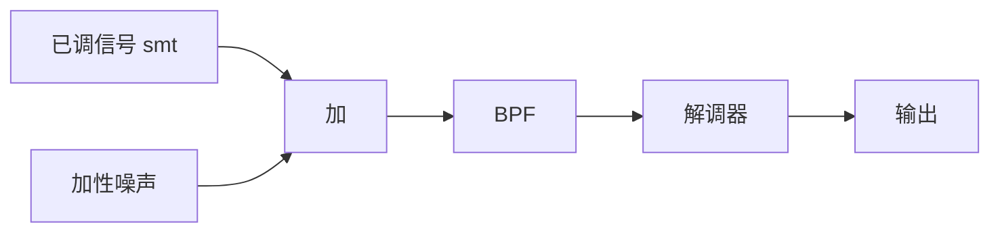

# 通信原理 EP5 模拟调制系统

> [!abstract] 本章定位
> 本章讨论模拟调制的原理和抗噪声性能。幅度调制四种（AM、DSB、SSB、VSB），角度调制两种（FM、PM），最后介绍频分复用。重点：各调制的表达式、带宽、功率、调制制度增益，以及卡森公式。

| 小节 | 内容 | 重点 |
|------|------|:--:|
| 5.1 | 模拟调制概述 | 定义、目的、分类 |
| 5.2 | 幅度调制原理与解调 | 表达式 + 带宽 + 功率计算 |
| 5.3 | 幅度调制抗噪声性能 | 调制制度增益 G |
| 5.4 | 角度调制原理 | 表达式 + 卡森带宽 + 功率 |
| 5.5 | 调频系统抗噪声性能 | 门限效应 |
| 5.6 | 频分复用 | 概念与框图 |

## 模拟调制概述

### 调制的定义与目的

**调制**：把消息信号寄托在载波的某个参数上，形成已调信号。**解调**是调制的逆过程——从已调信号中恢复消息信号。

**调制的四个目的**：

1. **匹配信道特性，减小天线尺寸**：天线尺寸 $h$ 一般要求 $\geq \lambda/10$。由 $c = \lambda f$，若 $f = 3000$ Hz，则 $\lambda = 10^5$ m，$h \geq 10^4$ m（不现实）。若提高到 $f = 900$ MHz，则 $\lambda \approx 0.33$ m → 天线尺寸降至厘米级。
2. **实现信道多路复用**：通过频谱搬移，将不同信号放到各自的频段内，提高信道利用率。
3. **扩展信号带宽，提高抗干扰能力**：如 FM 系统带宽大、抗干扰能力强。
4. **实现带宽与信噪比的互换**（有效性与可靠性的互换）。

### 调制的分类

| 分类依据 | 类别 |
|------|------|
| 按消息信号 $m(t)$ 类型 | 模拟调制 / 数字调制 |
| 按正弦载波的受调参量 | 幅度调制（AM）、频率调制（FM）、相位调制（PM） |
| 按已调信号频谱结构 | **线性调制**（频谱线性搬移）/ **非线性调制**（产生新频率分量） |
| 按载波类型 | 连续波调制 / 脉冲串调制 |

载波表达式：$c(t) = A\cos(\omega_c t + \varphi)$。用 $m(t)$ 控制 $A$ → 幅度调制；控制 $\omega_c$ → 频率调制（FM）；控制 $\varphi$ → 相位调制（PM）。FM 和 PM 统称**角度调制**——因为都表现为对 $\omega_c t + \varphi$ 这个"角度"整体的控制。

从波形上直观区分：**调幅**——$m(t)$ 蕴含在载波包络的变化中；**调频**——$m(t)$ 蕴含在载波频率（疏密程度）的变化中。

## 幅度调制（线性调制）

幅度调制中，已调信号的频谱是调制信号频谱的线性搬移，不产生新的频率分量。包括 AM、DSB、SSB、VSB 四种。

### AM 普通调幅

#### 原理与表达式

调制信号 $m(t)$ 先加直流偏置 $A_0$，再乘以载波：

$$s_{\text{AM}}(t) = [A_0 + m(t)]\cos\omega_c t = \underbrace{A_0\cos\omega_c t}_{\text{载波项}} + \underbrace{m(t)\cos\omega_c t}_{\text{边带项}}$$

**两个条件**：
1. $m(t)$ 的均值为零（无直流分量）
2. $A_0 \geq |m(t)|_{\max}$——**防止过调幅**

**调幅系数**：$a = \dfrac{|m(t)|_{\max}}{A_0} \leq 1$。$a = 1$ 时为满调幅（$A_0 = |m(t)|_{\max}$）；$a > 1$ 时为过调幅。

#### 时域波形与过调幅

直流偏置 $A_0$ 的作用是把 $m(t)$ 抬升到时间轴上方，再乘以有正有负的载波。当 $a \leq 1$ 时，包络与 $m(t)$ 成正比 → 可用包络检波。当 $a > 1$ 时，$A_0$ 不足以完全抬升，出现**载波反向点**（相位 180° 突变）→ 包络不再正比于 $m(t)$ → 不能包络检波。

#### 频谱与带宽

$$S_{\text{AM}}(\omega) = \pi A_0[\delta(\omega+\omega_c) + \delta(\omega-\omega_c)] + \frac{1}{2}[M(\omega+\omega_c) + M(\omega-\omega_c)]$$

- 载波分量：$\pm\omega_c$ 处的冲激
- 边带分量：$M(\omega)$ 左搬右搬，幅度减半
- 较高频率的边带 → **上边带（USB）**；较低频率的边带 → **下边带（LSB）**

$$B_{\text{AM}} = 2f_H$$

#### 功率与调制效率

载波功率：$P_c = \dfrac{A_0^2}{2}$（单位电阻）

边带功率：$P_s = \dfrac{1}{2}\overline{m^2(t)}$（推导利用倍角公式：$\cos^2\omega_c t = \frac{1}{2}(1+\cos2\omega_c t)$，$\cos2\omega_c t$ 项均值为零）

总功率：$P_{\text{AM}} = P_c + P_s$

调制效率：$\eta_{\text{AM}} = \dfrac{P_s}{P_c + P_s} = \dfrac{\overline{m^2(t)}}{A_0^2 + \overline{m^2(t)}}$

由 $A_0 \geq |m(t)|_{\max}$ 可证 $\eta_{\text{AM}} \leq 50\%$。载波分量不含信息却占用了大量功率——AM 效率很低。

**单音调制特例**：$m(t) = A_m\cos\omega_m t$，则 $\overline{m^2(t)} = A_m^2/2$，调幅系数 $a = A_m/A_0$。

$$\eta_{\text{AM}} = \frac{a^2}{2 + a^2}$$

满调幅（$a = 1$）时 $\eta_{\max} = 1/3$——单音满调幅的效率只到 33%。

边带功率与载波功率的关系：$P_s = \dfrac{1}{2}a^2 P_c$。

#### 解调：包络检波

仅 AM 可用。利用二极管 + RC 电路提取包络，再用隔直电容去掉 $A_0$ 得到 $m(t)$。条件是 $a \leq 1$（不过调幅）。

#### AM 信号总结

| 特点 | 说明 |
|------|------|
| 包络与 $m(t)$ 关系 | $a \leq 1$ 时成正比 → 可包络检波 |
| 带宽 | $B = 2f_H$ |
| 功率 | $P_c = A_0^2/2$，$P_s = \overline{m^2(t)}/2$ |
| 效率 | $\leq 50\%$，单音满调幅仅 $1/3$ |
| 优缺点 | 效率低但解调简单（包络检波） |

> [!example] 例：AM 信号综合计算
> $s_{\text{AM}}(t) = [5 + 2\cos(10^3\pi t)]\cos(6\pi \times 10^6 t)$
>
> **解**：
> - 未调载波：$5\cos(6\pi \times 10^6 t)$，$A_0 = 5$
> - 调制信号：$m(t) = 2\cos(10^3\pi t)$，$f_m = 500$ Hz
> - 载波频率：$\omega_c = 6\pi\times10^6$ → $f_c = 3$ MHz
> - 调幅系数：$a = 2/5 = 0.4$（$<1$，可包络检波）
> - $P_c = 25/2 = 12.5$ W，$P_s = (2^2/2)/2 = 1$ W
> - $P_{\text{AM}} = 13.5$ W，$\eta = 1/13.5 \approx 0.074$
> - 满调幅时 $\eta = 1/3$

> [!example] 例：AM 信号功率计算
> 发射 AM 信号，负载 50Ω。未调载波峰值 100V，载频 50kHz。用 1kHz 余弦调制，调制度 $a = 60\%$。
>
> **解**：$A_0 = 100$ V，$a = 0.6$ → $A_m = 60$ V
>
> $P_c = \dfrac{100^2}{2 \times 50} = 100$ W
>
> 边带功率（积化和差得幅度 30V 的上下边带各一个）：$P_s = 2 \times \dfrac{30^2}{2 \times 50} = 18$ W
>
> 总功率 $= 118$ W，$\eta = 18/118 \approx 15.3\%$

### DSB 抑制载波双边带

#### 原理

去掉 AM 中的直流偏置 $A_0$，直接传 $m(t)\cos\omega_c t$——抑制了不含信息的载波分量，因此又称 **DSB-SC**（DSB Suppressed Carrier）。

$$s_{\text{DSB}}(t) = m(t)\cos\omega_c t$$

#### 时域波形

无直流偏置 → $m(t)$ 的过零点处载波存在 180° 相位突变（**载波反向点**）→ 包络与 $m(t)$ **不成正比** → **不能**包络检波，必须相干解调。

#### 频谱与带宽

$$S_{\text{DSB}}(\omega) = \frac{1}{2}[M(\omega+\omega_c) + M(\omega-\omega_c)]$$

与 AM 比较：缺少 $\pm\omega_c$ 处的载波冲激，其余相同。$B_{\text{DSB}} = 2f_H$。

#### 功率与效率

$$P_{\text{DSB}} = P_s = \frac{1}{2}\overline{m^2(t)}$$

只含边带功率，不含载波功率 → $\eta = 100\%$。

**矛盾**：功率利用率高（100%），但解调复杂（必须相干解调）；AM 功率利用率低（$\leq 1/3$），但解调简单（包络检波）。

> [!example] 例：画出 AM 和 DSB 波形并比较包络检波结果
> 给 $m(t)$ 波形，画 AM（加 $A_0$ 抬升→包络正比于 $m(t)$→包络检波可恢复）和 DSB（直接乘载波→包络关于时间轴对称→包络检波输出为 $|m(t)|$，不是 $m(t)$）。

### SSB 单边带

DSB 的上下边带对称，信息相同，只传一个即可，带宽减半。

#### 滤波法

先产生 DSB 信号 $m(t)\cos\omega_c t$，再通过单边带滤波器：
- 取上边带（USB）→ 理想高通或带通滤波器（截止频率 $\omega_c$）
- 取下边带（LSB）→ 理想低通滤波器（截止频率 $\omega_c$）

**难点**：要求滤波器在 $\omega_c$ 处截止特性陡峭 → 理想特性物理不可实现 → 要求 $m(t)$ 在零频处近似为零（减少过渡带影响）。

#### 相移法

利用希尔伯特变换。从单频推广到一般情况：

**希尔伯特变换**：使信号所有频率分量相移 $-\pi/2$，幅度不变。
- 传递函数：$H(\omega) = -j\,\text{sgn}(\omega)$（正频率乘 $-j$、负频率乘 $+j$）
- 冲击响应：$h(t) = \dfrac{1}{\pi t}$

记 $m(t)$ 的希尔伯特变换为 $\hat{m}(t)$，则 $\cos\omega t$ 的希尔伯特变换为 $\sin\omega t$。

**SSB 时域表达式**：

$$s_{\text{SSB}}(t) = \frac{1}{2}m(t)\cos\omega_c t \mp \frac{1}{2}\hat{m}(t)\sin\omega_c t$$

其中：减号（$-$）→ 上边带（USB）；加号（$+$）→ 下边带（LSB）。

**相移法框图**：$m(t)$ 分两路——上路直接乘 $\cos\omega_c t$，下路经希尔伯特滤波器得 $\hat{m}(t)$ 后乘 $\sin\omega_c t$（载波相移 $-\pi/2$），两路相加（LSB）或相减（USB）。

#### 带宽与特点

$$B_{\text{SSB}} = f_H$$

| 优点 | 缺点 |
|------|------|
| 节省一半带宽 + 无载波功率浪费 | 滤波法：滤波器设计困难；相移法：希尔伯特滤波器设计困难 |
| 适用于频带拥挤场景（移动通信） | 必须相干解调 |

> [!example] 例：SSB 信号表达式与频谱
> $m(t) = \cos(2000\pi t) + \cos(4000\pi t)$，载波 $\cos(10^4\pi t)$。求 USB 和 LSB 信号并画频谱。
>
> **解**：希尔伯特变换：$\hat{m}(t) = \sin(2000\pi t) + \sin(4000\pi t)$
>
> USB（用减号）：代入 $s_{\text{USB}} = \frac{1}{2}m(t)\cos\omega_c t - \frac{1}{2}\hat{m}(t)\sin\omega_c t$
>
> 利用积化和差，化简得：$s_{\text{USB}}(t) = \frac{1}{2}\cos(12000\pi t) + \frac{1}{2}\cos(14000\pi t)$
>
> 频谱：$\pm 6000$ Hz 和 $\pm 7000$ Hz 处各有一条谱线（强度 $\pi/2$）。
>
> LSB（用加号）：$s_{\text{LSB}}(t) = \frac{1}{2}\cos(6000\pi t) + \frac{1}{2}\cos(8000\pi t)$
>
> 频谱：$\pm 3000$ Hz 和 $\pm 4000$ Hz 处各有一条谱线。

### VSB 残留边带

介于 DSB 和 SSB 之间——让一个边带的绝大部分通过，另一个边带残留一小部分，给滤波器设计一个过渡和折中，不需要理想陡峭截止。

$$s_{\text{VSB}}(t) = [m(t)\cos\omega_c t] * h_{\text{VSB}}(t)$$

$$S_{\text{VSB}}(\omega) = \frac{1}{2}[M(\omega+\omega_c) + M(\omega-\omega_c)] \cdot H_{\text{VSB}}(\omega)$$

**VSB 滤波器的条件**（通过分析相干解调的输出反推）：要使解调输出无失真地恢复 $m(t)$，需满足

$$H_{\text{VSB}}(\omega + \omega_c) + H_{\text{VSB}}(\omega - \omega_c) = \text{常数}, \quad |\omega| \leq \omega_H$$

即在 $\pm\omega_c$ 附近，滤波器的幅度响应呈**互补对称**（奇对称滚降）——这就允许滤波器有一个过渡带，不需要理想陡峭。

### 相干解调

适用于所有幅度调制（DSB、SSB、VSB 必须用，AM 也可用）。

**步骤**：已调信号 $\times \cos\omega_c t$（相干载波）→ 低通滤波（LPF）。

**原理**：乘 $\cos\omega_c t$ 相当于频谱再次左搬右搬——低频处恢复出 $\frac{1}{2}M(\omega)$，高频分量（$2\omega_c$）被 LPF 滤除。

**关键规律**：信号和噪声经 $\times\cos\omega_c t$ → LPF 后，只保留含 $\cos\omega_c t$ 项的包络，并乘 $1/2$：

| 输入 | 输出（LPF 后） |
|------|------|
| $m(t)\cos\omega_c t$（DSB） | $\frac{1}{2}m(t)$ |
| SSB 信号 | $\frac{1}{4}m(t)$ |
| 窄带噪声 $n_c\cos\omega_c t - n_s\sin\omega_c t$ | $\frac{1}{2}n_c(t)$ |

相干解调要求本地载波与发送载波**严格同频同相**。

## 幅度调制的抗噪声性能

### 分析模型

- 噪声：零均值高斯白噪声，双边功率谱密度 $n_0/2$
- BPF：带宽 = 已调信号带宽，中心频率 = 载频，起**传信滤噪**作用
- BPF 输出噪声变为窄带高斯噪声：$n_i(t) = n_c(t)\cos\omega_c t - n_s(t)\sin\omega_c t$，功率 $N_i = n_0 B$

**BPF 参数设定**：

| 调制方式 | BPF 带宽 | 中心频率 |
|------|------|------|
| AM / DSB | $2f_H$ | $f_c$ |
| SSB | $f_H$ | $f_c \pm f_H/2$（上/下边带） |
| FM | $2(m_f+1)f_m$（卡森公式） | $f_c$ |

**两个性能指标**：

$$\text{输出信噪比} = \frac{S_o}{N_o}, \quad \text{调制制度增益} \; G = \frac{S_o/N_o}{S_i/N_i}$$

**比较抗噪声性能的前提**：$S_i$ 相等、$n_0$ 相等、$f_H$ 相等。在此条件下，输出信噪比越高 → 抗噪声性能越强。

### DSB 相干解调性能

**信号部分**：$s_{\text{DSB}}(t) = m(t)\cos\omega_c t$，输入功率 $S_i = \frac{1}{2}\overline{m^2(t)}$。经 $\times\cos\omega_c t$ → LPF 后 $m_o(t) = \frac{1}{2}m(t)$，$S_o = \frac{1}{4}\overline{m^2(t)}$。

**噪声部分**：$N_i = n_0 B = 2n_0 f_H$。$n_i(t) \times \cos\omega_c t$ → LPF 后，正交分量 $\sin 2\omega_c t$ 项被滤除，只留下 $\frac{1}{2}n_c(t)$，$N_o = \frac{1}{4}N_i$。

$$G_{\text{DSB}} = \frac{S_o/N_o}{S_i/N_i} = 2$$

> [!info] 为什么 $G_{\text{DSB}} = 2$？
> 相干解调过程中，噪声的正交分量 $n_s(t)$ 被 LPF 滤除，信号无正交分量可被滤 → 信噪比改善一倍。

### SSB 相干解调性能

**信号部分**：$S_i = \frac{1}{4}\overline{m^2(t)}$（SSB 表达式中同相/正交分量功率相同，各占一半）。经相干解调后 $m_o(t) = \frac{1}{4}m(t)$，$S_o = \frac{1}{16}\overline{m^2(t)}$。

**噪声部分**：$N_i = n_0 f_H$（带宽为 DSB 的一半）。经相干解调后 $N_o = \frac{1}{4}N_i$（与 DSB 相同，正交分量被滤除）。

$$G_{\text{SSB}} = 1$$

> [!important] $G_{\text{DSB}} = 2$ 但 $G_{\text{SSB}} = 1$ 是否意味着DSB 抗噪声更强？
> **不！** 在 $S_i, n_0, f_H$ 相同的前提下：
> - DSB：$S_o/N_o = G_{\text{DSB}} \cdot \frac{S_i}{N_i} = 2 \cdot \frac{S_i}{2n_0 f_H} = \frac{S_i}{n_0 f_H}$
> - SSB：$S_o/N_o = G_{\text{SSB}} \cdot \frac{S_i}{N_i} = 1 \cdot \frac{S_i}{n_0 f_H} = \frac{S_i}{n_0 f_H}$
>
> **二者输出信噪比完全相同！** DSB 中信号和噪声的正交分量都被滤除（但信号本身无正交分量），SSB 中信号和噪声的正交分量都被滤除（SSB 信号本身确有正交分量）→ 最终效果一致。

### AM 包络检波性能（非相干解调）

包络检波是**非线性解调**——不能将信号和噪声分开处理。需要分析合成信号的包络，并分大/小信噪比讨论。

**大信噪比情形**（$A_0 + m(t) \gg$ 噪声包络）：用二项式近似 $\sqrt{1+x} \approx 1 + x/2$（$|x| \ll 1$），可证输出信号 $= m(t)$，输出噪声 $= n_c(t)$。

$$S_i = \frac{1}{2}A_0^2 + \frac{1}{2}\overline{m^2(t)}, \quad S_o = \overline{m^2(t)}, \quad N_o = N_i = n_0 B$$

$$G_{\text{AM}} = \frac{2\overline{m^2(t)}}{A_0^2 + \overline{m^2(t)}} < 1$$

**小信噪比情形**：信号包络远小于噪声包络时 → **门限效应**——输出信噪比急剧恶化，有用信号被噪声"淹没"。包络检波器在输入信噪比低于门限时无法正常工作。

> [!example] 例：DSB 系统，已知 $m(t)$ 功率谱求性能
> DSB 调制，接收端输入噪声为 $n_0/2$ 的高斯白噪声。$m(t)$ 功率谱在 $[-f_m, f_m]$ 呈三角形（$f=0$ 为 0，$f=\pm f_m$ 为 $\alpha$）。
>
> **解**：
> $S_i = \frac{1}{2}\overline{m^2(t)} = \frac{1}{2} \times 2 \times \frac{1}{2}f_m \alpha = \frac{1}{2}f_m\alpha$
>
> $S_o = \frac{1}{4}\overline{m^2(t)} = \frac{1}{4}f_m\alpha$
>
> $N_o = \frac{1}{4}n_0 B = \frac{1}{4}n_0 \cdot 2f_m = \frac{1}{2}n_0 f_m$
>
> $\dfrac{S_o}{N_o} = \dfrac{\alpha}{2n_0}$

> [!example] 例：DSB/SSB，已知输出 SNR 求发射功率
> 输出信噪比 $20\text{dB}$（即 $S_o/N_o = 100$），$N_o = 10^{-9}\text{W}$，发射到接收传输损耗 $100\text{dB}$（功率衰减 $10^{10}$ 倍）。
>
> **解**：
> **DSB**：$G=2$ → $S_i/N_i = 50$。$N_o = \frac{1}{4}N_i$ → $N_i = 4 \times 10^{-9}$。$S_i = 50 \times 4 \times 10^{-9} = 2 \times 10^{-7}$。发射功率 $= 2 \times 10^3\text{W}$。
>
> **SSB**：$G=1$ → $S_i/N_i = 100$。$S_i = 100 \times 4 \times 10^{-9} = 4 \times 10^{-7}$。发射功率 $= 4 \times 10^3\text{W}$。

> [!example] 例：AM 包络检波性能
> AM 系统，$m(t)$ 带宽 5kHz，载频 100kHz。解调输入端边带功率 1W，载波功率 4W。
>
> **解**：$B_{\text{AM}} = 10\text{kHz}$，$N_i = N_o = n_0 \times 10^4$
>
> $S_i = P_c + P_s = 5\text{W}$，$\frac{1}{2}\overline{m^2(t)} = P_s = 1$ → $\overline{m^2(t)} = 2$ W → $S_o = 2$ W
>
> $G = \dfrac{2/N_i}{5/N_i} = 0.4$

## 角度调制（非线性调制）

角度调制中，已调信号的频谱不再是原调制信号频谱的线性搬移，而是非线性变换——**产生新的频率分量**。包括 FM（调频）和 PM（调相）。

### 基本概念

给定正弦载波 $c(t) = A\cos(\omega_c t + \varphi_0)$，定义：

| 量 | 定义 | 单位 |
|------|------|------|
| **瞬时相位** | $\theta(t) = \omega_c t + \varphi(t)$ | rad |
| **瞬时相位偏移** | $\varphi(t)$（相对于 $\omega_c t$ 的偏移） | rad |
| **瞬时角频率** | $\omega(t) = \dfrac{d\theta(t)}{dt} = \omega_c + \dfrac{d\varphi(t)}{dt}$ | rad/s |
| **瞬时角频偏** | $\dfrac{d\varphi(t)}{dt}$ | rad/s |

**相位与频率的关系**：$\varphi(t) = \int \omega(t)\,dt$，$\omega(t) = \frac{d\varphi(t)}{dt}$。**调频必调相，调相必调频**——二者统称角度调制。

### PM 与 FM 的表达式

| | PM（调相） | FM（调频） |
|------|------|------|
| 控制关系 | $\varphi(t) = k_p \cdot m(t)$ | $\dfrac{d\varphi(t)}{dt} = k_f \cdot m(t)$ |
| 时域表达式 | $s_{\text{PM}}(t) = A\cos[\omega_c t + k_p m(t)]$ | $s_{\text{FM}}(t) = A\cos\!\left[\omega_c t + k_f\!\int_{-\infty}^t\! m(\tau)d\tau\right]$ |
| 常数 | $k_p$：相移常数（rad/V） | $k_f$：频偏常数 |

> [!warning] $k_f$ 的单位辨析
> - 若 $k_f$ 单位是 **rad/s/V**：$\frac{d\varphi}{dt} = k_f \cdot m(t)$，FM 表达式为 $A\cos[\omega_c t + k_f\int m(\tau)d\tau]$
> - 若 $k_f$ 单位是 **Hz/V**：$\Delta f = k_f \cdot m(t)$（频率偏移），则需乘 $2\pi$ 转为角频率 → FM 表达式为 $A\cos[\omega_c t + 2\pi k_f\int m(\tau)d\tau]$
>
> 做题时先看清 $k_f$ 的单位。

**FM 与 PM 的关系**：
- $m(t)$ 先**积分**再做 PM → FM（间接调频）
- $m(t)$ 先**微分**再做 FM → PM（间接调相）

如果预先不知道 $m(t)$ 的表达式，仅从已调波形**无法区分**是 FM 还是 PM。

### 单音调频

$m(t) = A_m\cos\omega_m t$ 时：

瞬时角频偏：$\frac{d\varphi}{dt} = k_f A_m\cos\omega_m t$

**最大角频偏**：$\Delta\omega = k_f A_m$，**最大频偏**：$\Delta f_{\max} = \dfrac{k_f A_m}{2\pi}$

瞬时相位偏移（积分）：$\varphi(t) = \dfrac{k_f A_m}{\omega_m}\sin\omega_m t$

**调频指数（最大相偏）**：$m_f = \dfrac{k_f A_m}{\omega_m} = \dfrac{\Delta f_{\max}}{f_m}$

FM 信号表达式：$s_{\text{FM}}(t) = A\cos[\omega_c t + m_f\sin\omega_m t]$

### 窄带调频（NBFM）

当 $|k_f\int m(\tau)d\tau| \ll \frac{\pi}{6}$（约 0.5 rad）时：

利用 $\cos x \approx 1$、$\sin x \approx x$ 近似：
$$s_{\text{NBFM}}(t) \approx A\cos\omega_c t - A\left[k_f\!\int\! m(\tau)d\tau\right]\sin\omega_c t$$

**NBFM 与 AM 的频谱对比**：

| | AM | NBFM |
|------|------|------|
| 载波项 | 有，同相 | 有，同相 |
| 带宽 | $2f_H$ | $2f_H$（相同） |
| 边带特点 | 线性搬移，幅度无频率加权 | 有频率加权（分母有 $\omega \pm \omega_c$），下边带**反向** |
| 调制类型 | 线性调制 | **非线性调制**（产生新频率分量） |

**矢量图理解**：AM 的上下边频合成后只产生幅度变化（与载波同相）；NBFM 的下边频反向 → 上下边频合成后产生正交分量 → 既有幅度变化又有相位变化。但当 $m_f$ 很小时，幅度变化几乎可以忽略。

### 宽带调频（WBFM）

$m_f$ 不再远小于 1。以单音为例展开为贝塞尔函数级数：

$$s_{\text{FM}}(t) = A\sum_{n=-\infty}^{\infty} J_n(m_f)\cos[(\omega_c + n\omega_m)t]$$

- 频谱以 $f_c$ 为中心，两侧有**无数多对**边频分量
- 边频间隔为 $f_m$（调制信号频率）
- 各边频幅度正比于 $J_n(m_f)$（第一类 $n$ 阶贝塞尔函数）
- $J_{-n}(m_f) = (-1)^n J_n(m_f)$：$n$ 为奇数 → 奇对称，$n$ 为偶数 → 偶对称

### 卡森公式（FM 带宽）

虽然理论带宽无限，但 $J_n(m_f)$ 随 $n$ 增大而收敛。取 $n \leq m_f+1$ 的边频分量即可。

$$B_{\text{FM}} = 2(m_f + 1)f_m = 2(\Delta f_{\max} + f_m)$$

推广到任意带限调制信号（最高频率 $f_{\max}$）：
$$B_{\text{FM}} = 2(m_f + 1)f_{\max} = 2(\Delta f_{\max} + f_{\max})$$

**两种极端情况**：
- $m_f \ll 1$（窄带）：$B \approx 2f_{\max}$——与 AM 相同
- $m_f \gg 1$（宽带）：$B \approx 2\Delta f_{\max}$——带宽主要由最大频偏决定

> [!example] 调频广播：$\Delta f_{\max} = 75$ kHz，$f_m = 15$ kHz → $m_f = 5$，$B = 2(5+1) \times 15 = 180$ kHz

### FM 信号的功率分配

将 $s_{\text{FM}}(t)$ 展开为级数后，每个频率分量都是正弦波，功率为其幅度的平方除以 2。利用 $\sum J_n^2(m_f) = 1$：

$$P_{\text{FM}} = \frac{A^2}{2} = P_{\text{载波}}$$

**结论**：FM 信号的总平均功率等于未调载波功率。调制只改变功率在载波和各边频分量之间的**分配**（各边频分得多少取决于 $m_f$），不改变总功率。

### PM 相位调制

单音调制时：$m(t) = A_m\cos\omega_m t$

$$s_{\text{PM}}(t) = A\cos[\omega_c t + m_p\cos\omega_m t]$$

调相指数：$m_p = k_p A_m =$ 最大相偏

PM 带宽同样用卡森公式：$B_{\text{PM}} = 2(m_p + 1)f_m$。功率 $= A^2/2$。

> [!tip] 核心记忆
> FM 和 PM 的 $m_f$、$m_p$ 都表示**最大相位偏移**。看表达式：$\cos$ 里 $\sin$ 或 $\cos$ 前面的系数就是 $m$。若不知道 $m(t)$ 的具体形式，仅从已调波形无法区分 FM 和 PM。

> [!example] 例：角调波参数分析
> $u(t) = 10\cos[2\pi \times 10^6 t + 10\cos(2000\pi t)]$
>
> **解**：
> 瞬时相位：$\theta(t) = 2\pi\times10^6 t + 10\cos(2000\pi t)$
>
> 最大相偏：$m = 10$ 弧度
>
> 瞬时角频率（求导）：$\omega(t) = 2\pi\times10^6 - 20000\pi\sin(2000\pi t)$
>
> 最大角频偏 $= 20000\pi$ → $\Delta f_{\max} = 10000\text{ Hz} = 10\text{ kHz}$
>
> $f_m = 1000$ Hz，卡森带宽 $= 2(10+1) \times 1000 = 22$ kHz
>
> 功率：$P = 10^2/2 = 50$ W。不能确定是 FM 还是 PM。

> [!example] 例：FM 电路计算
> $k_f = 2\text{ kHz/V}$（Hz/V），$m(t) = 5\cos(2\pi\times10^3 t)$，载波 $2\cos(10\pi\times10^6 t)$。
>
> **解**：$k_f$ 单位为 Hz/V → 先转角频率：$k_f = 4000\pi$ rad/s/V
>
> 瞬时角频率：$\omega(t) = 10\pi\times10^6 + 4000\pi \times 5\cos(2\pi\times10^3 t)$
>
> $\Delta\omega_{\max} = 20000\pi$ → $\Delta f_{\max} = 10$ kHz
>
> $\varphi(t) = \int \Delta\omega\,dt = \frac{20000\pi}{2\pi\times10^3}\sin(2\pi\times10^3 t) = 10\sin(2\pi\times10^3 t)$
>
> $m_f = 10$，$B = 2(10+1)\times 1000 = 22$ kHz
>
> $s_{\text{FM}}(t) = 2\cos[10\pi\times10^6 t + 10\sin(2\pi\times10^3 t)]$

> [!example] 例：从瞬时频率反推 FM 表达式——参数变化分析
> 某单频调频波，振幅 10V，瞬时频率 $f(t) = 10^6 + 10^4\cos(2\pi \times 10^3 t)$ Hz。
>
> **(1) 写出 FM 表达式：**
>
> 瞬时角频率 $\omega(t) = 2\pi f(t) = 2\pi\times10^6 + 2\pi\times10^4\cos(2\pi\times10^3 t)$ rad/s
>
> 瞬时相位（积分）：$\theta(t) = \int\omega(t)dt = 2\pi\times10^6 t + \frac{2\pi\times10^4}{2\pi\times10^3}\sin(2\pi\times10^3 t)$
> $= 2\pi\times10^6 t + 10\sin(2\pi\times10^3 t)$
>
> $s_{\text{FM}}(t) = 10\cos[2\pi \times 10^6 t + 10\sin(2\pi \times 10^3 t)]$
>
> **(2) 最大频偏 $\Delta f_{\max} = 10$ kHz，$m_f = 10$，$B = 2(10+1)\times1000 = 22$ kHz。**
>
> **(3) 调制信号频率提高到 2000 Hz：**
> $\Delta f_{\max}$ 不变（频偏只取决于调制信号幅度，与频率无关）→ 仍为 10 kHz。
> $m_f = \frac{10\text{k}}{2000} = 5$（减半）。$B = 2(5+1)\times2000 = 24$ kHz。
>
> **FM 的特点**：$f_m$ 翻倍，带宽仅从 22k→24k（变化很小）——因为 $\Delta f_{\max} \gg f_m$ 时带宽主要由最大频偏决定。
>
> **(4) 峰值频偏加倍** → 调制信号幅度加倍。

> [!example] 例：从已调波反推调制信号——FM/PM 的 $k_f$/$k_p$ 单位换算
> $u(t) = 8\cos[2\pi\times10^6 t + 10\cos(2000\pi t)]$
>
> **(1) 求功率、最大相偏、最大频偏和带宽：**
>
> $P = 8^2/2 = 32$ W。最大相偏 $m = 10$ rad。
>
> 对相位偏移求导：$\frac{d}{dt}[10\cos(2000\pi t)] = -20000\pi\sin(2000\pi t)$
> → 最大角频偏 $\Delta\omega = 20000\pi$ → $\Delta f_{\max} = 10$ kHz。
>
> $f_m = \frac{2000\pi}{2\pi} = 1000$ Hz，$m = \frac{10\text{k}}{1000} = 10$，$B = 2(10+1)\times1000 = 22$ kHz。
>
> **(2) 仅从表达式无法判断是 FM 还是 PM。**
>
> **(3) 若是 FM 信号，且 $k_f = 2000$ Hz/V：**
>
> 由 $\frac{d\varphi}{dt} = 2\pi k_f \cdot m(t)$（$k_f$ 单位 Hz/V 须乘 $2\pi$），又 $\frac{d\varphi}{dt} = -20000\pi\sin(2000\pi t)$：
> $4000\pi \cdot m(t) = -20000\pi\sin(2000\pi t) \Rightarrow m(t) = -5\sin(2000\pi t)$
>
> **(4) 若是 PM 信号，且 $k_p = 4$ rad/V：**
>
> 由 $\varphi(t) = k_p \cdot m(t)$，又 $\varphi(t) = 10\cos(2000\pi t)$：
> $4 \cdot m(t) = 10\cos(2000\pi t) \Rightarrow m(t) = 2.5\cos(2000\pi t)$

## 调频系统的抗噪声性能

FM 采用**鉴频器**解调——非相干解调，也是非线性解调。

**大信噪比时**：
$$G_{\text{FM}} = 3m_f^2(m_f+1)$$

如 $m_f = 10$ 时 $G \approx 3300$——FM 是所有模拟调制中抗噪声性能最好的。代价是占用带宽大（以带宽换信噪比）。

**小信噪比时**出现**门限效应**：输入信噪比低于某个门限值时，输出信噪比急剧恶化。本质原因是鉴频器的非线性——噪声尖峰导致鉴频器输出出现"咔嗒"声。

> [!info] 门限效应
> 当解调器输入信噪比低于一定门限时，输出信噪比急剧恶化的现象。由鉴频器的非线性引起。门限效应也存在于 AM 包络检波中。

### 模拟调制系统性能对比

在 $S_i, n_0, f_H$ 相同的前提下：

| 调制方式            |      带宽       |   $G$   | 输出 SNR   | 解调方式     |
| --------------- | :-----------: | :-----: | -------- | -------- |
| AM              |    $2f_H$     |  $<1$   | 最低       | 包络检波     |
| DSB             |    $2f_H$     |   $2$   | 中等       | 相干解调     |
| SSB             |     $f_H$     |   $1$   | 与 DSB 相同 | 相干解调     |
| FM（$m_f \gg 1$） | $2(m_f+1)f_H$ | $\gg 1$ | 最高       | 鉴频器（非相干） |

## 频分复用（FDM）

### 复用的概念

当一条物理信道的传输能力高于一路信号的需求时，可让信道被多路信号共享——**复用**。目的：充分利用信道频带或时间资源，提高信道利用率。

| 复用方式 | 划分依据 | 主要应用 |
|------|------|------|
| **FDM**（频分复用） | 按频率划分 | 模拟信号多路传输 |
| **TDM**（时分复用） | 按时间划分 | 数字信号多路传输 |

### FDM 原理

将信道带宽划分为多个**互不重叠**的频段（子信道），各路信号占据各自的子信道。子信道之间设有**防护频带**（保护间隔），防止信号重叠。

**FDM 系统框图**：
1. 发送端：$N$ 路信号 → 各经 LPF（限制最高频率，抗混叠）→ 分别调制到不同载频 $f_{c1}, f_{c2}, \dots, f_{cN}$ → 经 BPF → 合并送入信道
2. 接收端：用一组中心频率不同的 BPF 分离各路信号 → 分别解调 → 恢复 $N$ 路信号

## 本章小结

### 基本概念

| 知识点              | 要点                                                            |
| ---------------- | ------------------------------------------------------------- |
| 调制分类             | 幅度调制（线性：AM/DSB/SSB/VSB）+ 角度调制（非线性：FM/PM）                      |
| AM               | $[A_0+m(t)]\cos\omega_c t$，$B=2f_H$，效率 $\leq 1/3$（单音满调幅），包络检波 |
| DSB              | $m(t)\cos\omega_c t$，$B=2f_H$，效率 100%，必须相干解调                  |
| SSB              | 单边带，$B=f_H$，滤波法/相移法（希尔伯特变换），相干解调                              |
| VSB              | 介于 DSB 和 SSB 之间，$H(\omega+\omega_c)+H(\omega-\omega_c)=C$     |
| 相干解调             | $\times\cos\omega_c t$ → LPF：信号和噪声各留含 $\cos$ 项的包络乘 $1/2$      |
| $G_{\text{DSB}}$ | $=2$（噪声正交分量被滤除）                                               |
| $G_{\text{SSB}}$ | $=1$（信号和噪声的正交分量均被滤除）                                          |
| DSB vs SSB       | $G$ 不同但输出 SNR 相同（SSB 输入 $S_i$ 和 $N_i$ 都减半）                    |
| FM/PM            | 调频/调相统称角度调制；$m_f=\Delta f_{\max}/f_m$ = 最大相偏                  |
| 卡森公式             | $B = 2(m+1)f_m = 2(\Delta f_{\max} + f_m)$                    |
| FM 功率            | $P = A^2/2$，等于载波功率，不随调制改变                                     |
| 门限效应             | 输入 SNR 低于门限 → 输出 SNR 急剧恶化（AM 包络检波和 FM 鉴频器均有）                  |
| $G_{\text{FM}}$  | $= 3m_f^2(m_f+1)$，大信噪比时远大于 1                                  |
| FDM              | 按频率划分信道，子信道间设防护频带； 发送端调制搬移，接收端 BPF 分离                      |

### 核心公式

| 公式 | 说明 |
|------|------|
| $s_{\text{AM}} = [A_0 + m(t)]\cos\omega_c t$ | AM 表达式 |
| $\eta_{\text{AM}} = \dfrac{\overline{m^2(t)}}{A_0^2 + \overline{m^2(t)}} \leq 50\%$ | AM 调制效率 |
| $s_{\text{DSB}} = m(t)\cos\omega_c t$ | DSB 表达式 |
| $s_{\text{SSB}} = \frac{1}{2}m(t)\cos\omega_c t \mp \frac{1}{2}\hat{m}(t)\sin\omega_c t$ | SSB 表达式（$-$ USB，$+$ LSB） |
| $B_{\text{AM}} = B_{\text{DSB}} = 2f_H$，$B_{\text{SSB}} = f_H$ | 幅度调制带宽 |
| $G_{\text{DSB}} = 2$，$G_{\text{SSB}} = 1$ | 幅度调制制度增益 |
| $\omega(t) = d\theta(t)/dt$ | 瞬时角频率 = 相位导数 |
| $\Delta f_{\max} = k_f A_m$（$k_f$ 单位 rad/s/V） | 最大频偏 |
| $m_f = \Delta f_{\max} / f_m$ | 调频指数 = 最大相偏 |
| $B = 2(m+1)f_m$ | 卡森公式 |
| $P = A^2/2$ | 角度调制功率 |
| $G_{\text{FM}} = 3m_f^2(m_f+1)$ | FM 制度增益（大 SNR） |

### 注意事项

| 注意 | 说明 |
|------|------|
| 功率计算除以电阻 | 题目给负载电阻时：$P = U^2/(2R)$ |
| $k_f$ 单位换算 | Hz/V 时，求瞬时角频率须乘 $2\pi$；rad/s/V 时直接使用 |
| $m_f$ 是最大相偏 | $\cos$ 括号里 $\sin$ 或 $\cos$ 前面的系数就是 $m$ |
| 卡森公式的 $f_m$ | 是基带信号最高频率，不是载波频率 |
| 相干解调规律 | 输入 × $\cos\omega_c t$ → LPF → 只留含 $\cos$ 项的包络，乘 $1/2$ |
| DSB vs SSB 比较 | 必须在 $S_i, n_0, f_H$ 相同的前提下比较输出 SNR |
| AM 过调幅 | $a > 1$ 时 $A_0 < \vert m(t)\vert_{\max}$，载波反向 → 不能包络检波 |
| 希尔伯特变换 | $H(\omega) = -j\,\text{sgn}(\omega)$，不改变幅度，全频带相移 $-\pi/2$ |
