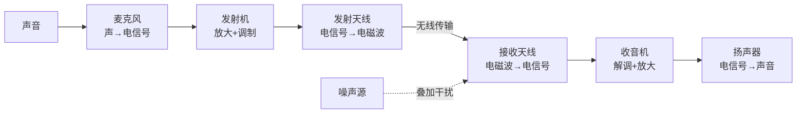
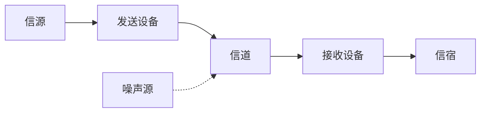
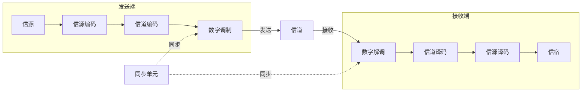

# 通信原理 EP1 绪论

> [!abstract] 课程概述
> 本课程共 11 章，面向期末考试重点和难点，精选习题并带做。需要的信号与系统、概率统计知识会在课程中穿插复习。主讲：张景浩。参考教材：《通信原理》第七版，樊昌信、曹丽娜主编，西安电子科技大学。

| 章节  | 内容        |
| --- | --------- |
| 1   | 绪论        |
| 2   | 确知信号      |
| 3   | 随机过程      |
| 4   | 信道        |
| 5   | 模拟调制系统    |
| 6   | 数字基带传输系统  |
| 7   | 数字带通传输系统  |
| 8   | 数字信号的最佳接收 |
| 9   | 信源编码      |
| 10  | 差错控制编码    |
| 11  | 同步原理      |

> [!note] 关于第 10、11 章
> 大多数学校期末考试只考到第 9 章。本笔记集对应视频课程同样仅覆盖第 1~9 章。第 10 章（差错控制编码）和第 11 章（同步原理）请根据各自学校教学大纲选择性学习。

## 通信的基本概念

通信的根本目的是传输信息。通信原理讨论的核心问题就是**如何有效而又可靠地传输信息**——即 **有效性** 和 **可靠性**，它们将在第三节作为性能指标正式登场，并贯穿全课始终。

### 从一个实例出发：调幅（AM）无线广播系统

在给出抽象定义之前，先用一个典型的通信系统——调幅广播——建立直观认知：

整个过程中，信息经历了 **四次形态转换**：声音 → 电信号 → 电磁波 → 电信号 → 声音。这就是通信系统的最基本面貌——它由**信源、发送设备、信道、接收设备、信宿**五大模块构成，外加无处不在的**噪声源**。

> [!info] 这是张景浩老师在课程开头用 AM 广播系统做的完整走读演示，目的是让大家在看任何框图之前先有一个"活的系统"的概念。

### 三个核心名词辨析

| 名词     | 定义           | 关键点             |
| ------ | ------------ | --------------- |
| **消息** | 通信系统所要传输的对象  | 文字、语音、图片等本身就是消息 |
| **信息** | 消息中蕴含的真正有效内容 | 只有人才能理解的具体含义    |
| **信号** | 消息的物理载体      | 声信号、电信号、光信号等    |

**三者关系**：
1. **信号是消息的传输载体**——消息只有负载在信号上才能传输。
2. **消息是信息的表现形式**——信息是抽象的，只能通过消息表现出来。
3. **信息是消息的内涵**——用信号传递消息，最终目的是获取信息。

> [!tip] 一句话概括
> **通信的目标 = 利用电信号传输消息中包含的信息。** 收端获得信息后，不确定性被消除——**通信的意义就是消除不确定性。**

**生活中的实例**：查看路况——听广播（声音信号）、看窗外（图像信号）、刷手机 APP（文字/图片消息）→ 这些消息帮你了解"路堵不堵"→ 最终获得的是关于出行路况的**信息**。你能感知到的永远是信号和消息层面的东西，信息才是最核心的内核。

> [!quote] 控制论创始人维纳
> 「信息就是信息，它不是物质，也不是能量。」——信息与物质、能量并称为三大要素。

### 消息的分类

消息分为两类，理解这个分类有助于后面区分模拟和数字通信：

| 类型 | 定义 | 例子 |
|------|------|------|
| **连续消息** | 取值在时间上连续变化 | 语音、温度、活动图片 |
| **离散消息** | 取值是有限个离散状态 | 计算机数据（0/1）、26 个字母、天气预报符号（晴/雨/雾） |

### 模拟信号 vs 数字信号

**核心判据**：看载荷消息的那个**信号参量**的取值是否**有限可数**。

- **模拟信号**：信号参量取值**连续**（无限多不可数）。
- **数字信号**：信号参量取值**离散**（有限个，可数）。

> [!warning] 关键：看研究的是哪个参量！
> 不一定只看幅度——幅度、频率、**相位**都可以是我们要研究的参量。

**四个典型例子**（课程重点辨析）：

| 波形 | 判断 | 原因 |
|------|:--:|------|
| 普通正弦波（时间连续、幅度连续） | 模拟 | 时间和幅度取值都连续 |
| 抽样序列（对正弦波采样后的离散点） | **仍是模拟** | 虽然时间上离散了，但幅度取值仍然是无限多的 |
| 二电平方波（只有高/低两种电平） | 数字 | 幅度只有两种离散取值 |
| 2PSK 信号（相位只有 0 和 π） | 数字 | **看的是相位！** 相位只有 0 和 π 两种离散取值 |

> [!tip] 2PSK 相位识别
> - 0 相位 →   sin 波（正半周先上后下）
> - π 相位 → -sin 波（负半周先下后上），即关于横轴对称

### 码元

**码元**是在一个码元周期内的独立符号波形，是数字通信系统中传输的**最小信号单元**。

> [!tip] 如何识别码元？
> 在时域波形图上找到不断重复出现的**最小波形单元**，即为一个码元。
> - **二进制码元**：波形有两种形状交替出现（如正脉冲代表 1，负脉冲代表 0）
> - **四进制码元**：波形有四种不同幅度或相位

- **码元周期** $T_b$：一个码元持续的时间长度，又称码元长度
- **几进制码元**：总共有几种最小信号单元就称为几进制码元
  - 2 种最小信号单元 → 二进制码元
  - 4 种最小信号单元 → 四进制码元
  - M 种最小信号单元 → M 进制码元

## 通信系统模型

### 一般模型

- **信源**：将消息转换为电信号发出。**信宿** ↔ **信宿** 对应关系（宿 = 宿主/接收者）。
- **发送设备**：将电信号转换为更适合在信道中传输的信号（编码、调制、放大等）。
- **信道**：物理媒质，分有线和无线，常引入噪声和衰落（第 4 章详讲）。
- **接收设备**：与发送设备功能互逆（解调、译码等）。
- **信宿**：将电信号还原为消息，**终极目标仍是获取信息**。

### 模拟通信系统模型

- 发射机：**调制** + **上变频**
- 接收机：**下变频** + **解调**

模拟通信系统传递的是**模拟波形**。信号变换路径：原始电信号 → **基带信号** → 调制 → **已调信号（带通信号）**。

> [!info] 调制本质上实现的是**频谱搬移**。基带信号和带通信号各会用一章的篇幅进行详细讲解（第 5~6 章）。

#### 简答题常考：为什么要调制和上变频？

1. **适宜天线设计**：天线长度通常取 λ/4。以 3kHz 人声为例，由 $c = \lambda f$ 知波长约 100km，天线需长达 25km，这显然不现实。调制将信号搬移到高频载波，λ 减小，天线尺寸随之大幅缩小。
2. **避免多路信号频率重叠干扰**：实现频分复用，提高频带利用率。

### 数字通信系统模型

数字通信的红框核心模块只有五个：**编码、解码、调制、解调、同步**。

#### 信源编码
1. **压缩去冗余** → 提高**有效性**（压缩编码）。类比：用抽气筒抽走被子里的空气再运输 —— 所需空间更小。
2. **模数转换**（A/D 转换）：Analog → Digital。

> [!example] 生活中的压缩编码
> 视频编码 H.264 → H.265 (HEVC)：同样画质下存储量大幅减小。图片格式 JPEG、PNG 也是同理——通过数据压缩去除冗余信息。

#### 信道编码
- 人为**加入冗余**（保护成分）→ 提高**可靠性**
- 又称**差错控制编码**，具有检错和纠错能力
- 本质：通过加冗余对抗信道噪声和干扰。类比：寄快递时多加几层包装——路上磕碰（干扰）的影响被缓冲吸收。

> [!tip] 去冗余 vs 加冗余 —— 矛盾吗？
> 不矛盾！信源编码去掉的是对通信目标**无用的冗余**（提高有效性）；信道编码加入的是对通信目标**有保护作用的冗余**（提高可靠性）。两者服务于不同的性能指标。

#### 数字调制与解调
- 把数字基带信号频谱搬移到高频，形成适合信道传输的带通信号
- 基本方式：
	- **ASK**：振幅键控
	- **FSK**：频移键控
	- **PSK**：相移键控
	- **DPSK**：差分相移键控
- 解调方式：**相干解调**、**非相干解调**

> [!info] 调制也可以提高抗噪声性能，这一点在后续章节会体现。

#### 同步单元
- 让收发两端信号在时间上保持步调一致
- 是数字通信系统有序、准确、可靠工作的**前提条件**

> [!tip] 为什么同步至关重要？
> 假设发送一串 10110001，接收端需要知道消息从哪儿开始——如果起始位置识别错了，整个消息就全错了。同步提供的就是这个"步调一致"的功能。

#### 加密与解密
- 出于安全性考虑，对数字信息进行加密处理后再传输

### 数字通信的特点

| 优点 | 缺点 |
|------|------|
| 抗干扰能力强 | 需要较大的传输带宽 |
| 传输差错可控 | 对同步要求高 |
| 便于处理、变换、存储 | |
| 便于多信源综合传输 | |
| 易于集成 | |
| 易于加密、保密性好 | |

#### 为什么数字通信抗干扰能力强？
关键在于数字通信**看的是状态而非波形**。二进制传"1"——不管波形是方是圆，只要识别出是"高电平"状态即可。而模拟通信看的是**波形的保真度**，失真就意味着信息损失。

#### 为什么数字通信需要较大带宽？

1. 数字信号本身是**矩形脉冲**，波形跳变陡峭 → 含丰富高频分量
2. 高速通信要求脉宽越来越窄 → **带宽 = 1/脉宽**，脉宽越小带宽越大

> [!warning] 必背公式：矩形脉冲的傅里叶变换
> 强度为 $E$、脉宽为 $\tau$ 的矩形脉冲，其傅里叶变换为：
> $$E\tau \cdot \mathrm{Sa}\left(\frac{\omega\tau}{2}\right)$$
> 其中 $\mathrm{Sa}(x) = \frac{\sin x}{x}$（采样函数）。

**带宽为什么是 $1/\tau$？** 推导如下：
1. Sa 函数的**第一个零点**出现在 $x = \pi$ 处（因为 $\sin\pi = 0$）
2. 令 $\frac{\omega\tau}{2} = \pi$，得角频率 $\omega = \frac{2\pi}{\tau}$
3. 用频率表示：$f = \frac{\omega}{2\pi} = \frac{1}{\tau}$（Hz）

这就是**带宽 = 1/脉宽**的来源——矩形脉冲频谱的第一个零点恰好落在 $f = 1/\tau$ 处。

> [!tip] 时宽-带宽反比
> $\tau$ 越小（脉冲越窄），频谱越展宽，高频分量越多。**时域越窄，频域越宽。** 这是傅里叶变换尺度性质的直接体现。

#### 低通信号 vs 带通信号

| 类型 | 频谱位置 | 带宽 |
|------|----------|------|
| 低通信号 | 集中在 y 轴（ω=0）附近 | 从 0 到第一个零点（或等效宽度） |
| 带通信号 | 不在 y 轴附近，两边对称 | 正频率部分的有效宽度 |

### 通信系统的分类

除了按模拟/数字分类外，还有多种分类维度：

| 分类依据 | 类别 |
|----------|------|
| 传输媒质 | 有线 / 无线 |
| 传输方式 | 基带 / 带通（各用一章详讲）|
| 通信业务 | 电话、数据传输、视频、图像 |
| 工作波段 | 长波、中波、短波、微波、红外、激光 |
| **复用方式** | **FDM**（频分）、**TDM**（时分）、**CDM**（码分）、**SDM**（空分）、**WDM**（波分） |

> [!info] 频分复用（FDM）直观理解
> 信号 1 的频谱位置较低，信号 2 的频谱位置较高，中间的空隙很小。通过调制将两路信号的频谱精确地"塞"到互不重叠的位置上，从而有效节省稀缺的带宽资源。

> [!note] 同一系统可属于多个分类
> 例如 AM 广播系统同时属于：中短波、模拟通信、带通传输系统。

## 通信方式

### 按消息传递方向与时间关系

| 方式 | 特点 | 例子 | 通俗理解 |
|------|------|------|----------|
| **单工** | 消息只能单方向传输 | 广播、遥控 | 单向广播，只听不说 |
| **半双工** | 双方都能收发，但不能同时 | 对讲机 | 我说完你回答，互相不插话 |
| **全双工** | 双方能同时收发 | 打电话 | 两个人吵架——你说你的，我说我的 |

### 按线路数量

| 方式       | 特点            | 优点           | 缺点          | 应用       |
| -------- | ------------- | ------------ | ----------- | -------- |
| **并行传输** | 多条线路同时传 n 个比特 | 速度快，节省时间     | 成本高，需 n 条线路 | 近距离，如打印机 |
| **串行传输** | 一条线路依次传       | 成本低，只需 1 条线路 | 速度慢，需外加同步措施 | 远距离通信    |

> [!info] 串行传输中的并/串转换
> 发送方：并行流 → **并串转换** → 串行流发出；
> 接收方：串行流 → **串并转换** → 恢复并行流。
> 同步措施用来确定消息的起始位置——从哪个比特开始才算第一个。

## 信息及其度量

信息是一个很抽象的概念。为了对抽象概念做**定量研究**，我们引入了信息量和信息熵。

### 为什么要引入信息量？

获取信息 = 消除不确定性。不确定性又与**事件发生的概率**有关。因此，信息量应该是事件发生概率的函数：$I = f(P)$。

### 自信息量需满足的四条性质

这些性质决定了 $f(P)$ 必须取什么形式：

| 性质 | 内容 | 生活例子 |
|------|------|----------|
| ① 单调递减 | $P$ 越大 → $I$ 越小（高概率事件信息量小）| "通信原理不太好学"——大家都知道，信息量小 |
| ② 极限为零 | $P=1$（确定事件）→ $I=0$ | "太阳东升西落"——废话文学，信息量为零 |
| ③ 极限为无穷 | $P \to 0$（几乎不可能）→ $I \to \infty$ | "买彩票中头奖"——极低概率，爆炸性新闻 |
| ④ 独立可加性 | 两独立事件联合信息量 = 各自信息量之和：$I(x_i, y_j) = I(x_i) + I(y_j)$ | — |

### 信息量公式

同时满足上述四条性质的函数只有**对数**（减函数 + 乘变加）：取概率倒数的对数。

$$I = \log_a \frac{1}{P} = -\log_a P$$

**记忆口诀**：信息量 = 事件发生概率的负对数。

> [!info] 为什么用对数？
> 两个独立事件同时发生，概率相乘，信息量应相加。**只有对数函数**能将乘变加：$-\log(P_A \cdot P_B) = -\log P_A - \log P_B$。

**概率越小 → 信息量越大**。$I = -\log_2 P$ 在 $P \in (0,1]$ 上的曲线从 $(1,0)$ 单调上升至 $(0, \infty)$：
- $P = 1$（必然事件，如"太阳从东方升起"）→ $I = 0$
- $P \to 0$（极端罕见）→ $I \to \infty$

### 信息量单位

| 底数 $a$ | 单位              | 由来           |
| ------ | --------------- | ------------ |
| 2      | **比特**（bit / b） | binary unit  |
| $e$    | 奈特（nat）         | natural unit |
| 10     | 哈特莱（hartley）    | 纪念哈特莱        |

 $a=2$ 时单位为**比特**，其余稍作了解。

### 对数换底公式

$$\log_2 x = \lg x \cdot \log_2 10 \approx 3.322 \times \lg x$$

> [!tip] 考场操作
> 计算器只能算 $\lg$ 时：先算 $\lg x$，再乘以 3.322，即为 $\log_2 x$ 的近似值。$\log_2 10 \approx 3.322$ 建议记住。

### 自信息量的物理意义

- **事件发生前**：自信息量描述的是该事件的**不确定性大小**——事件给我们多少不确定感，自信息量就是多少。
- **事件发生后**（理想信道，无损传输）：自信息量表示收到消息后**获得的信息量**——意味着**不确定度的消除**。

> [!info] 香农
> 信息量和熵的定义均出自香农（Shannon）1948 年的奠基性论文《通信的数学理论》。香农的贡献不限于信息论——他还是数字电路、密码学等多个领域的先驱。

> [!example] 例：等概二进制信息量
> 离散信源以等概发送二进制数字 0 和 1，求每个数字的信息量。
>
> **解**：$P(0) = P(1) = \frac{1}{2}$
> $$I = -\log_2 \frac{1}{2} = \log_2 2 = 1 \text{ bit}$$
>
> **引申**：
> - 等概四进制：$I = -\log_2 \frac{1}{4} = 2$ bit
> - 等概八进制：$I = -\log_2 \frac{1}{8} = 3$ bit
> - **一般结论**：等概 $M$ 进制码元的信息量 $I = \log_2 M$ 比特
>
> **重要推论**：信息量只看概率，不看符号的"主观含义"。只要概率相同，信息量就相同。

### 等概 M 进制码元的信息量

每个码元信息量：$I = \log_2 M$ 比特

| 进制 M | 每码元信息量 |
|--------|-------------|
| 2 | 1 bit |
| 4 | 2 bit |
| 8 | 3 bit |
| 16 | 4 bit |

### 信源熵

信源中不同符号的概率往往不一样——单独一个事件的信息量**不能代表整个信源**。需要统计平均。

**熵 = 自信息的统计平均（数学期望）**：

$$H(X) = \sum_{i=1}^{M} P(x_i) \cdot I(x_i) = -\sum_{i=1}^{M} P(x_i) \log_2 P(x_i)$$

- 单位：**比特/符号**（bit/symbol）
- 含义：信源中**平均**每个符号所蕴含的信息量
- 又称：信息熵、信源熵、香农熵、无条件熵、熵函数

> [!info] 为什么叫"熵"？
> 因为它的数学形式与量子力学中的冯·诺依曼熵一致。

> [!info] 重要结论
> **等概时熵最大。** 对于 $M$ 个符号的信源，最大熵 $H_{\max} = \log_2 M$。证明涉及詹森不等式。

> [!example] 例：非等概信源熵与总信息量的两种求法
> 离散信源由 $\{0, 1, 2, 3\}$ 四个符号组成（四进制信源），概率为 $P(0)=\frac{3}{8}, P(1)=\frac{1}{4}, P(2)=\frac{1}{4}, P(3)=\frac{1}{8}$。发一条消息共 57 个符号（包含 23 个 0、14 个 1、13 个 2、7 个 3），求整条消息的总信息量。
>
> **解**：
> **法一（精确法）**：利用信息量的独立可加性，分别统计各符号出现次数，乘各自信息量后求和。
> $$I_{\text{总}} = 23 \cdot I(0) + 14 \cdot I(1) + 13 \cdot I(2) + 7 \cdot I(3)$$
> $$= 23\left(-\log_2\frac{3}{8}\right) + 14\left(-\log_2\frac{1}{4}\right) + 13\left(-\log_2\frac{1}{4}\right) + 7\left(-\log_2\frac{1}{8}\right) = 108 \text{ bit}$$
>
> **法二（近似法）**：先求信源熵，再乘符号总数。
> $$H = -\frac{3}{8}\log_2\frac{3}{8} - \frac{1}{4}\log_2\frac{1}{4} - \frac{1}{4}\log_2\frac{1}{4} - \frac{1}{8}\log_2\frac{1}{8} \approx 1.906 \text{ 比特/符号}$$
> $$I_{\text{总}} \approx 57 \times 1.906 = 108.64 \text{ bit}$$
>
> 两种方法结果非常接近。不等概时 $H=1.906 < 2$（等概时的熵），验证了**等概时熵最大**。
>
> **建议**：如果题目给定了具体的概率分布和符号统计，用**法一**更精确；如果只给了熵或符号数很大，用**法二**更方便。当消息长度趋于无穷时，两法结果趋于一致。

> [!example] 例：最大信源熵
> 某离散信源由 8 个不同独立符号构成，求最大信源熵。
>
> **解**：等概时熵最大 → $H_{\max} = \log_2 8 = 3$ 比特/符号

### 码元传输速率 vs 信息传输速率

| 名称 | 符号 | 定义 | 单位 |
|------|------|------|------|
| 码元传输速率（传码率/波特率/符号率） | $R_B$ | 单位时间传输的码元个数 | **波特**（Baud）= 符号/秒 |
| 信息传输速率（传信率/比特率） | $R_b$ | 单位时间传输的信息量 | **比特/秒**（bps） |

$$R_B = \frac{1}{T_b}$$

> [!important] $R_B$ 的两条重要性质
> 1. $R_B$ **与进制数 M 无关**——不管是二进制还是四进制，每个码元是一个"符号"，符号数不变。
> 2. $R_B$ **与信源统计特性无关**——和概率分布无关。

**$R_B$ 与 $R_b$ 的关系**：

$$R_b = R_B \cdot H$$

其中 $H$ 为信源熵。这就是"比特率 = 符号率 × 熵"。

> [!tip] 单位消去法——验证公式是否用对
> 符号/秒 × 比特/符号 = 比特/秒 ✓。若单位对不上，公式必定用错。

**等概时**，$H = \log_2 M$，因此：
$$R_b = R_B \cdot \log_2 M \quad \text{（等概 M 进制）}$$

| 进制 | 等概时 $R_b$ vs $R_B$ |
|------|----------------------|
| 二进制 (M=2) | $R_b = R_B$（**数值碰巧相等，单位不同！**）|
| 四进制 (M=4) | $R_b = 2R_B$ |
| 八进制 (M=8) | $R_b = 3R_B$ |

> [!example] 例：码速率与信速率
> 二进制数字传输系统，每隔 0.4 ms 发一个码元。
>
> **(1)** 求信息速率。
>
> **解**：$T_b = 0.4\text{ms}$ → $R_B = \frac{1}{T_b} = 2500$ 波特。二进制每码元 1 bit → $R_b = 2500 \times 1 = 2500$ bps。
>
> **(2)** 改为 16 进制，码元间隔不变，求信息速率。
>
> **解**：$R_B = 2500$ 波特不变，16 进制每码元 $\log_2 16 = 4$ bit → $R_b = 2500 \times 4 = 10000$ bps。

> [!example] 例：非等概五进制，一小时信息量
> 信源符号集 $\{A, B, C, D, E\}$（五进制），各符号概率为 $P(A)=\frac{1}{4}, P(B)=\frac{1}{4}, P(C)=\frac{1}{4}, P(D)=\frac{1}{8}, P(E)=\frac{1}{8}$。每秒发送 1000 个符号。
>
> **解**：
> **(1)** 求信源熵：$H = -\sum_{i=1}^{5} P(x_i) \log_2 P(x_i) \approx 2.25$ 比特/符号。
>
> **(2)** 一小时传输的信息量：$I = R_b \times 3600 = (1000 \times 2.25) \times 3600 \approx 8.1 \times 10^6$ bit。
>
> **(3)** 若等概：$H = \log_2 5 \approx 2.322$ 比特/符号，总信息量 $\approx 8.36 \times 10^6$ bit。等概时 $2.322 > 2.25$，再次验证**等概时熵最大**。

> [!example] 例：混合进制（四进制码元用二进制编码传输）
> 符号集 $\{A, B, C, D\}$（四进制），用二进制码元编码：00 表示 A，01 表示 B，10 表示 C，11 表示 D。每个二进制码元宽度 5ms。
>
> > [!important] 先理清进制关系
> > 四进制码元 = {A, B, C, D} 四个整体；二进制编码 00、01、10、11 只是给这四个整体起的代号。**码元是整体，不是单个符号**——00 是一个码元，01 是一个码元，而非单个 0 或 1。
>
> **解**：每个四进制符号由 2 个二进制脉冲组成 → 每个四进制符号宽度 = 2 × 5ms = 10ms → $R_B = \frac{1}{10\text{ms}} = 100$ 波特。
>
> - 等概：$R_b = 100 \times \log_2 4 = 200$ bps
> - 不等概：先求信源熵 $H$，则 $R_b = 100 \times H$

> [!danger] 码元 vs 比特
> | | 码元（Symbol） | 比特（bit） |
> |------|------|------|
> | 本质 | 最小信号单元，是**电波形** | **信息量的单位**（概率的负对数） |
> | 单位 | 波特（Baud） | bit |
> | 关系 | M 进制码元携带 $\log_2 M$ 比特 | — |
>
> **工程上习惯将「一个二进制码元」称为「一比特」**，这是历史口头简称，本质不同。例如并行传输中「8 条线路同时发送 8 比特」——实际是 **8 个二进制码元**，因每个恰好携带 1 bit，故简称"8 比特"。二进制时数值碰巧相等；四进制时一个码元携带 2 bit，一个码元 ≠ 一比特。

> [!info] 码元概念贯穿全课程
> 码元是数字通信最基础的概念。在[[数字基带传输系统]]中讨论码元的波形与速率，在[[数字带通传输系统]]中讨论码元的调制方式，在[[信源编码]]中讨论码元的数字化编码（PCM）。

## 通信系统性能指标

任何通信系统的性能指标，归根结底就两个维度：**有效性** 和 **可靠性**。

### 有效性与可靠性的矛盾

> [!warning] 二者不可兼得，此消彼长
> 可靠性高 → 占用带宽大 → 有效性差；
> 有效性好 → 可靠性下降。
> 通信系统设计就是在这两者之间**折中（trade-off）**。

**一个具体的例子——信道编码中的矛盾**：设一个 $(n, k)$ 分组码，$k$ 个信息位加 $n-k$ 个校验位。

- 校验位增多 → 编码效率 $\eta = k/n$ **下降**（有效性变差）
- 但同时 → 纠错能力增强 → **可靠性提高**
- 反之，减少校验位可以提升效率，但保护能力减弱

> 这就是"牺牲有效性换取可靠性"的典型体现。反过来也可以牺牲可靠性换取有效性。

### 模拟通信 vs 数字通信的性能指标

| | 有效性指标 | 可靠性指标 |
|------|----------|----------|
| **模拟通信** | 传输带宽 | **输出信噪比** $S_o/N_o$ |
| **数字通信** | 码元速率 $R_B$、信息速率 $R_b$、**频带利用率** $\eta$ | **误码率** $P_e$、**误信率** $P_b$ |

> [!info] 模拟通信
> 在[[模拟调制系统]]一章会重点分析各调制方式的输出信噪比和抗噪声性能。

### 有效性：频带利用率

仅看 $R_B$ 或 $R_b$ 不够——数字通信带宽大是硬伤。需要将传输速率与带宽结合：

$$\eta_B = \frac{R_B}{B} \quad \text{（单位：Baud/Hz）}$$

$$\eta_b = \frac{R_b}{B} \quad \text{（单位：bps/Hz）}$$

两者的关系和 $R_B$ 与 $R_b$ 的关系一致：
$$\eta_b = \eta_B \cdot H \quad \text{；等概时 } \eta_b = \eta_B \cdot \log_2 M$$

### 可靠性：误码率 / 误信率

$$P_e = \frac{\text{错误码元数}}{\text{传输总码元数}} \quad \text{（误码率，又称误符号率）}$$

$$P_b = \frac{\text{错误比特数}}{\text{传输总比特数}} \quad \text{（误信率，又称误比特率）}$$

> [!important] 重要结论：多进制时 $P_e > P_b$
> - 二进制时：$P_e = P_b$（数值相等）
> - M > 2 时：**误码率一般大于误信率**。
>
> **直观理解**：八进制符号每符号由 3 位二进制组成。假设 9 个比特中错 1 个比特 → $P_b = 1/9$。但 9 个比特 = 3 个八进制符号 → 其中 1 个符号错 → $P_e = 1/3$。$1/3 > 1/9$，所以 $P_e > P_b$。

> [!example] 例：二进制系统综合计算
> 二进制数字传输系统，码长 $T_b = 0.1$ ms，等概独立出现。连续工作 30 分钟后，收到 18 个错码，且每个错码仅发生一比特错误。
>
> **解**：
> **(1)** $T_b = 0.1\text{ms} = 10^{-4}\text{s}$ → $R_B = \frac{1}{10^{-4}} = 10^4$ 波特。
>
> 二进制 → $R_b = R_B = 10^4$ bps（数值相等，**单位不同！**）。
>
> 总信息量 $= 10^4 \times 30 \times 60 = 1.8 \times 10^7$ bit。
>
> 总码元数 $= 10^4 \times 1800 = 1.8 \times 10^7$ 个。
>
> 误码率 $P_e = \frac{18}{1.8 \times 10^7} = 10^{-6}$。
>
> 误信率 $P_b = \frac{18}{1.8 \times 10^7} = 10^{-6}$（二进制时两者碰巧相等）。
>
> **(2)** 改为**四进制**系统，码长不变：
>
> $R_B = 10^4$ 波特不变（与进制数无关！）
>
> $R_b = 10^4 \times \log_2 4 = 2 \times 10^4$ bps。
>
> 总信息量 $= 2 \times 10^4 \times 1800 = 3.6 \times 10^7$ bit。
>
> 总码元数 $= 10^4 \times 1800 = 1.8 \times 10^7$（不变）。
>
> $P_e = \frac{18}{1.8 \times 10^7} = 10^{-6}$（不变——误码率和进制无关）。
>
> $P_b = \frac{18}{3.6 \times 10^7} = 5 \times 10^{-7}$（误信率降低了——总比特数翻倍而错误比特数不变）。
>
> 验证了 $P_e = 10^{-6} > 5 \times 10^{-7} = P_b$（多进制时误码率 > 误信率）。

> [!example] 例：字母编码求信息速率
> 信源符号集 $\{A, B, C, D\}$，每字母用 2 个二进制码元编码（00=A, 01=B, 10=C, 11=D），每个二进制码元宽度 5ms。
>
> **解**：
> 每个四进制符号 = 2 个二进制码元 → 符号宽度 $= 2 \times 5\text{ms} = 10\text{ms} = 0.01\text{s}$。
>
> $R_B = \frac{1}{0.01} = 100$ 波特。
>
> **(1) 等概出现**：$R_b = 100 \times \log_2 4 = 200$ bps。
>
> **(2) 不等概**：$P(A)=\frac{1}{5}, P(B)=\frac{1}{4}, P(C)=\frac{1}{4}, P(D)=\frac{3}{10}$。
>
> 先求熵：
> $$H = -\frac{1}{5}\log_2\frac{1}{5} - \frac{1}{4}\log_2\frac{1}{4} - \frac{1}{4}\log_2\frac{1}{4} - \frac{3}{10}\log_2\frac{3}{10} \approx 1.984 \text{ 比特/符号}$$
>
> $R_b = 100 \times 1.984 = 198.4$ bps。
>
> 不等概时 $H = 1.984 < 2 = \log_2 4$，再次验证**等概时熵最大**。

> [!example] 例：四进制系统误码率
> 某四进制数字传输系统，信息速率 $R_b = 2400$ bps。接收端在 0.5 小时内共收到 216 个错误码元，求误码率 $P_e$。
>
> **解**：四进制 → 每码元 $\log_2 4 = 2$ bit。
>
> 码元速率 $R_B = \frac{R_b}{\log_2 4} = \frac{2400}{2} = 1200$ 波特。
>
> 0.5 小时 $= 1800$ 秒 → 传输总码元数 $= 1200 \times 1800 = 2.16 \times 10^6$。
>
> $$P_e = \frac{216}{2.16 \times 10^6} = 1 \times 10^{-4}$$

## 本章小结

### 基本概念

| 知识点 | 要点 |
|--------|------|
| 消息 / 信息 / 信号 | 消息是物理表现形式，信息是内涵，信号是传输载体。通信目标 = 利用电信号传输消息中包含的信息 |
| 自信息量四条性质 | ① $P$↑→$I$↓ ② $P=1$→$I=0$ ③ $P\to0$→$I\to\infty$ ④ 独立可加：$I(x_i,y_j)=I(x_i)+I(y_j)$ |
| 模拟信号 vs 数字信号 | 参量取值是否有限——无限连续为模拟，有限离散为数字。**关键看研究的是哪个参量**（幅度/频率/相位）|
| 码元 | 数字通信的最小信号单元；一个 $M$ 进制码元携带 $\log_2 M$ 比特信息；$R_B$ 与进制数 $M$ 无关 |
| 通信系统五大模块 | 信源 → 发送设备 → 信道 → 接收设备 → 信宿，外加噪声源 |
| 数字通信五大环节 | 信源编码 + 信道编码 + 调制 + 解调 + 同步（加密/解密可选）|
| 调制两大目的 | ① 适宜天线设计（减小尺寸）② 实现频分复用，避免频率重叠 |
| 单工/半双工/全双工 | 单向 / 双向不同时 / 双向同时 |
| 并行 vs 串行传输 | 并行快但贵（近距离），串行慢但便宜（远距离，需同步）|
| 有效性与可靠性的矛盾 | 此消彼长，通信设计 = 折中。信道编码加冗余 → 可靠性↑ 有效性↓ |

### 核心公式

| 公式 | 说明 |
|------|------|
| $I = -\log_2 P$ | 信息量 = 概率的负对数；等概时熵最大 |
| $H = -\sum P(x_i) \log_2 P(x_i)$ | 信源熵（平均信息量），单位：比特/符号 |
| $H_{\max} = \log_2 M$ | 等概时熵最大（$M$ 个符号） |
| $\log_2 x = \lg x \times \log_2 10 \approx 3.322 \lg x$ | 对数换底（考场必备） |
| $E\tau \cdot \mathrm{Sa}\left(\frac{\omega\tau}{2}\right)$ | 矩形脉冲的傅里叶变换（必背） |
| 带宽 $= \frac{1}{\tau}$ | 脉宽越窄，带宽越大 |
| $R_B = \frac{1}{T_b}$ | 传码率（波特），与进制数无关 |
| $R_b = R_B \cdot H$ | 传信率（bps），一般公式 |
| $R_b = R_B \cdot \log_2 M$ | 传信率，仅等概时成立 |
| $\eta = \frac{R_B}{B}$ 或 $\frac{R_b}{B}$ | 频带利用率（有效性） |
| $P_e = \frac{\text{错误码元数}}{\text{总码元数}}$ | 误码率（可靠性） |
| $P_b = \frac{\text{错误比特数}}{\text{总比特数}}$ | 误信率 |

### 考试注意

| 注意 | 说明 |
|------|------|
| **单位换算** | $T_b$ 常以 ms 给出，代入 $R_B = 1/T_b$ 前须转为**秒** |
| **等概条件** | $R_b = R_B \cdot \log_2 M$ 仅等概时成立，不等概须用 $R_b = R_B \cdot H$ |
| **码元 ≠ 比特** | 二进制时数值碰巧相等，四进制及以上不相等 |
| **$R_B$ 与 $M$ 无关** | 改变进制数，$R_B$ 不变，$R_b$ 变 |
| **误码率 vs 误信率** | M > 2 时，$P_e > P_b$；二进制时相等 |
| **自信息性质** | 简答题可能考：列出自信息的四条性质 |
| **换底公式** | $\log_2 10 \approx 3.322$ 记住，考场计算器只有 lg 时救命 |
| **调制的两个目的** | 简答题高频考点：天线设计 + 频分复用 |
