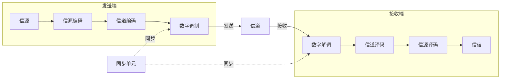

---
tags:
  - 通信原理
  - 绪论
  - 期末速成
  - 课程笔记
---
# 通信原理 EP1 绪论

> [!abstract] 课程概述
> 本课程共 11 章，面向期末考试重点和难点，精选习题并带做。需要的信号与系统、概率统计知识会在课程中穿插复习。

| 章节  | 内容            |
| --- | ------------- |
| 1   | 绪论            |
| 2   | 确知信号（信号与系统复习） |
| 3   | 随机过程          |
| 4   | 信道            |
| 5   | 模拟调制系统        |
| 6   | 数字基带传输系统      |
| 7   | 数字带通传输系统      |
| 8   | 数字信号的最佳接收     |
| 9   | 信源编码          |
| 10  | 差错控制编码（信道编码）  |
| 11  | 同步原理          |

## 通信的基本概念

通信的根本目的是传输信息。通信原理讨论的核心问题就是**如何有效而又可靠地传输信息**——即 **有效性** 和 **可靠性**，它们将在 1.5 节作为性能指标正式登场，并贯穿全课始终。

### 三个核心名词辨析

| 名词     | 定义           | 关键点             |
| ------ | ------------ | --------------- |
| **消息** | 通信系统所要传输的对象  | 文字、语音、图片等本身就是消息 |
| **信息** | 消息中蕴含的真正有效内容 | 只有人才能理解的具体含义    |
| **信号** | 消息的物理载体      | 声信号、电信号、光信号等    |

**关系**：消息是信息的物理表现形式，信息是消息的内涵，信号是传递消息和信息的载体。

### 模拟信号 vs 数字信号

- **模拟信号**：时间上连续 **且** 幅度上连续的信号
- **数字信号**：载荷消息的信号参量只有 **有限个取值**

**识别要点**：数字信号看幅度或相位是否有有限个取值。例如二电平信号、二相位信号都是数字信号。

**相位补充**：
- 零相位： sin 波（正半周先上后下）
- π 相位：-sin 波（负半周先下后上），即关于横轴对称

### 码元（Symbol）

**码元**是在一个码元周期内的独立符号波形，是数字通信系统中传输的**最小信号单元**。

> [!tip] 如何识别码元？
> 在时域波形图上找到不断重复出现的**最小波形单元**，即为一个码元。
> - **二进制码元**：波形有两种形状交替出现（如正脉冲代表 1，负脉冲代表 0）
> - **四进制码元**：波形有四种不同幅度或相位

- **码元周期** $T_b$：一个码元持续的时间长度，又称码元长度
- **几进制码元**：总共有几种最小信号单元就称为几进制码元
  - 2 种最小信号单元 → 二进制码元
  - 4 种最小信号单元 → 四进制码元
  - M 种最小信号单元 → M 进制码元

## 通信系统模型

### 一般模型

- **信源** ↔ **信宿** 对应关系（ 宿= 宿主 ）
- **信道**：物理媒质，分有线和无线，常引入噪声和衰落（第 4 章详讲）

### 模拟通信系统模型

- 发射机：**调制** + **上变频**
- 接收机：**下变频** + **解调**

#### 简答题常考：为什么要调制和上变频？

1. **适宜天线设计**：天线长度通常取 λ/4。以 3kHz 人声为例，波长约 100km，天线需长达 25km，这显然不现实。
2. **避免多路信号频率重叠干扰**：实现频分复用，提高频带利用率。

### 数字通信系统模型

#### 信源编码
1. **压缩去冗余** → 提高**有效性**（压缩编码）
2. **模数转换**（A/D 转换）：Analog → Digital

#### 信道编码
- 人为**加入冗余**（保护成分）→ 提高**可靠性**
- 又称**差错控制编码**
- 本质：通过加冗余对抗信道噪声和干扰

#### 数字调制与解调
- 把数字基带信号频谱搬移到高频，形成适合信道传输的带通信号
- 基本方式：
	- **ASK**：振幅键控
	- **FSK**：频移键控
	- **PSK**：相移键控
	- **DPSK**：差分相移键控
- 解调方式：**相干解调**、**非相干解调**

#### 同步单元
- 让收发两端信号在时间上保持步调一致
- 是数字通信系统有序、准确、可靠工作的**前提条件**

### 数字通信的特点

| 优点 | 缺点 |
|------|------|
| 抗干扰能力强 | 需要较大的传输带宽 |
| 传输差错可控 | 对同步要求高 |
| 便于处理、变换、存储 | |
| 便于多信源综合传输 | |
| 易于集成 | |
| 易于加密、保密性好 | |

#### 为什么数字通信需要较大带宽？

1. 数字信号本身是**矩形脉冲**，波形跳变陡峭 → 含丰富高频分量
2. 高速通信要求脉宽越来越窄 → **带宽 = 1/脉宽**，脉宽越小带宽越大

> [!warning] 必背公式：矩形脉冲的傅里叶变换
> 强度为 $E$、脉宽为 $\tau$ 的矩形脉冲，其傅里叶变换为：
> $$E\tau \cdot \mathrm{Sa}\left(\frac{\omega\tau}{2}\right)$$
> 其中 $\mathrm{Sa}(x) = \frac{\sin x}{x}$（采样函数）。

**带宽为什么是 $1/\tau$？** 推导如下：
1. Sa 函数的**第一个零点**出现在 $x = \pi$ 处（因为 $\sin\pi = 0$）
2. 令 $\frac{\omega\tau}{2} = \pi$，得角频率 $\omega = \frac{2\pi}{\tau}$
3. 用频率表示：$f = \frac{\omega}{2\pi} = \frac{1}{\tau}$（Hz）

这就是**带宽 = 1/脉宽**的来源——矩形脉冲频谱的第一个零点恰好落在 $f = 1/\tau$ 处。

> [!tip] 时宽-带宽反比
> $\tau$ 越小（脉冲越窄），频谱越展宽，高频分量越多。**时域越窄，频域越宽。** 这是傅里叶变换尺度性质的直接体现。

#### 低通信号 vs 带通信号

| 类型 | 频谱位置 | 带宽 |
|------|----------|------|
| 低通信号 | 集中在 y 轴（ω=0）附近 | 从 0 到第一个零点（或等效宽度） |
| 带通信号 | 不在 y 轴附近，两边对称 | 正频率部分的有效宽度 |

## 通信方式

### 按消息传递方向与时间关系

| 方式 | 特点 | 例子 |
|------|------|------|
| **单工** | 消息只能单方向传输 | 广播、遥控 |
| **半双工** | 双方都能收发，但不能同时 | 对讲机 |
| **全双工** | 双方能同时收发 | 打电话 |

### 按线路数量

| 方式       | 特点              |
| -------- | --------------- |
| **并行传输** | 多条线路同时传，速度快，成本高 |
| **串行传输** | 一条线路依次传，速度慢，成本低 |

## 信息及其度量

### 信息量公式

$$I = \log_a \frac{1}{P} = -\log_a P$$

**记忆口诀**：信息量 = 事件发生概率的负对数

> [!info] 为什么用对数？
> 两个独立事件同时发生，概率相乘，信息量应相加。**只有对数函数**能将乘变加：$-\log(P_A \cdot P_B) = -\log P_A - \log P_B$。

**概率越小 → 信息量越大**。$I = -\log_2 P$ 在 $P \in (0,1]$ 上的曲线从 $(1,0)$ 单调上升至 $(0, \infty)$：
- $P = 1$（必然事件，如"太阳从东方升起"）→ $I = 0$
- $P \to 0$（极端罕见，如"特朗普遇刺"）→ $I \to \infty$

### 信息量单位

| 底数 $a$ | 单位 |
|----------|------|
| 2 | **比特**（bit / b） |
| $e$ | 奈特（nat） |
| 10 | 哈特莱（hartley） |

只需记住 $a=2$ 时单位为**比特**，其余稍作了解。

> [!example] 例：等概二进制信息量
> 离散信源以等概发送二进制数字 0 和 1，求每个数字的信息量。
>
> **解**：$P(0) = P(1) = \frac{1}{2}$
> $$I = -\log_2 \frac{1}{2} = \log_2 2 = 1 \text{ bit}$$
>
> **引申**：
> - 等概四进制：$I = -\log_2 \frac{1}{4} = 2$ bit
> - 等概八进制：$I = -\log_2 \frac{1}{8} = 3$ bit
> - **一般结论**：等概 $M$ 进制码元的信息量 $I = \log_2 M$ 比特

### 等概 M 进制码元的信息量

每个码元信息量：$I = \log_2 M$ 比特

| 进制 M | 每码元信息量 |
|--------|-------------|
| 2 | 1 bit |
| 4 | 2 bit |
| 8 | 3 bit |
| 16 | 4 bit |

### 信源熵

$$H(X) = \sum_{i=1}^{M} P(x_i) \cdot I(x_i) = -\sum_{i=1}^{M} P(x_i) \log_2 P(x_i)$$

- 单位：**比特/符号**（bit/symbol）
- 含义：信源中平均每个符号所蕴含的信息量

> [!info] 重要结论
> **等概时熵最大**

> [!example] 例：非等概信源熵
> 离散信源由 $\{0, 1, 2, 3\}$ 四个符号组成（四进制信源），概率为 $P(0)=\frac{3}{8}, P(1)=\frac{1}{4}, P(2)=\frac{1}{4}, P(3)=\frac{1}{8}$。发一条长消息，求整条消息的信息量。
>
> **解**：
> **法一**：统计消息中各符号出现次数，分别乘各自信息量后求和。繁琐但准确。
>
> **法二**：先求信源熵，再乘符号总数。
> $$H = -\frac{3}{8}\log_2\frac{3}{8} - \frac{1}{4}\log_2\frac{1}{4} - \frac{1}{4}\log_2\frac{1}{4} - \frac{1}{8}\log_2\frac{1}{8} \approx 1.906 \text{ 比特/符号}$$
> $$\text{消息总信息量} \approx 1.906 \times \text{符号总数}$$
>
> 两种方法结果非常接近。不等概时 $H=1.906 < 2$（等概时的熵），验证了**等概时熵最大**。

> [!example] 例：最大信源熵
> 某离散信源由 8 个不同独立符号构成，求最大信源熵。
>
> **解**：等概时熵最大 → $H_{\max} = \log_2 8 = 3$ 比特/符号

### 码元传输速率 vs 信息传输速率

| 名称 | 符号 | 定义 | 单位 |
|------|------|------|------|
| 码元传输速率（传码率/波特率） | $R_B$ | 单位时间传输的码元个数 | **波特**（Baud）= 符号/秒 |
| 信息传输速率（传信率/比特率） | $R_b$ | 单位时间传输的信息量 | **比特/秒**（bps） |

$$R_B = \frac{1}{T_b}$$

$$R_b = R_B \cdot \log_2 M \quad \text{（等概 M 进制）}$$

> [!tip] 单位消去法——考试时验证公式是否用对
> 波特 = 符号/秒，比特/符号 × 符号/秒 = 比特/秒 ✓。若单位对不上，公式必定用错。

> [!example] 例：码速率与信速率
> 二进制数字传输系统，每隔 0.4 ms 发一个码元。
>
> **(1)** 求信息速率。
>
> **解**：$T_b = 0.4\text{ms}$ → $R_B = \frac{1}{T_b} = 2500$ 波特。二进制每码元 1 bit → $R_b = 2500 \times 1 = 2500$ bps。
>
> **(2)** 改为 16 进制，码元间隔不变，求信息速率。
>
> **解**：$R_B = 2500$ 波特不变，16 进制每码元 $\log_2 16 = 4$ bit → $R_b = 2500 \times 4 = 10000$ bps。

> [!example] 例：非等概五进制，一小时信息量
> 信源符号集 $\{A, B, C, D, E\}$（五进制），各符号概率为 $P(A)=\frac{1}{4}, P(B)=\frac{1}{4}, P(C)=\frac{1}{4}, P(D)=\frac{1}{8}, P(E)=\frac{1}{8}$。每秒发送 1000 个符号。
>
> **解**：
> **(1)** 求信源熵：$H = -\sum_{i=1}^{5} P(x_i) \log_2 P(x_i) \approx 2.25$ 比特/符号。
>
> **(2)** 一小时传输的信息量：$1000 \times 3600 \times 2.25 \approx 8.1 \times 10^6$ bit。
>
> **(3)** 若等概：$H = \log_2 5 \approx 2.322$ 比特/符号，总信息量 $\approx 8.36 \times 10^6$ bit。等概时 $2.322 > 2.25$，再次验证**等概时熵最大**。

> [!example] 例：混合进制（四进制码元用二进制编码传输）
> 符号集 $\{A, B, C, D\}$（四进制），用二进制码元编码：00 表示 A，01 表示 B，10 表示 C，11 表示 D。每个二进制码元宽度 5ms。
>
> > [!important] 先理清进制关系
> > 四进制码元 = {A, B, C, D} 四个整体；二进制编码 00、01、10、11 只是给这四个整体起的代号。**码元是整体，不是单个符号**——00 是一个码元，01 是一个码元，而非单个 0 或 1。
>
> **解**：每个四进制码元由 2 个二进制符号组成 → 码元宽度 = 2 × 5ms = 10ms → $R_B = \frac{1}{10\text{ms}} = 100$ 波特。
>
> - 等概：$R_b = 100 \times \log_2 4 = 200$ bps
> - 不等概：先求信源熵 $H$，则 $R_b = 100 \times H$

> [!danger] 码元 vs 比特——全章最易混淆
> | | 码元（Symbol） | 比特（bit） |
> |------|------|------|
> | 本质 | 最小信号单元，是**电波形** | **信息量的单位**（概率的负对数） |
> | 单位 | 波特（Baud） | bit |
> | 关系 | M 进制码元携带 $\log_2 M$ 比特 | — |
>
> **工程上习惯将「一个二进制码元」称为「一比特」**，这是历史口头简称，本质不同。例如并行传输中「8 条线路同时发送 8 比特」——实际是 **8 个二进制码元**，因每个恰好携带 1 bit，故简称"8 比特"。二进制时数值碰巧相等；四进制时一个码元携带 2 bit，一个码元 ≠ 一比特。

## 通信系统性能指标

### 有效性：频带利用率

$$\eta_B = \frac{R_B}{B} \quad \text{（单位：Baud/Hz）}$$

$$\eta_b = \frac{R_b}{B} \quad \text{（单位：bps/Hz）}$$

### 可靠性：误码率 / 误信率

$$P_e = \frac{\text{错误码元数}}{\text{传输总码元数}} \quad \text{（误码率）}$$

$$P_b = \frac{\text{错误比特数}}{\text{传输总比特数}} \quad \text{（误信率）}$$

> [!example] 例：四进制系统误码率
> 某四进制数字传输系统，信息速率 $R_b = 2400$ bps。接收端在 0.5 小时内共收到 216 个错误码元，求误码率 $P_e$。
>
> **解**：四进制 → 每码元 $\log_2 4 = 2$ bit。
>
> 码元速率 $R_B = \frac{R_b}{\log_2 4} = \frac{2400}{2} = 1200$ 波特。
>
> 0.5 小时 $= 1800$ 秒 → 传输总码元数 $= 1200 \times 1800 = 2.16 \times 10^6$。
>
> $$P_e = \frac{216}{2.16 \times 10^6} = 1 \times 10^{-4}$$

> [!warning] 有效性与可靠性的矛盾
> **二者不可兼得**。
> 可靠性高 → 占用带宽大 → 有效性差；
> 有效性好 → 可靠性下降。
> 通信系统设计就是在这两者之间折中。

## 本章小结

### 基本概念

| 知识点 | 要点 |
|--------|------|
| 消息 / 信息 / 信号 | 消息是物理表现形式，信息是内涵，信号是传输载体 |
| 模拟信号 vs 数字信号 | 参量取值是否有限——无限连续为模拟，有限离散为数字 |
| 码元 | 数字通信的最小信号单元；一个 $M$ 进制码元携带 $\log_2 M$ 比特信息 |

### 核心公式

| 公式 | 说明 |
|------|------|
| $I = -\log_2 P$ | 信息量 = 概率的负对数；等概时熵最大 |
| $E\tau \cdot \mathrm{Sa}\left(\frac{\omega\tau}{2}\right)$ | 矩形脉冲的傅里叶变换（必背） |
| 带宽 $= \frac{1}{\tau}$ | 脉宽越窄，带宽越大 |
| $R_B = \frac{1}{T_b}$ | 传码率（波特） |
| $R_b = R_B \cdot \log_2 M$ | 传信率（bps） |
| $\eta = \frac{R_B}{B}$ 或 $\frac{R_b}{B}$ | 频带利用率（有效性） |
| $P_e = \frac{\text{错误码元数}}{\text{总码元数}}$ | 误码率（可靠性） |

### 考试注意

| 注意          | 说明                                                          |
| ----------- | ----------------------------------------------------------- |
| **单位换算**    | $T_b$ 常以 ms 给出，代入 $R_B = 1/T_b$ 前须转为秒                       |
| **等概条件**    | $R_b = R_B \cdot \log_2 M$ 仅等概时成立，不等概须用 $R_b = R_B \cdot H$ |
| **码元 ≠ 比特** | 二进制时数值碰巧相等，四进制及以上不相等                                        |

