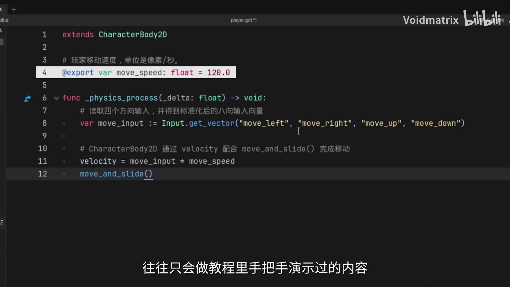

# 第1章 项目先导

> **系列**：Godot 2D 游戏开发入门与实践  
> **项目**：像素八方向射击游戏《冥日芳粥：肿么滴》

---

## 学习目标

- 了解项目游戏玩法、设计灵感与整体目标
- 掌握本教程覆盖的知识范围与完整开发流程
- 理解教程倡导的架构思维与举一反三的学习方法
- 建立对后续学习路径的清晰认知，做好实践准备

---

## 1.1 项目简介

本章将带领读者从零开始，完成一款像素风格的八方向射击游戏 **《冥日芳粥：肿么滴》** 。  
该项目玩法致敬了《星露谷物语》中的街机小游戏《草原大王的旅行》。玩家可以在 2D 场景中自由移动，进行八方向射击，与拥有不同机制的敌人战斗，并拾取随机掉落的强化道具，最终完成关卡流程。

游戏虽体量适中，但足以串联 Godot 引擎中最常用、最易上手的第一批核心知识，适合作为 2D 游戏开发的入门实战案例。

## 1.2 教程内容概览

本系列教程将从 **引擎安装** 开始，完整覆盖项目搭建、核心功能实现、游戏流程打通到最终打包发布的**全开发闭环**。无论读者此前是否接触过 Godot，都可以跟随步骤逐步产出自己的可运行游戏。

在实际开发过程中，你将落地一系列高价值的工程思路，例如：

- 使用规范的场景结构组织玩家、敌人、子弹、道具等模块；
- 通过资源配置（Resource）的方式复用不同敌人的数据和表现；
- 处理动态瓦片掉落、增益效果叠加等跨类型的高频交互逻辑。

下面是一段本教程将会详细实现的玩家移动代码（初学者可先大致浏览其结构）：

```gdscript
extends CharacterBody2D

@export var move_speed: float = 120.0

func _physics_process(_delta: float) -> void:
    var move_input := Input.get_vector("move_left", "move_right", "move_up", "move_down")
    velocity = move_input * move_speed
    move_and_slide()
```



**代码关键行解析**：

| 关键代码 | 说明 |
|----------|------|
| `extends CharacterBody2D` | 继承自 `CharacterBody2D` 类，专为物理驱动的角色设计，提供 `move_and_slide()` 等常用方法。 |
| `@export var move_speed: float = 120.0` | 使用 `@export` 将变量暴露到编辑器中，允许在场景面板直接调整移动速度，无需改动代码。 |
| `func _physics_process(_delta: float) -> void:` | 引擎每物理帧（默认 60 次/秒）调用的回调函数，所有物理相关逻辑应在此处理。 |
| `var move_input := Input.get_vector(...)` | 调用 `Input.get_vector()` 获取四个方向键组成的归一化二维向量，天然支持八方向输入。 |
| `velocity = move_input * move_speed` | 将输入向量乘以移动速度，赋值给内置的 `velocity` 属性。 |
| `move_and_slide()` | `CharacterBody2D` 的核心移动方法，根据 `velocity` 移动角色，并自动处理碰撞与滑动。 |

> 后续章节会结合编辑器配置、输入映射等步骤，详细拆解这段代码的运行原理，确保每一位读者都能理解并自行修改。

## 1.3 教程理念：构建可迁移的开发能力

本系列的目标远不止“跟着视频复制代码”。教程将采用 **自顶向下** 的方式剖析项目架构，说明每个设计决策背后的原因，传达可复用的开发方法论，并配合概念动画降低抽象知识的理解门槛。

在教学过程中，还会刻意引导读者**举一反三**——当你需要扩展更多敌人类型、设计全新道具或增加关卡机制时，你能够知道如何设计数据结构、如何组织场景、如何复用逻辑，从而真正脱离“只会做教程里的内容”的状态，具备独立开发的能力。

## 1.4 学习说明

- 本教程所有核心教学内容**永久公开、永久免费**，读者可随时反复学习。
- 项目基础阶段不依赖任何额外付费内容，请放心跟随。
- 建议在学习的同时动手实践，每完成一个小节即运行游戏验证效果，形成“学习→实践→反馈”的正向循环。

---

## 小结

本章作为先导部分，向读者展示了本套教程的完整蓝图：

- **项目定位**：像素八方向射击游戏《冥日芳粥：肿么滴》，玩法致敬《草原大王的旅行》。
- **学习路径**：从引擎安装到打包发布，覆盖完整的 2D 游戏开发流水线。
- **教学理念**：以架构思维为核心，注重可迁移能力的培养，而非机械式跟做。
- **学习方式**：永久免费公开，强调实践与反馈。

在接下来的章节中，你将亲手搭建项目环境，逐步实现游戏的每一个功能模块。让我们开始这场从零到一的 Godot 开发之旅吧。