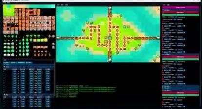

·瓦片地图编辑器

·角色属性编辑器

·关卡波次编辑器

· PIE 调试控制台

·一键打包发布功能

## 项目体量与结构总览

MiniTdGame  
引用  
外部依都项  
头文件  
axe bulleth  
bulleth  
bullet\_type.h

tower   
archer\_tower.h   
axeman tower.h   
gunnec\_towerh   
towerh   
tower\_typeh   
panel   
panelh   
place\_paneth   
upgrade panelh   
banner.h   
status bar.h   
animationh   
coin\_prap.h   
facing.h   
maph   
resource.h   
routeh   
tileh   
timerh   
vector2h   
wave.h

即原文件  
cISON  
main.cpp  
资原文件  
iconico  
MiniTdGame.rc  
TieAmnotator  
引用  
外部休解项  
头文件  
resource.h  
源文件  
main.cpp  
民原文件  
iconico  
TleAnnotator.ec

4000余行核心代码

工程视野：仅聚焦于单个案例项目 从独游到大型网游技术思路从同步和优化到调试与更新，提供贯穿项目生命周期的解决方案

## 四大进阶篇章

40+课时|构建从原理到工业环境的完整路径

1基础篇：联机与核心通信模型直击关键概念完成多人聊天室，快速建立“联机”体感与信心

2核心篇：服务端架构与世界同步技术深入游戏服务端核心架构，构建稳固的多人游戏逻辑基石

3精进篇：优化与专项技术直面延迟抖动，掌握状态/帧同步策略，打造流畅稳定的线上体验

4升华篇：引擎源码解读与工业级架构

深入浅出拆解Godot引擎联机模块实现，获得引擎维度的架构理解工业实践篇：

解读大型网游服务器集群分布式系统设计，建立高屋建瓴的架构师视角

## 附赠课程资料

7个专题配套示例工程 涵盖聊天室、Lua热更等核心概念清晰易懂的代码

齐全图文学习资料：Godot源代码与引擎网络模块技术架构高清图

一站式集成资源包：所有三方库工具链等资料，告别繁琐的资料下载

## 适合人群

体系化学习路径：仅介绍设计模式 从基础原则到模式架构从萌新小白到实战经验，再到大厂面试高频考察点一网打尽

跨领域开发能力：仅关注某语言/领域游戏与通用软件开发并行角色、战斗上层逻辑与场景资源、架构底层性能优化两手抓

## 五大进阶模块

50+课时|贯穿游戏开发全场景

筑基篇：面向对象六大原则+架构思维重塑创世篇：创建型模式×5 更灵活的对象创建机制塑形篇：结构型模式×7 更丰富的对象组织架构赋能篇：行为型模式×11更高效的对象职责沟通5 升华篇：面试专题+ECS/对象池等工业级架构解析

·23个可交互设计模式Demo含6000+行源码的完整项目工程

·自研迷你引擎框架

逐个击破JSON/XML加载解析、场景树编辑、Lua脚本接入等进阶功能

10+简历高光技术点指路代理延迟加载、ECS数据驱动、对象池与数据局部性优化等高热度专题

#舞引学是独立于我们教程项自之外的更进阶的游戏开发专题课程 Java/C++/C#开发者

## 适合人群

新人破局者：被“如何设计代码架构”困扰的入门开发者独立游戏人：想更好地使用引擎工具实现深度定制的创作者