# 第2章 引擎安装与瓦片系统基础

> **系列**：从零开始构建 ArknightsLike 塔防游戏
> **项目**：ArknightsLike

---

## 学习目标

- 掌握 Godot 引擎的下载与安装流程，理解版本选择与兼容性。
- 能够创建并运行 2D 项目，熟悉场景、节点与命名规范。
- 理解像素游戏纹理过滤的原理，并正确配置项目。
- 理解瓦片系统（TileSet / TileMapLayer）的核心概念与协作方式。
- 独立完成静态地面瓦片地图的创建与绘制。
- 掌握动态动画瓦片的手动配置方法。
- 学会使用多层瓦片叠加（装饰层）丰富地图细节。
- 使用 `Camera2D` 控制游戏画面的居中与缩放。

---

## 2.1 下载与安装 Godot 引擎

访问 [Godot 官网](https://godotengine.org/) 下载最新版本。本教程基于 **Godot 4.6.1**（非 .NET 版本），这也是官网首页默认推荐的稳定版。

**版本兼容性说明**  
Godot 采用语义化版本号：同一大版本（如 4.x）内的小版本与补丁更新保持良好兼容性，工程一般可直接迁移；只有跨大版本（例如 3.x → 4.x）才需额外处理。因此，即使未来更新到 4.7、4.8 等高版本，本教程内容依然适用。

下载页面中，最上方是 **Godot Engine**（使用 GDScript 脚本），下方是 **Godot Engine - .NET**（使用 C# 脚本）。考虑到上手成本与跨平台兼容性，推荐新手选择 GDScript 版本。

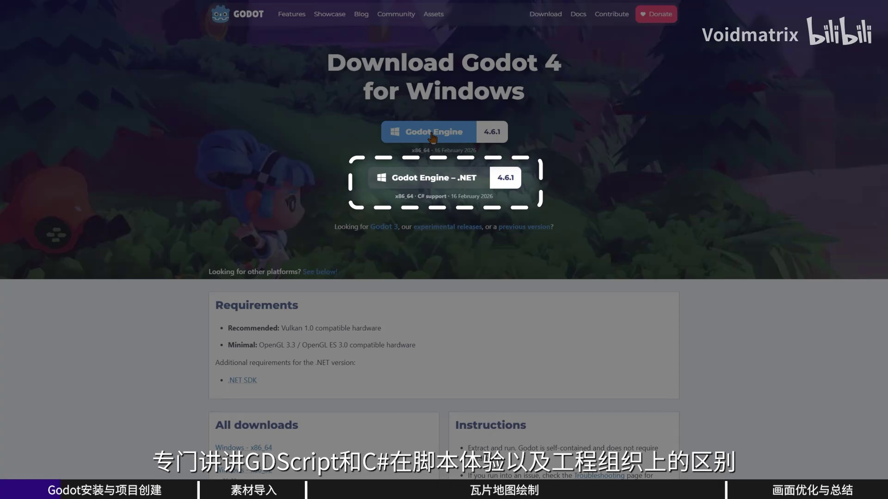

除引擎本体外，还需下载 **Export Templates**（导出模板），用于将来将游戏发布到不同平台。页面下方提供了各平台的导出模板链接。

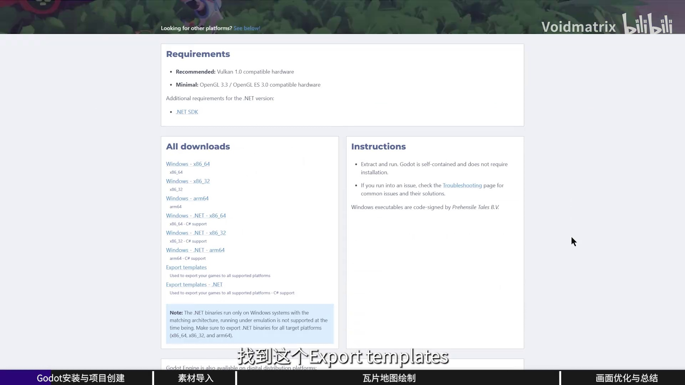

下载完成后，解压引擎压缩包。你会得到类似如下三个文件（含 `.tpz` 导出模板文件）：

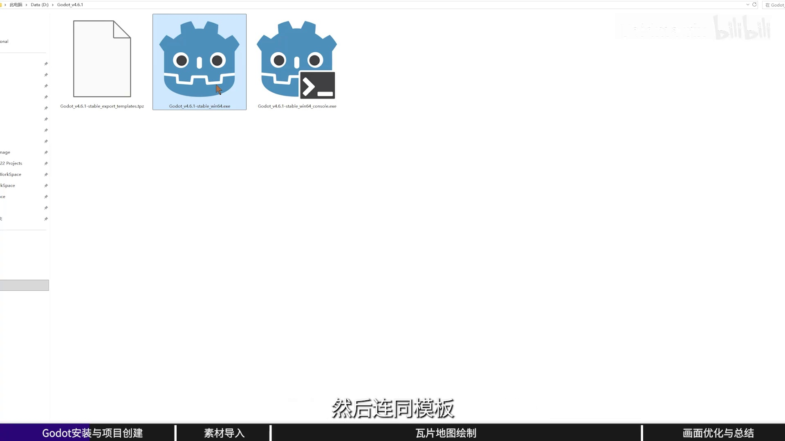

双击带有 Godot 图标的可执行文件即可启动编辑器。该版本为绿色版，无需安装，便于同时管理多个引擎版本。

---

## 2.2 创建项目与初次运行

1. **创建项目**：启动后在项目管理器中点击“创建”，选择工作目录并输入项目名称（例如 `ArknightsLike`）。**渲染器等设置保持默认**，点击“创建”。

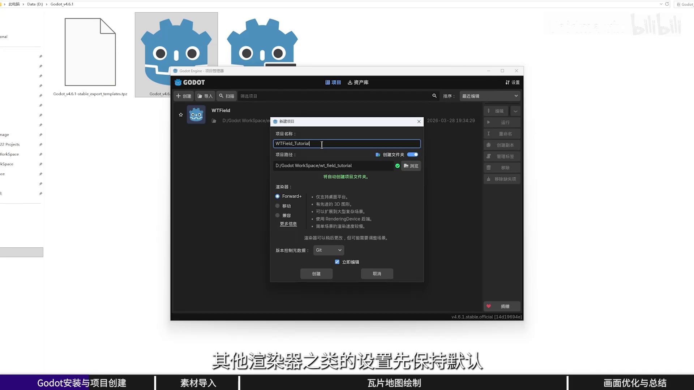

2. **切换至 2D 工作区**：默认打开的是 3D 视图，在编辑器顶部切换到 **2D** 工作区。

3. **创建场景**：点击“创建 2D 场景”按钮，得到一个 `Node2D` 根节点。节点可理解为各有职责的小零件，场景则是将这些零件按树形结构组织起来的功能单元。

4. **运行与保存**：点击右上角的 **运行按钮**（三角形图标），此时会弹出选择主场景的对话框。因为项目尚未设置，直接点击“选择当前”，并按照提示保存场景。

**文件命名规范**

- 先创建子文件夹（如 `scenes`）存放场景和后续脚本。
- 将场景文件命名为 `game.tscn`（全部小写）。
- 项目中所有**文件与文件夹**推荐采用 **snake_case**（蛇形命名，全小写，单词间用下划线），例如 `player.tscn`、`enemy_1.png`。
- **节点名称**建议采用 **PascalCase**（大驼峰，首字母均大写），例如 `Game`、`GroundTileLayer`。

| 类型       | 命名风格    | 示例                  |
|------------|-------------|-----------------------|
| 文件/文件夹 | snake_case  | `player.tscn`、`enemy_1.png` |
| 节点       | PascalCase  | `Game`、`OverlayTileLayer` |

> **为何如此严格？**  
> Windows 和 macOS 默认文件系统不区分大小写，而 Linux 与 Godot 导出后的 PCK 文件系统**区分大小写**。命名不一致极易在导出后出现资源丢失等难以排查的问题。

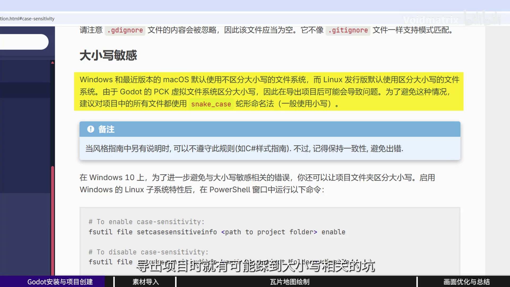

保存场景后，游戏会以独立窗口运行——尽管当前画面空白，但项目创建、场景保存到运行的整条链路已经打通。

---

## 2.3 导入素材与像素纹理过滤

### 2.3.1 导入素材

下载素材包并解压，得到 `resources` 文件夹，内部结构如下：

- `audio/`：音频文件
- `font/`：字体文件
- `texture/`：纹理（图片）文件

在 Godot 编辑器左下角的 **文件系统** 面板中右键，选择“在文件管理器中打开”，将整个 `resources` 文件夹复制到项目根目录。回到编辑器后，Godot 会自动导入这些资产。

### 2.3.2 纹理过滤问题

从文件系统拖入一张纹理到场景，编辑器会自动创建 `Sprite2D` 节点。放大视图后，会发现**图片变得非常模糊**——这是像素游戏中最常见的画面品质杀手。

**原因**：Godot 默认使用 **线性过滤（Linear Filtering）** 处理纹理缩放，对像素图会导致边缘模糊。

**解决方案**：打开顶部菜单 **项目 → 项目设置**，在左侧分类中找到 **渲染 → 纹理**，将 **默认纹理过滤** 改为 **Nearest**。修改后，场景中所有像素纹理的锯齿边缘立刻恢复清晰。

### 2.3.3 过滤原理对比

| 过滤模式 | 原理                                           | 适用场景               |
|----------|------------------------------------------------|------------------------|
| 邻近过滤 (Nearest) | 取离目标像素最近的原始像素颜色，边缘锐利     | 像素风格游戏，保留原始像素感 |
| 线性过滤 (Linear)   | 参考周围多个像素进行插值混合，画面平滑       | 非像素风格游戏，避免明显锯齿 |

完成设置后，将之前拖入的示例节点从场景中删除（选中后按 `Delete` 键）。

---

## 2.4 瓦片系统基础

游戏地图由一个个单元格（Tile）拼接而成，素材提供了多种单元格样式的图片。这就需要使用 **瓦片系统（Tile System）**。

### 2.4.1 节点选择

在 `Game` 根节点上右键，选择添加子节点。搜索 **Tile** 会出现两个相似节点：`TileMap` 和 `TileMapLayer`。

- **TileMap**：已弃用的旧版地图节点，不再推荐使用。
- **TileMapLayer**：新版瓦片层节点。每个节点只负责一层瓦片，多个 `TileMapLayer` 叠加即可实现多层地图。

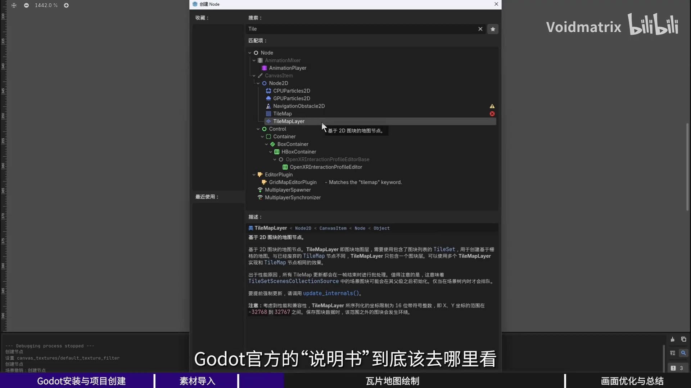

点击创建，并将节点重命名为 **GroundTileLayer**（后续会区分地面层和装饰层）。

### 2.4.2 查阅官方文档

对于不熟悉的节点，最权威的途径是查阅官方文档。在 Godot 官网点击“文档”，进入文档页面后可在左下角将语言切换为 **简体中文**（zh_CN）。搜索 `TileSet`，即可看到《使用 TileSet》《使用 TileMap》等教程。

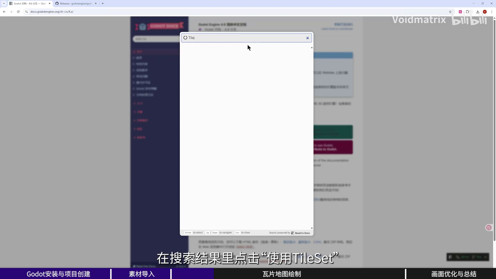

养成查阅文档的习惯，比任何二手教程都权威且持久。

### 2.4.3 TileSet 与 TileMapLayer 的关系

- **TileSet**：相当于“颜料库”，不仅存放瓦片图片，还能为每种瓦片添加碰撞、导航、动画等属性。
- **TileMapLayer**：相当于“画布”，在二维网格上摆放瓦片进行绘制。多个图层叠加可构建复杂场景。

选中 `GroundTileLayer` 节点，在右侧检查器中 **TileSet** 属性为空，点击后选择「新建 TileSet」。此时下方面板会出现 **TileMap** 和 **TileSet** 两个子页签，供后续配置。

---

## 2.5 静态地面瓦片

### 2.5.1 添加图集并自动切图

1. 切换到下方的 **TileSet** 页签，点击最下方的 **「+」** 按钮，选择「图集」。

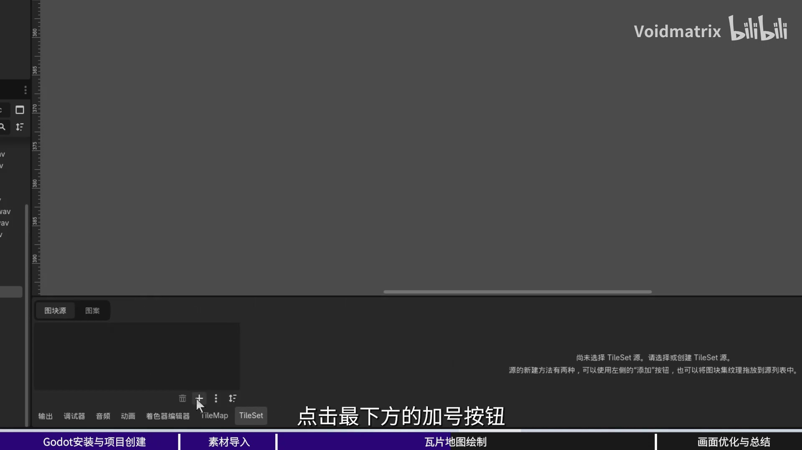

2. 在弹出的文件浏览器中选择地面静态瓦片的纹理文件（例如 `tileset_ground.png`）。
3. 系统询问“是否自动创建图块”，点击**是**。工具将根据图片内容自动按网格切分出一个个瓦片。

### 2.5.2 绘制地图

切换到下方的 **TileMap** 页签，此时便可使用矩形工具在场景网格中拖拽绘制。例如先绘制一片 16×16 格的地面区域，再自由挑选不同图样的瓦片丰富细节。按 `Ctrl+Z` 可撤销操作。

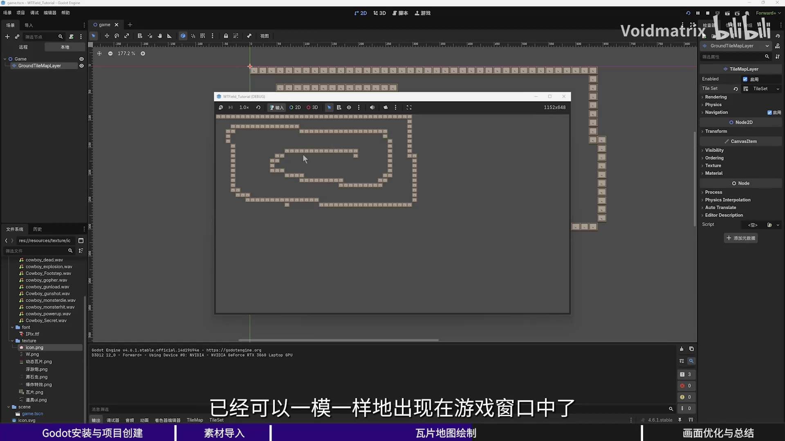

点击右上角运行按钮，地图便会显示在游戏窗口中。

---

## 2.6 动态瓦片（动画瓦片）

地图上许多瓦片带有动画效果（如闪烁、流水、能量流动），这些需要动态瓦片实现。

### 2.6.1 导入纹理但不自动切图

1. 回到 **TileSet** 页签，再次点击 **「+」** 添加图集，选择动态瓦片纹理（例如 `tileset_animated.png`）。
2. 询问是否自动创建图块时，**选择“否”**——我们需要手动指定动画帧序列。若误点了“是”，可用选择工具框选全部瓦片后按 `Delete` 删除。

### 2.6.2 手动创建动画帧

1. 点击上方工具栏切换到「设置」，在纹理预览中**框选第一列下方四个瓦片**（避开最上方一行）。
2. 切回「选择」，此时四个格子都被高亮。点选第一个瓦片，左侧会出现**动画属性**。
3. 设置 **速度（FPS）**（例如默认 5 帧/秒）和 **模式（Mode）**。模式决定场景中不同位置的同一瓦片是同步播放（`同步`）还是各自随机起点播放（`随机`）。
4. 保持瓦片选中，在左侧展开 **Frames**，点击「添加元素」按钮**三次**，后续三帧依次亮起，四帧动画即配置完成。

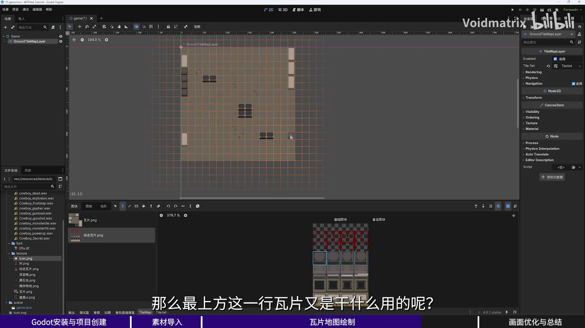

> **提示**：用于边界或背景的大面积动态瓦片，建议将速度调慢（例如 2–3 FPS），避免视觉上过于跳跃。

重复以上步骤，将每一列都设置为对应的动画。完成后切换到 **TileMap** 页签，选择这些动画瓦片即可直接在场景中绘制，并实时看到播放效果。

---

## 2.7 装饰瓦片层（Overlay）

素材最上方一行是较为特殊的动态瓦片——它们并非铺在地板上，而是**覆盖在地面层之上**，作为装饰（例如传送带箭头、裂痕高光）。这就需要单独的一层 `TileMapLayer`。

### 2.7.1 新建 Overlay 层

1. 在根节点下再添加一个 `TileMapLayer` 子节点，命名为 **OverlayTileLayer**。
2. 同样为其新建一个 `TileSet`，添加图集并选择同一张动态纹理，依然选择**否**（不自动创建图块）。

### 2.7.2 处理非正方形瓦片

最上方一行瓦片纵向占据了两个基础网格的高度（16×32 像素）。默认 16×16 的切分会把一个完整装饰塔切成两个独立图块。

**解决方法**：在 TileSet 设置面板中找到**纹理区域大小**（Tile Size）一项，将**高度**改为 `32`。编辑器就会将纵向两个单元格合并为一个完整的动画瓦片。

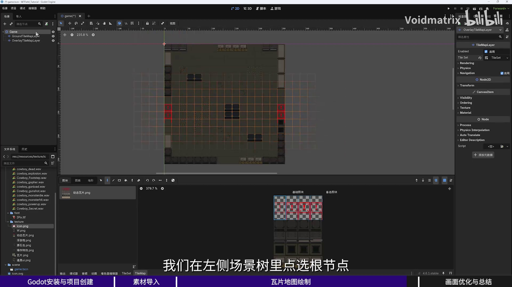

### 2.7.3 配置动画并绘制

- 框选这一整列（高度 32）的瓦片，设置动画速度（例如 `4` FPS），模式保持默认，然后添加三帧补齐四帧动画。
- 切换到 **TileMap** 页签，在上方的 `OverlayTileLayer` 图层上进行绘制。完成后选中根节点，即可预览完整地图效果。

---

## 2.8 使用 Camera2D 调整视图

运行项目会发现地图只缩在窗口左上角，且内容很小。此时需要一个控制观察区域的节点：**Camera2D**。

1. 在 `Game` 根节点上添加子节点，搜索 **Camera2D** 并创建。

### 2.8.1 居中显示

场景中绘制的区域为 16×16 个单元格，每个单元格 16×16 像素，因此当前地图区域尺寸为 **256 × 256 像素**。在检查器中将 Camera2D 的 **Offset** 属性设置为 `(128, 128)`（即区域中心），摄像机会对准地图中央，画面随即居中。

### 2.8.2 放大画面

若感觉内容太小，可调整 **Zoom** 属性。例如设置为 `(2, 2)`，画面将放大两倍。

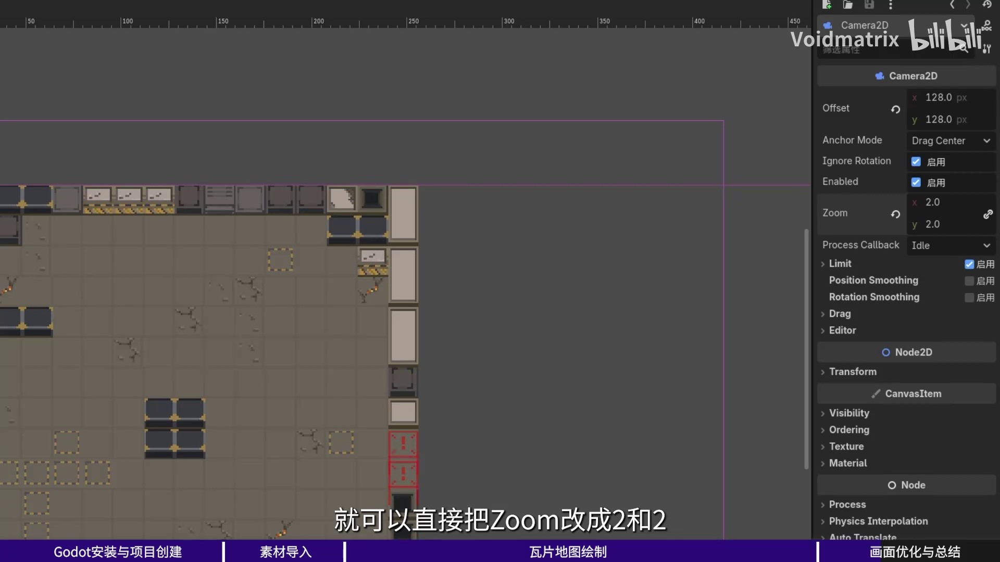

`Zoom` 数值越大，画面内容越大，但可视范围相应缩小，效果类似摄像机镜头“拉近”。

### 2.8.3 窗口适配问题

此时即使放大了画面，拉大游戏窗口后四周仍会留下大量空白。原因是项目默认的 **拉伸模式（Stretch Mode）** 为“禁用”（disabled），导致游戏画面以固定分辨率渲染，不会随窗口尺寸自动缩放。

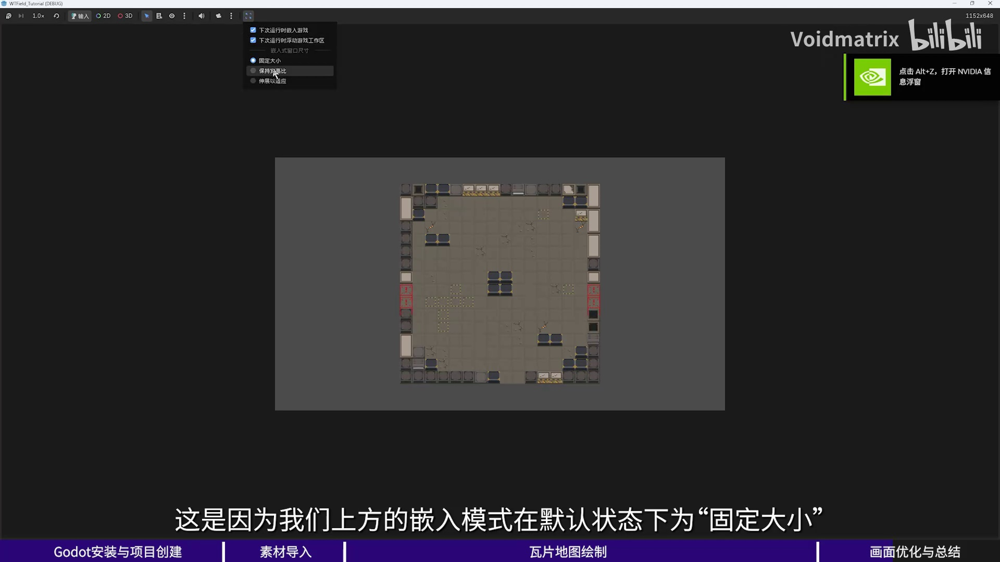

这一问题将在后续章节中专门解决，使游戏窗口能够自适应各种屏幕比例。

---

## 本章小结

通过本章的学习，你已经完成了以下内容：

- 下载并安装 Godot 4.6.1 引擎，了解了稳定版与导出模板的作用。
- 创建了第一个 2D 项目，掌握了场景与节点的基本关系，并严格执行了命名规范。
- 解决了像素风格游戏中的纹理模糊问题，理解了邻近过滤与线性过滤的区别。
- 认识了瓦片系统的核心概念（TileSet 作为“颜料库”，TileMapLayer 作为“画布”），学会了查阅官方文档。
- 制作了静态地面瓦片地图，并手动配置动态动画瓦片（动画帧、速度、模式）。
- 通过新建 `OverlayTileLayer` 实现了装饰瓦片的叠加，并处理了非正方形瓦片的切分问题。
- 使用 `Camera2D` 完成了地图的居中与缩放调整。

下一章，我们将深入处理窗口的自适应拉伸、摄像机跟随，以及塔防地图碰撞区域的设置，让地图具备可游玩的基础。

---