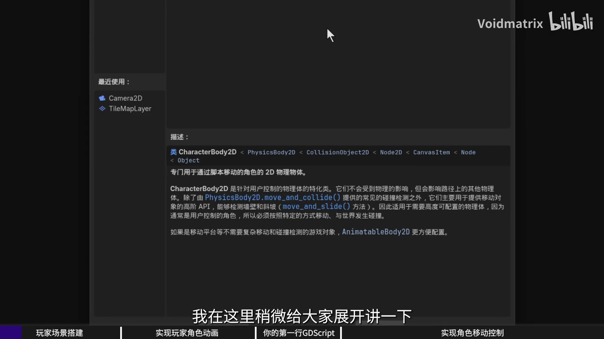
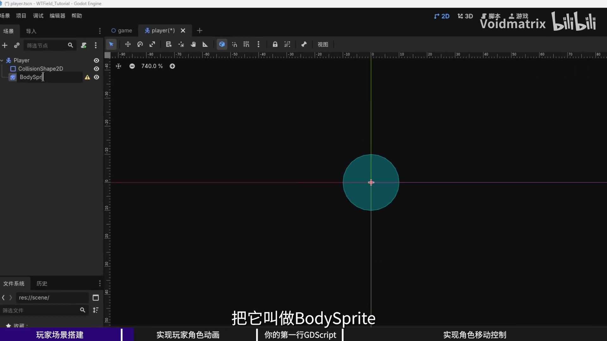
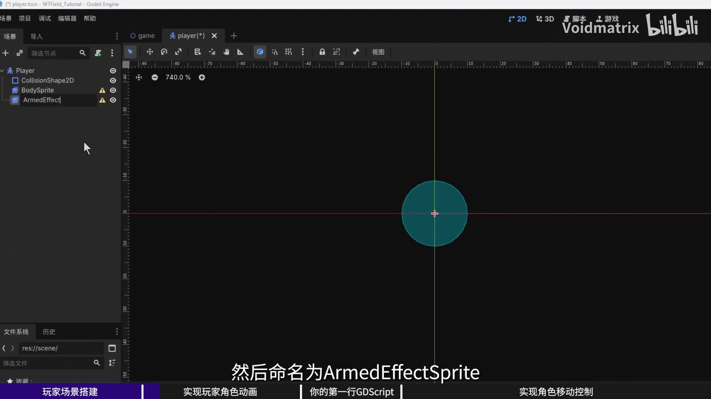
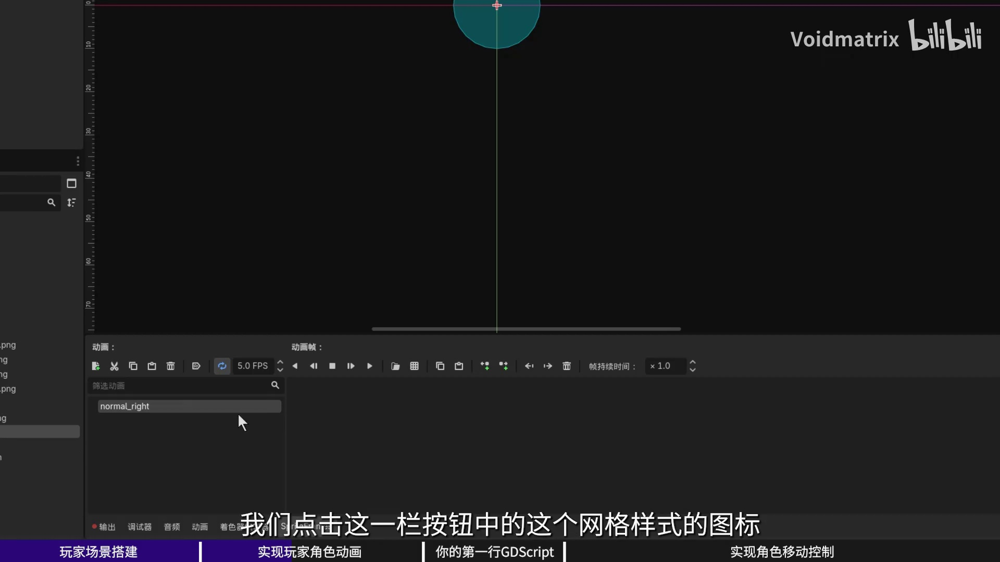
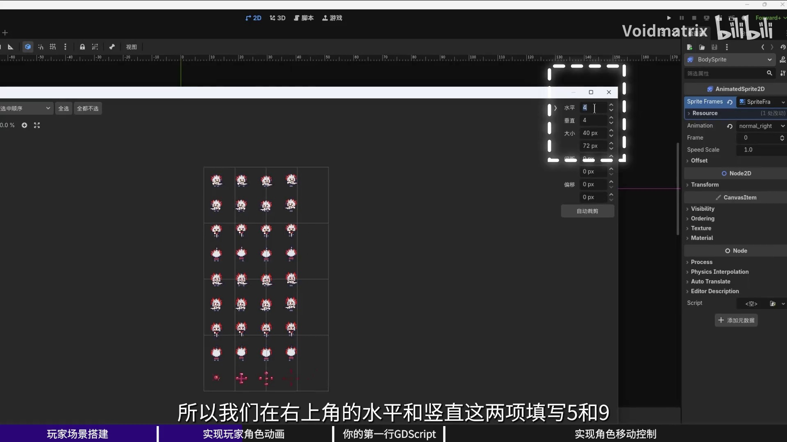
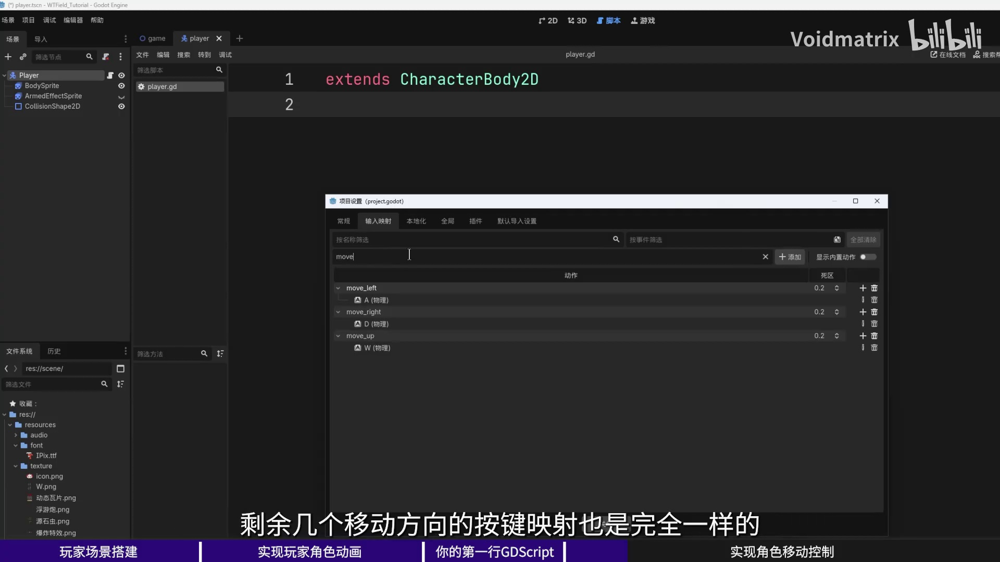
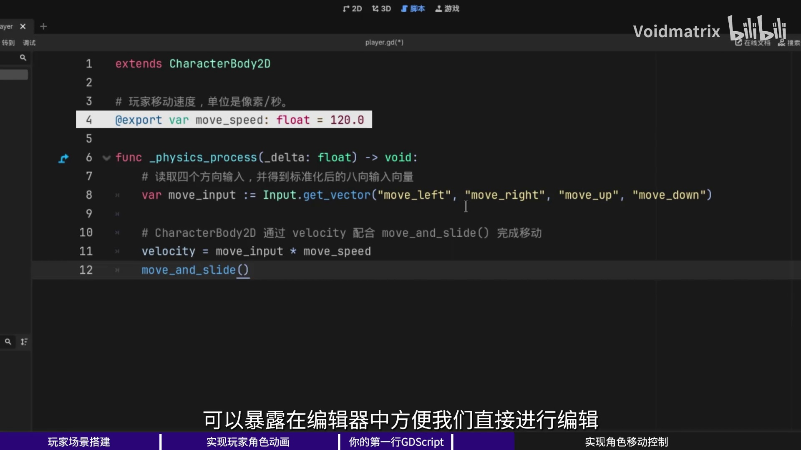
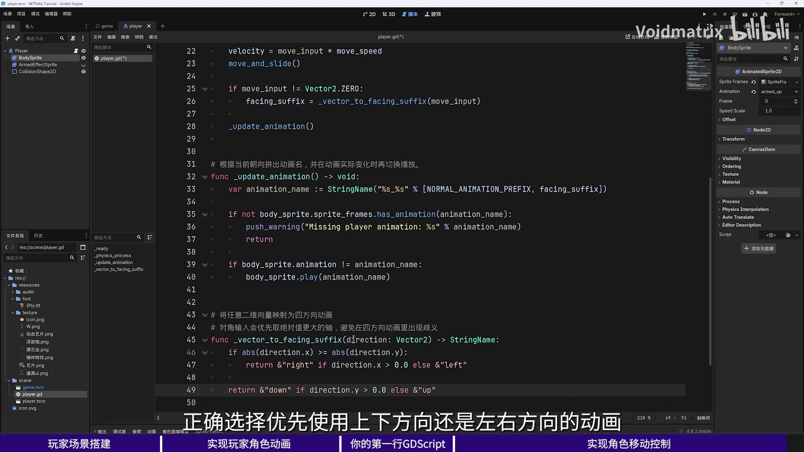
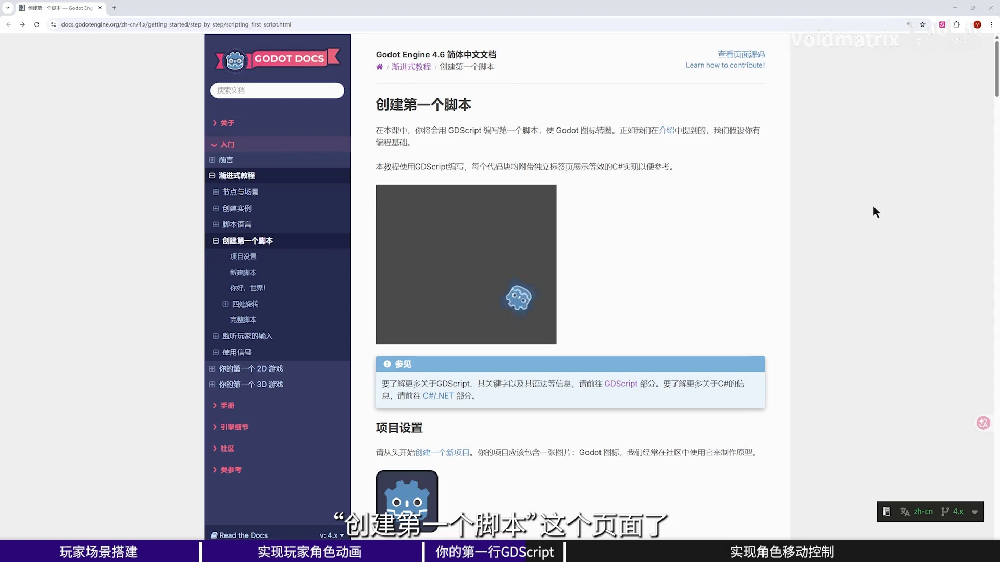

# 第1章 玩家角色动画与移动基础

> **系列**：Godot 4 动作游戏开发教程
> **项目**：玩家角色系统

---

## 学习目标

- 了解 CharacterBody2D、Node2D、RigidBody2D 的区别及适用场景
- 掌握使用 CollisionShape2D 为角色添加碰撞形状的方法
- 学会使用 AnimatedSprite2D 创建多方向、多状态的动画
- 掌握输入映射的配置与 Input.get_vector 的用法
- 理解 `_physics_process` 与 `_process` 的区别
- 实现基于速度向量自动切换四方向行走动画的逻辑
- 了解 GDScript 的官方学习资源与学习路径

---

## 1.1 根节点选择与节点对比

在 `scene` 目录下新建场景，根节点类型选择 **CharacterBody2D**，保存为 `player.tscn`。

2D 游戏开发中初学者常遇到以下三种相似节点，其本质差异如下：

| 节点 | 特点 | 适用场景 |
|------|------|----------|
| **Node2D** | 基础变换节点，只包含位置、旋转、缩放。无物理和碰撞功能。 | 纯逻辑父节点、UI 布局等。 |
| **CharacterBody2D** | 专为脚本控制的角色设计，可参与物理碰撞，但移动不受物理引擎直接模拟。提供 `move_and_slide()` 等接口。 | 玩家角色、NPC 等需要精确手感控制的角色。 |
| **RigidBody2D** | 完全由物理引擎驱动，受重力、弹力等规律影响，适合自由运动的物体。 | 箱子、碎石等物理自由体。 |

**结论**：需要脚本控制移动且希望参与碰撞、滑动时，**CharacterBody2D** 是最佳选择。



---

## 1.2 添加碰撞形状

选中 `player` 节点后，右侧出现“该节点没有形状子节点”的警告。这体现了 Godot 的组合式设计理念：碰撞外形作为独立模块，通过子节点形式挂载，而非内置在角色类中。

操作步骤：
1. 右键 → 添加子节点 → 搜索 **CollisionShape2D** 并添加。
2. 在右侧 `Shape` 属性中新建 **CircleShape2D**。场景视图中出现蓝色圆形碰撞区域，可通过滚轮缩放、中间拖拽调整视角。



---

## 1.3 搭建动画精灵

玩家角色包含两个独立的动画模块：
- **本体动画**（普通/强化状态移动、死亡等）
- **武装特效动画**（浮游炮环绕效果，需独立控制可见性）

因此添加两个 **AnimatedSprite2D** 子节点，并分别命名为：
- `BodySprite`（负责本体动画）
- `ArmedEffectSprite`（负责武装特效）

节点顺序会影响绘制层级，可将它们拖拽至 `CollisionShape2D` 上方以便编辑器中查看。



---

## 1.4 配置角色动画帧

### 1.4.1 动画命名规范
动画名称采用 `状态_方向` 格式，例如：
- `Normal_right`：普通状态向右移动
- `Armed_left`：强化状态向左移动
- `Death`：死亡动画（无方向后缀）

所有动画的速度统一设置为 **8 FPS**。

素材图片为一幅 **9 行 5 列** 的精灵表：
- 第1行：普通状态向右（4 帧）
- 第2行起：普通状态其他方向
- 中间若干行：强化状态四个方向
- 最后一行：单帧死亡素材

### 1.4.2 设置 BodySprite 动画
1. 选中 `BodySprite`，在底部动画帧面板点击“新增 SpriteFrames”。
2. 将默认动画重命名为 `Normal_right`。
3. 点击“从精灵表中添加帧”，选择素材图片。
4. 在弹出窗口中将**水平切分**设为 `5`，**垂直切分**设为 `9`，按 Enter 键自动划分网格。
5. 拖拽选中第1行的 4 帧，点击“添加四帧”。
6. 将 FPS 设为 `8`，并将该动画设为默认动画。
7. 重复以上步骤，依次创建 `Normal_left`、`Normal_up`、`Normal_down`，以及强化状态动画 `Armed_right`、`Armed_left`、`Armed_up`、`Armed_down`。
8. 最后创建 `Death` 动画，仅选取最后一行的单帧，速度保持 8 FPS。




### 1.4.3 设置 ArmedEffectSprite
`ArmedEffectSprite` 使用一张独立的 8 帧浮游炮素材，添加帧后设置速度 8 FPS。由于武装特效默认不可见，在场景树中点击该节点右侧的**眼睛图标**将其隐藏。

---

## 1.5 输入映射与移动脚本

### 1.5.1 输入映射
进入 **项目设置 → 输入映射**，添加以下动作并绑定对应按键：
- `move_left`：A 键
- `move_right`：D 键
- `move_up`：W 键
- `move_down`：S 键

输入映射使得代码只依赖“动作名称”而非具体按键，便于后期改键和多平台适配。



### 1.5.2 核心移动脚本
为 `player` 节点附加脚本 `player.gd`，继承 `CharacterBody2D`，编写基础移动代码：

```gdscript
extends CharacterBody2D

# 玩家移动速度（像素/秒）
@export var move_speed: float = 120.0

func _physics_process(_delta: float) -> void:
    # 读取四个方向输入，生成标准化后的方向向量
    var move_input := Input.get_vector(
        "move_left", "move_right",
        "move_up", "move_down"
    )
    velocity = move_input * move_speed
    move_and_slide()
```

**关键代码解析**：

| 代码行 | 作用 |
|--------|------|
| `@export var move_speed: float = 120.0` | 将变量暴露到编辑器属性面板，允许可视化调整速度。 |
| `func _physics_process(_delta: float) -> void:` | 物理帧更新函数，默认每秒固定调用 60 次，适合处理移动与碰撞。 |
| `Input.get_vector(...)` | 根据四个方向输入生成标准化 `Vector2`，斜向自动处理为 `(0.707, 0.707)` 等。 |
| `velocity = move_input * move_speed` | 计算速度向量并赋值给内置属性 `velocity`。 |
| `move_and_slide()` | 基于 `velocity` 移动角色，并自动处理与其他物理体的碰撞和滑动。 |



将 `player.tscn` 实例化到游戏主场景后运行，即可使用 WASD 控制角色移动。

---

## 1.6 动画朝向逻辑

当前角色移动时始终播放默认动画，需通过代码让动画根据移动方向自动切换。

### 1.6.1 实现代码
在 `player.gd` 中追加以下内容，并在 `_physics_process` 末尾调用 `_update_animation()`：

```gdscript
const NORMAL_ANIMATION_PREFIX := &"Normal"

@onready var body_sprite: AnimatedSprite2D = $BodySprite

func _physics_process(_delta: float) -> void:
    # ... 前面的移动代码 ...
    _update_animation()

func _update_animation() -> void:
    var facing_suffix := _vector_to_facing_suffix(velocity)
    var animation_name := StringName("%s_%s" % [NORMAL_ANIMATION_PREFIX, facing_suffix])

    if not body_sprite.sprite_frames.has_animation(animation_name):
        push_warning("Missing player animation: %s" % animation_name)
        return

    body_sprite.play(animation_name)

# 将二维向量映射为四方向后缀
func _vector_to_facing_suffix(direction: Vector2) -> StringName:
    if abs(direction.x) >= abs(direction.y):
        return &"right" if direction.x > 0.0 else &"left"
    else:
        return &"down" if direction.y > 0.0 else &"up"
```

**关键代码解析**：

| 代码行 | 作用 |
|--------|------|
| `const NORMAL_ANIMATION_PREFIX := &"Normal"` | 定义动画名前缀常量，`&` 表示高效的 StringName 类型。 |
| `@onready var body_sprite: AnimatedSprite2D = $BodySprite` | 延迟获取节点引用，确保场景树已就绪。 |
| `var facing_suffix := _vector_to_facing_suffix(velocity)` | 根据当前速度向量计算方向后缀（如 `"right"`）。 |
| `var animation_name := StringName(...)` | 拼接完整动画名，如 `"Normal_right"`。 |
| `body_sprite.sprite_frames.has_animation(...)` | 安全检查，避免播放不存在的动画。 |
| `body_sprite.play(animation_name)` | 播放对应方向的动画。 |
| `_vector_to_facing_suffix` 内部逻辑 | 比较 x、y 绝对值，选择较大轴作为主方向，解决斜向移动时的方向抖动问题。 |



运行测试，角色移动时将自动切换四个方向的行走动画。强化状态和死亡动画的切换，将在后续章节与道具拾取、战斗系统结合实现。

---

## 1.7 GDScript 学习资源推荐

对于希望深入学习 GDScript 的读者，推荐以下学习路径：

1. **交互式入门**：Godot 官方提供的 **《从零开始学习 GDScript》** 浏览器应用（Learn GDScript From ZERO），适合零基础学习者。
2. **必读文档**：
   - 《创建第一个脚本》：快速掌握 GDScript 与 Godot 结合的基本操作。
   - 《GDScript 参考》：完整语法手册，可随时查阅。
   - 《导出属性》《动态语言入门》等分类专题，深入理解引擎特性。
3. **学习策略**：借助 AI 辅助理解代码，但需主动思考“为什么用这个结构”“不同方案的差异是什么”，逐步将知识内化为独立解决问题的能力。



---

## 小结

本章完成了玩家角色的创建、动画配置以及基础移动系统的搭建，主要内容包括：

- 选择 CharacterBody2D 作为角色根节点，并理解其与 Node2D、RigidBody2D 的区别。
- 通过 CollisionShape2D 为角色赋予碰撞体积。
- 使用 AnimatedSprite2D 制作多状态、多方向的精灵动画。
- 配置输入映射，基于 `Input.get_vector` 和 `move_and_slide()` 实现 WASD 移动。
- 编写动画朝向逻辑，根据速度向量自动切换四方向行走动画。

至此，一个可操控移动且动画正确的玩家角色已构建完成，为后续强化状态、生命系统等功能奠定了基础。