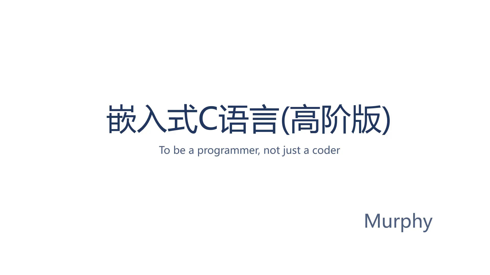
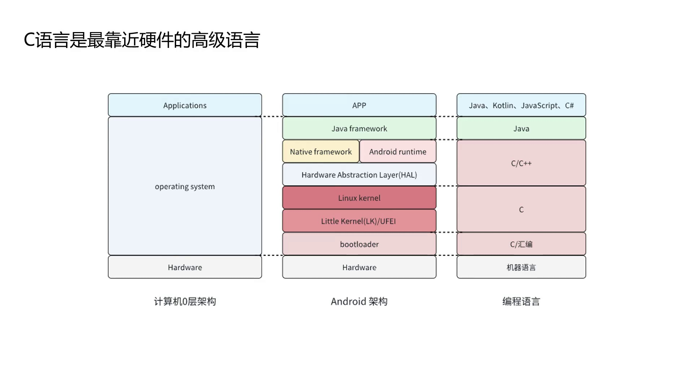
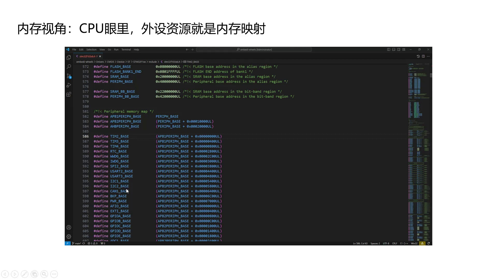

# 嵌入式C语言（高阶版）课程设计理念

> **系列**：嵌入式C语言（高阶版）
> **项目**：课程设计理念

---

## 课程开场与设计理念

该课程定位为嵌入式C语言的高阶学习，旨在帮助开发者深入底层逻辑，成为真正理解硬件的程序员（Programmer），而非仅会调用API的码农（Coder）。C语言的核心能力在于对内存的直接操控，以及如何借助操作系统与编译器实现稳定、可维护的软件设计。课程围绕**内存视角**、**架构视角**与**编译器视角**三个维度，剖析C语言的底层运行机制与设计思想。



---

## C语言为何是嵌入式开发的基石

### 五十年的生命力

C语言自1972年由Dennis Ritchie发明以来，始终占据编程语言排行榜顶端。根据TIOBE编程社区指数（衡量编程语言流行度的参考指标）的长期统计，C语言多年来稳居前两位，这在技术迭代迅速的软件领域中极为罕见。

### 操作系统中的不可撼动地位

计算机系统通常划分为底层硬件、中间操作系统、上层应用三层。以Android系统为例，其软件栈从上到下依次为：

| 层级 | 主要语言 |
|------|----------|
| Java Framework 层 | Java |
| Native Framework 与 Android Runtime | C/C++ |
| Hardware Abstraction Layer (HAL) | C/C++ |
| Linux Kernel | C |
| Little Kernel (LK) 或 UEFI | C/汇编 |
| Bootloader（如U-Boot） | C/汇编 |




除Java Framework层以外，其余各层均主要使用C或C++。越靠近硬件，C语言的占比越高。Linux内核完全由C语言编写，这使得C语言在操作系统领域拥有不可替代的基础地位。

### 最靠近硬件的高级语言

C语言兼具高级语言的抽象能力和贴近硬件的底层控制力。在智能硬件领域（智能手机、无人机、物联网设备、扫地机器人、智能座舱等），C语言应用广泛。


其根本原因在于：CPU将GPIO、I2C、UART等所有外设均视为内存地址空间中的一组寄存器。无论是裸机开发，还是基于RTOS、Linux、AUTOSAR等操作系统的开发，掌握C语言即掌握了直接操控硬件的通道，这直接影响嵌入式工程师的发展上限。

---

## 三大视角深度剖析C语言底层

### 内存视角：操作硬件即操作内存

C语言控制外设的本质是内存读写。以单片机GPIO点灯为例：CPU通过地址总线、控制总线、数据总线与存储器相连，GPIO等外设被映射到内存地址空间中特定的地址区域。当程序向这些特定地址写入数据时，实际是在操作GPIO模块的控制寄存器，从而控制LED的亮灭。


以STM32微控制器为例，其外设寄存器被映射到固定的内存地址（参见外设内存映射图）。定时器、ADC、SPI、I2C等模块在CPU视角下就是一组地址。深入理解内存映射关系，是自如操控硬件的基础。



### 架构视角：用C语言写出“面向对象”的代码

C语言是过程式语言，但借助结构体嵌套、函数指针等技巧，完全可以模拟封装、多态、重载等面向对象特性。这些技巧已广泛应用于Linux内核等工业级项目中，并非无实际价值的技巧。

典型案例是Linux内核的设备驱动模型：通过结构体嵌套和函数指针表，将同类设备的共性抽象为“类”，并将差异封装在各设备的操作函数中。这种架构使C代码具有高内聚、低耦合的特性，与面向对象语言的设计目标一致。深入分析这些设计模式，有助于构建稳固的嵌入式软件架构。


### 编译器视角：理解“翻译官”

编译器不仅将C代码转译为机器指令，其优化行为和扩展语法也可能影响程序的正确性与结构。许多隐蔽的缺陷源于编译器在高优化级别（如-O2、-O3）下的过度优化，例如打乱内存访问顺序或省略看似无用的操作。

#### volatile关键字

当变量可能被中断服务程序、其他线程或硬件外设修改时，必须使用`{c} volatile`修饰，以告知编译器不得对该变量的访问进行优化（如缓存到寄存器、删除“无用”语句等）。STM32 HAL库中，外设寄存器的结构体成员普遍使用`{c} __IO`（即`{c} volatile`）定义：

```c
// stm32f103xb.h
#define __O    volatile  /*!< Defines 'write only' permissions */
#define __IO   volatile  /*!< Defines 'read / write permissions' */

typedef struct
{
  __IO uint32_t CRL;
  __IO uint32_t CRH;
  __IO uint32_t IDR;
  __IO uint32_t ODR;
  __IO uint32_t BSRR;
  __IO uint32_t BRR;
  __IO uint32_t LCKR;
} GPIO_TypeDef;
```

1. `{c} volatile` 关键字指示编译器不要对相关变量进行优化，确保每次读写都直接作用于实际内存地址。
2. 在STM32 HAL库中，外设寄存器结构体的成员统一使用 `{c} __IO`（即 `{c} volatile`）修饰，以保证硬件状态的实时正确性，避免因编译器缓存而导致逻辑错误。
3. 结构体中的 `{c} CRL`、`{c} CRH` 等寄存器地址通过基址加偏移确定，且不会因编译器优化而被缓存，从而准确反映硬件状态。

#### 利用编译器特性辅助设计

编译器提供许多有用的`{c} __attribute__`扩展，可以被主动驾驭，以实现更精确的内存布局或模块化设计。CMSIS软件包中便封装了常用的属性宏：

```c
// cmsis_gcc.h
#define __NO_RETURN
#define __USED
#define __WEAK
#define __PACKED
#define __PACKED_STRUCT
#define __PACKED_UNION
```

1. `{c} __PACKED` 等宏通常定义为 `{c} __attribute__((packed))`，指示编译器取消结构体成员间的自动填充对齐。
2. 在寄存器映射或通信协议解析等场景，内存布局必须与硬件或协议完全一致，使用该属性可避免因对齐而导致的偏移错误。
3. CMSIS标准提供统一的宏替换，便于在不同编译器中保持一致的打包行为。

Linux内核则通过 `{c} __attribute__((section))` 实现模块初始化的自动注册。内核中的 `{c} module_init` 宏正是这一技术的典型应用：

```c
// include/linux/init.h
#ifndef MODULE
/* 省略 ... */
#define module_init(x) __initcall(x);
/* 省略 ... */
#else

#define module_init(x) __initcall(x);
  |--> #define __initcall(fn) device_initcall(fn)
       |--> #define device_initcall(fn) __define_initcall(fn, 6)
            |--> #define __define_initcall(fn, id) \
                    static initcall_t __initcall_##fn##id __used \
                    __attribute__((__section__(".initcall" #id ".init"))) = fn
```

1. `{c} module_init(x)` 宏逐级展开，最终调用 `{c} __define_initcall(fn, 6)`，生成一个静态的函数指针变量。
2. `{c} __attribute__((__section__(".initcall6.init")))` 将该变量放入名为 `{c} .initcall6.init` 的独立数据段中。内核启动时会统一遍历并调用该段中所有的初始化函数，实现驱动自动加载。
3. 通过 `{c} ##` 连接符和 `{c} #id` 字符串化操作，为每个模块生成唯一的变量名，避免符号冲突。
4. 这种利用段属性的技巧解耦了模块与内核核心代码，开发者只需在驱动中调用 `{c} module_init(my_init_func)`，无需手动维护初始化列表。


---

## 小结

- C语言凭借直接操作内存的能力，在嵌入式系统和操作系统中占据核心地位。
- 掌握内存映射机制是控制外设的基础：CPU将GPIO、I2C等外设视为一组内存地址。
- 运用架构视角，可通过结构体与函数指针在C语言中模拟面向对象设计，提升代码的模块化与可维护性。
- 理解编译器的优化行为与扩展属性（如 `{c} volatile`、`{c} packed`、`{c} section`），有助于规避底层缺陷，并主动利用编译特性构建更优雅的系统架构。