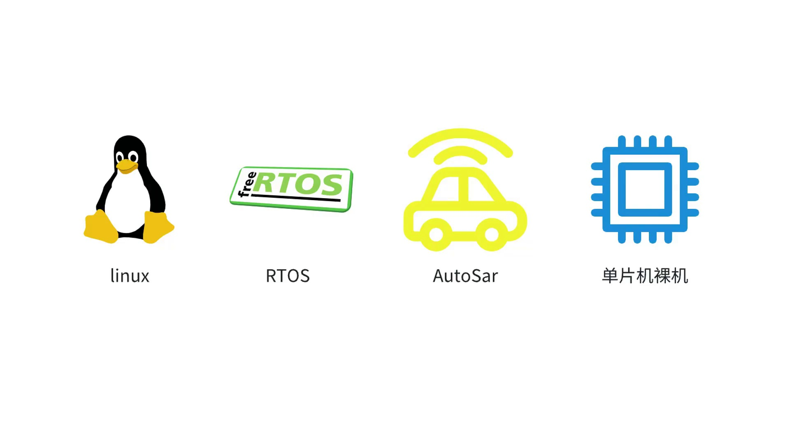
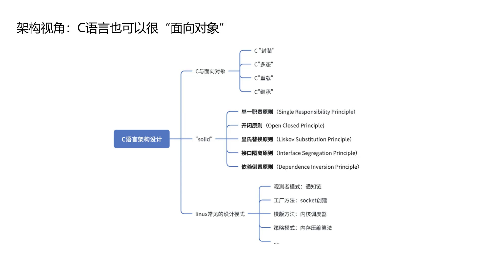
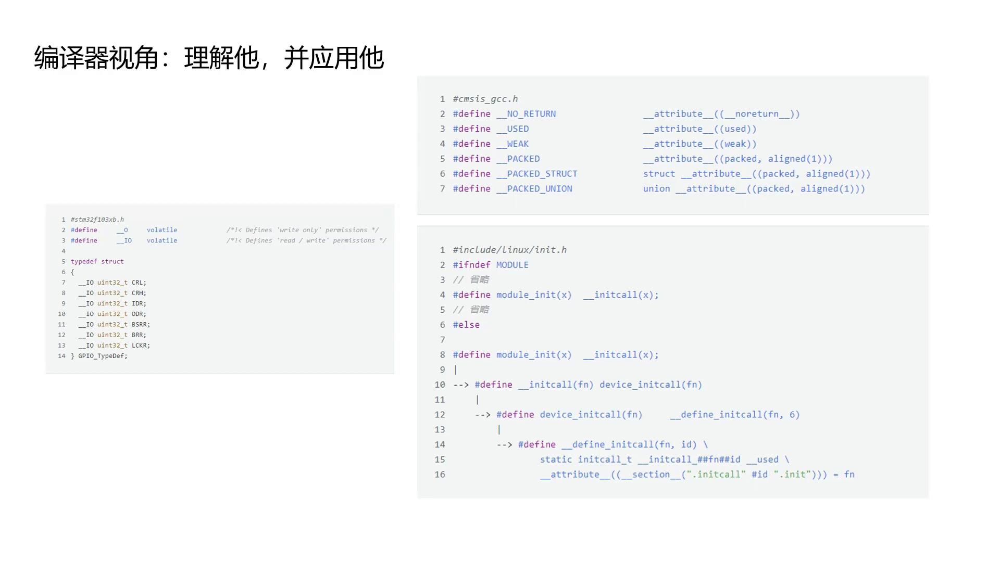

# 第1章 课程导论

> **系列**：C语言进阶：内存、架构与编译器
> **项目**：课程内容与理念介绍

---

## 学习目标

- 明确C语言在操作系统和嵌入式系统中的核心地位
- 理解“操作内存”是C语言控制硬件的本质
- 了解如何在C语言中运用面向对象设计思想进行架构优化
- 认识编译器在开发中的双重角色：规避优化陷阱并活用其特性
- 把握课程“内存–架构–编译器”三位一体的设计理念

---

## 1.1 C语言的广泛应用与核心地位

C语言由Dennis Ritchie于1972年发明，历经半个多世纪，至今仍在TIOBE编程语言排行榜中稳居前两位。其长久生命力的根源在于对底层硬件的直接控制能力。

**C语言在操作系统中的角色**  
现代计算机系统自底向上可分为三层：硬件、操作系统、应用程序。以Android系统为例，其软件栈中仅最上层的Java框架层使用Java编写，而Bootloader（如U‑Boot）、Linux内核、HAL层（硬件抽象层）等均由C/C++实现。整个Linux内核完全由C语言构建，这使得C语言在操作系统领域拥有不可撼动的地位。


**C语言与智能硬件**  
C语言是最靠近硬件的高级编程语言。在智能手机、无人机、IoT设备、扫地机器人、智能驾驶舱等智能硬件中，C语言无处不在。无论是单片机的裸机开发，还是基于RTOS、Linux、AUTOSAR等操作系统的嵌入式软件开发，C语言都是必备的核心技能。对C语言的理解深度，直接影响嵌入式工程师的职业高度。




以上种种应用场景，都指向一个核心事实：**C语言的操作对象是内存，而硬件本质上就是内存映射**。本课程正是围绕这一根本认知，从内存、架构、编译器三个视角展开深度解析。


---

## 1.2 内存视角：操作内存就是控制硬件

C语言控制硬件的本质是操作内存。外设硬件（如GPIO、I2C、UART等）在CPU视角下，都以内存映射的方式呈现。

以单片机点灯实验为例：CPU将GPIO外设的寄存器映射到特定的内存地址，C语言程序通过对这些地址进行读写，即可驱动GPIO模块，最终点亮LED。因此，控制硬件的代码，本质上就是在操作内存。


以STM32微控制器的外设内存映射表为例：CPU将Timer、ADC、SPI、I2C等所有外设资源，各自映射为一段连续的内存地址。开发者通过C语言访问这些地址，就能操控对应的外设。从内存的角度看待C语言程序，是在实际工作中游刃有余的关键。


---

## 1.3 架构视角：C语言也可以“面向对象”

大型项目中“告别if/else”的代码设计，要求开发者具备架构设计思维。虽然C语言本身是面向过程的，但完全可以借鉴C++、Java等面向对象语言的思想，利用编程技巧实现**封装、多态、重载**等效果。

这些技巧在Linux内核源码中被大量运用：通过函数指针、结构体嵌套、回调注册等方式，C语言可以构建出非常稳健的架构设计。掌握合理的编程理念和原则，C语言的架构能力同样可以十分出色。



---

## 1.4 编译器视角：理解它并应用它

编译器不仅是产生可执行文件的翻译工具，更是一个强大的辅助编程工具。深刻理解编译器的行为，既能避免优化带来的陷阱，又能主动利用其特性实现更优雅的设计。

**应对编译器优化**  
开启高等级优化（如`-O3`）时，编译器可能过度优化而导致程序逻辑错误。此时使用`volatile`关键字可以防止编译器对相关变量进行不当优化，确保每次访问都直接从硬件地址读取或写入。

**控制字节对齐**  
为防止编译器自动进行字节对齐，可以使用`__attribute__((packed))`（或`packed, aligned(1)`）属性，强制结构体按1字节紧凑排列，保证内存布局与实际需求一致。

**利用section属性实现模块化**  
Linux模块化编程中的`module_init`机制，底层依赖`__attribute__((section(...)))`技术——将函数指针放入特定的程序段中，启动时由链接脚本按顺序调用，从而实现自动初始化。

以下代码片段展示了上述技术的具体形式。

**定义volatile外设寄存器（CMSIS风格）**
```c
#define __O   volatile  /*!< 只写权限 */
#define __IO  volatile  /*!< 读写权限 */

typedef struct
{
  __IO uint32_t CRL;
  __IO uint32_t CRH;
  __IO uint32_t IDR;
  __IO uint32_t ODR;
  __IO uint32_t BSRR;
  __IO uint32_t BRR;
  __IO uint32_t LCKR;
} GPIO_TypeDef;
```

**代码解析**：
| 代码段 | 说明 |
|--------|------|
| `#define __IO volatile` | 定义带volatile的别名宏，声明外设寄存器为“易变”类型，禁止编译器缓存其值 |
| `typedef struct { ... } GPIO_TypeDef;` | 将GPIO的所有控制寄存器封装为一个结构体类型，每个成员对应一个实际的硬件寄存器，通过基地址偏移访问 |

**常用编译器属性宏**
```c
#define __NO_RETURN     __attribute__((__noreturn__))
#define __USED          __attribute__((used))
#define __WEAK          __attribute__((weak))
#define __PACKED        __attribute__((packed, aligned(1)))
#define __PACKED_STRUCT struct __attribute__((packed, aligned(1)))
#define __PACKED_UNION  union  __attribute__((packed, aligned(1)))
```

**代码解析**：
| 宏名称 | 对应属性 | 作用 |
|--------|----------|------|
| `__NO_RETURN` | `noreturn` | 告知编译器该函数不会返回，有助于优化与消除警告 |
| `__USED` | `used` | 防止符号因未引用而被优化移除 |
| `__WEAK` | `weak` | 声明弱符号，可被用户定义的强符号覆盖 |
| `__PACKED` | `packed, aligned(1)` | 取消对齐，按1字节紧凑排列变量 |
| `__PACKED_STRUCT` / `__PACKED_UNION` | 同上 | 方便直接定义紧凑结构体或联合体 |

**模块初始化的宏展开（Linux内核）**
```c
#include <linux/init.h>

#ifndef MODULE
#define module_init(x) __initcall(x);
#else
#define module_init(x) __initcall(x);
#endif

#define __initcall(fn)      device_initcall(fn)

#define device_initcall(fn) __define_initcall(fn, 6)

#define __define_initcall(fn, id) \
    static initcall_t __initcall_##fn##id __used \
    __attribute__((__section__(".initcall" #id ".init"))) = fn;
```



**代码解析**：
| 代码段 | 说明 |
|--------|------|
| `module_init(x)` | 模块入口宏，最终将初始化函数指针放置到特定段 |
| `__define_initcall(fn, id)` | 定义静态函数指针，并通过`section`属性编译到`.initcall6.init`段，赋予初始值`fn` |
| `__used` | 防止该指针因未被显式引用而被优化掉 |
| `##fn##id` | 拼接唯一变量名，避免重复定义 |
| `section` 属性 | 链接时将所有该段的函数指针收集起来，在初始化阶段按顺序统一调用，实现自动化模块加载 |

通过编译器视角，不仅能解决优化引发的现实问题，更能主动驾驭编译器特性，编写出更精巧的代码。

---

## 1.5 课程设计理念

本课程从**内存、架构、编译器**三个维度，深层次解构C语言的底层逻辑。同时，鼓励学习者站在语言设计者的角度思考“为什么C语言要这样设计”。通过沉浸式Linux环境编程，研究行业内优秀源码案例，拓宽编程视野，实现从“码农”到“工程师”的思维转换，切实提升工程软实力。


---

## 小结

- C语言在操作系统内核、嵌入式硬件领域占据核心地位，是离硬件最近的高级语言。
- “操作内存”是C语言控制硬件的本质，外设皆可通过内存映射地址进行访问。
- 尽管C语言是面向过程的，但借助函数指针等技巧，可以模拟面向对象的封装、多态等特性，实现稳健的架构设计。
- 编译器既能因优化引发问题（需用volatile等规避），也能通过属性（packed、section等）提供强大的编程支持，主动利用编译器特性可以写出更精妙的代码。
- 课程贯穿内存、架构、编译器三个视角，旨在培养底层系统级的工程思维。