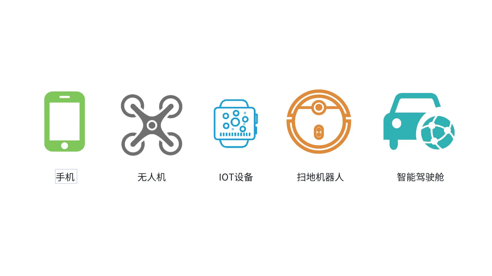
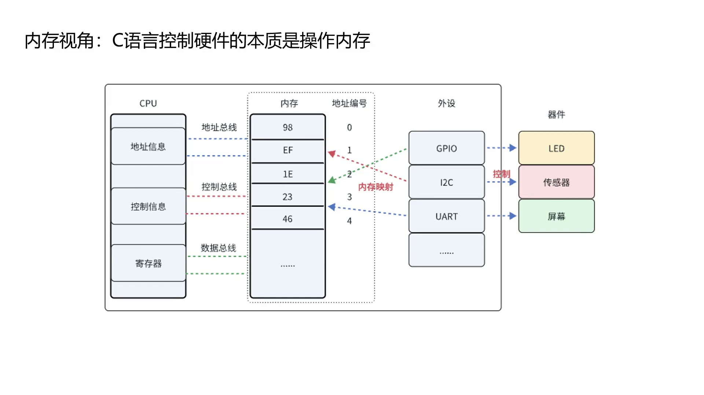
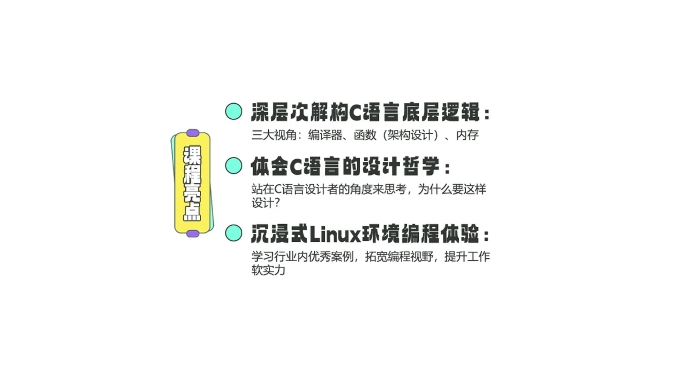

# 课程内容与理念介绍

> **系列**：C 语言底层逻辑与应用
> **项目**：课程导览

---

## C 语言经久不衰的根本原因

### 操作系统中的核心支柱

计算机系统采用经典的分层架构：底层为硬件，中间层为操作系统，最上层为应用程序。以 Android 系统为例，从下往上依次包含 Bootloader（U-Boot）、Linux 内核、硬件抽象层（HAL）等。除 Java Framework 由 Java 编写外，其余绝大多数组件均使用 C/C++ 构建，层次越贴近硬件，C 语言的占比越高——整个 Linux 内核 100% 由 C 语言实现。这种对底层资源的直接掌控能力，使 C 语言在操作系统领域占据不可替代的地位。


### 智能硬件与嵌入式开发的必备基础

C 语言同时也是最贴近硬件的语言之一，因此几乎遍及所有智能硬件：手机、无人机、IoT 设备、扫地机器人、智能驾驶舱等。无论从事单片机裸机开发，还是基于 RTOS、Linux、AUTOSAR 等平台的嵌入式软件设计，C 语言都是必要的基础。对 C 语言的掌握程度，直接影响嵌入式工程师的职业发展空间。




---

## 课程设计的三大分析视角

为了深入揭示 C 语言的底层逻辑，本课程将从**内存**、**架构（函数设计）**、**编译器**三个维度进行解析，这三大视角将贯穿全部内容。


---

## 内存视角：操作硬件的本质是内存

C 语言最核心的能力体现在对内存的直接操控。在 CPU 视角下，各种外设硬件（GPIO、I2C、UART、SPI、ADC、Timer 等）并非独立的物理实体，而是通过地址映射在内存空间中表现为一段连续的地址区域。以典型的单片机 GPIO 点灯为例：CPU 将 GPIO 模块的控制寄存器映射到特定的内存地址，C 语言通过对这些地址的读写，即可驱动 GPIO 外设，最终控制 LED 亮灭。因此，C 语言控制硬件的本质，就是操作内存。



下面的 STM32 外设内存映射表直观展示了这一点：Timer、ADC、SPI、I2C 等外设在 CPU 中仅表现为一段段连续的内存空间。


---

## 架构视角：C 语言的“面向对象”设计

实际工程中，大量 `if-else` 堆砌会导致代码难以维护。要改善这种状况，就需要引入架构设计的思维。尽管 C 语言是典型的面向过程语言，但借助函数指针、结构体嵌套、回调注册等技巧，可以在 C 语言中实现类似封装、继承、多态的面向对象效果。这些技术在 Linux 内核源码中已被大量成熟运用，表明只要遵循合适的原则，C 语言同样可以构建稳固（solid）的架构。


---

## 编译器视角：防范优化陷阱与利用扩展特性

编译器优化可能导致不易察觉的运行时缺陷，但掌握编译器的扩展特性后，也可以将其转化为增强代码可靠性的设计工具。

**防范编译器过度优化**

当使用 `-O3` 等高级别优化时，编译器可能将多次读取同一内存地址的操作优化为只读一次并缓存于寄存器。若该地址对应硬件状态寄存器（会被硬件异步改变），则会导致逻辑错误。此时需引入 `volatile` 关键字，明确告知编译器该变量可能在任何时刻被意外修改，每次访问都必须重新从内存读取。在 STM32 的 CMSIS 头文件中，所有外设寄存器均通过 `__IO`（即 `volatile`）来声明：

```c
typedef struct
{
  __IO uint32_t CRL;   /* 端口配置低寄存器 */
  __IO uint32_t CRH;   /* 端口配置高寄存器 */
  __IO uint32_t IDR;   /* 输入数据寄存器 */
  __IO uint32_t ODR;   /* 输出数据寄存器 */
  __IO uint32_t BSRR;  /* 位设置/清除寄存器 */
  __IO uint32_t BRR;   /* 位复位寄存器 */
  __IO uint32_t LCKR;  /* 配置锁定寄存器 */
} GPIO_TypeDef;
```

**代码解析**

1. `__IO` 是 `volatile` 的宏定义（通常为 `#define __IO volatile`），指示编译器不得优化对该变量的任何读写操作，每次都必须直接访问实际的内存地址。这对于映射到硬件寄存器的变量至关重要，因为寄存器的值可能由硬件异步改变。
2. `typedef struct { ... } GPIO_TypeDef;`：将 GPIO 外设的七个控制寄存器按照硬件手册中定义的顺序和偏移量封装成一个结构体类型，使得通过基地址指针可像访问普通结构体成员一样操作寄存器，简化了外设编程。
3. 该设计体现了 C 语言“操作硬件即操作内存”的核心理念：只要将外设基地址强制转换为该结构体指针，即可通过结构体成员读写对应的寄存器。

**将编译器特性转化为设计工具**

合理运用编译器的扩展属性可以有效提升代码的健壮性和可维护性。例如，使用 `__attribute__((packed, aligned(1)))` 可以强制取消编译器的自动字节填充，实现紧凑的内存布局，这对硬件寄存器映射或通信协议解析至关重要：

```c
#define __PACKED        __attribute__((packed, aligned(1)))
#define __PACKED_STRUCT struct __attribute__((packed, aligned(1)))
#define __PACKED_UNION  union  __attribute__((packed, aligned(1)))
```

**代码解析**

1. `__attribute__((packed, aligned(1)))` 指示编译器在分配结构体或联合体成员时，取消任何为对齐而插入的填充字节，并将整体对齐要求设为 1 字节。
2. 通过 `__PACKED_STRUCT` 或 `__PACKED_UNION` 声明紧凑数据结构，可确保类型的内存布局与硬件寄存器的位定义或通信协议的字节流完全一致，避免因对齐偏移导致的数据解析错误。

更进一步，在 Linux 内核的模块化管理中，`module_init` 宏借助 `__attribute__((section))` 将各个模块的初始化函数指针放入特定的数据段，从而在启动时实现自动化的顺序遍历与调用：

```c
#define module_init(x)       __initcall(x);
#define __initcall(fn)       device_initcall(fn)
#define device_initcall(fn)  __define_initcall(fn, 6)
#define __define_initcall(fn, id) \
    static initcall_t __initcall_##fn##id __used \
    __attribute__((__section__(".initcall" #id ".init"))) = fn
```

**代码解析**

1. `module_init(x)` 宏最终展开为将函数 `x` 的地址赋给一个带有特定段属性（`.initcall` 段）的静态变量。
2. `__attribute__((__section__(".initcall" #id ".init")))` 将该变量放置到以 `.initcall` 开头、编号 `id` 区分的独立数据段中，编译器与链接器会将这些段按顺序收集到最终映像。
3. 内核启动时，只需遍历这些 `.initcall` 段中的函数指针，即可按顺序自动执行各个模块的初始化函数，实现了模块间的解耦与自动加载，是 Linux 内核模块化管理的核心技巧之一。


---

## 课程理念总结

本课程将从**编译器、架构（函数设计）、内存**三大视角出发，对 C 语言的底层逻辑进行深层次解构，并引导开发者站在 C 语言设计者的角度思考“为什么要这样设计”。同时，课程提供沉浸式的 Linux 环境编程体验，通过分析行业内的优秀源码案例，帮助学习者拓宽编程视野，提升实际工作能力。



---

## 小结

- C 语言长期占据编程语言排行榜前列，其活力来源于操作系统底层实现和智能硬件领域的广泛渗透。
- 理解 C 语言需要紧扣**内存、架构、编译器**三条主线：操作硬件即操作内存；借助函数指针等手法可实现面向对象的设计；`volatile` 和 `__attribute__` 等编译器特性既能防范优化陷阱，又可作为构造高级运行逻辑的工具。
- 从语言设计者的视角审视线程，有助于写出更专业、更健壮的 C 代码。