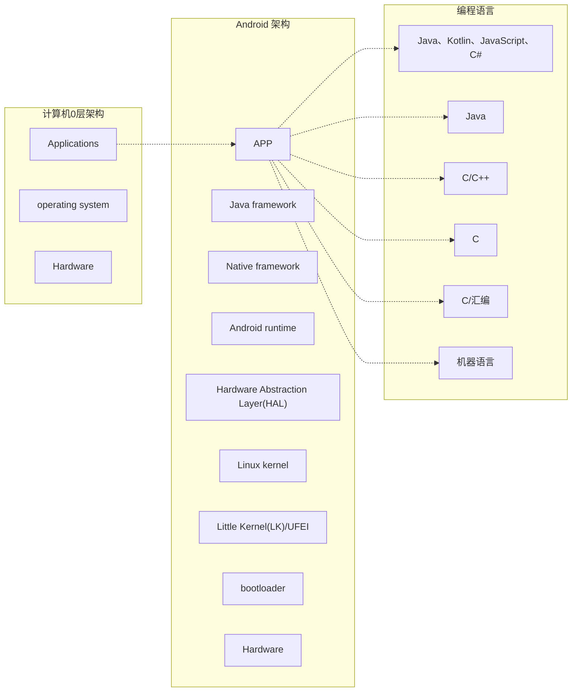

## keyframe_001_13.5s (13.5s)

## 嵌入式C语言(高阶版)
To be a programmer, not just a coder
Murphy

---

## keyframe_002_32.4s (32.4s)

## C语言在操作系统中的地位

---

## keyframe_003_78.1s (78.1s)

## C语言是最靠近硬件的高级语言
<details>
<summary>flowchart</summary>

</details>

---

## keyframe_004_87.9s (87.9s)

<details>
<summary>natural_image</summary>
Green rounded square icon with a blank smartphone screen and a small circle on the right (no text or symbols)
</details>
手机
<details>
<summary>natural_image</summary>
Abstract geometric pattern with four curved lines and a central dot (no text or symbols)
</details>
无人机
<details>
<summary>natural_image</summary>
Blue line icon of a smartwatch with bubbles on screen (no text or symbols)
</details>
IOT设备
<details>
<summary>natural_image</summary>
Simple orange circular icon with a central circular element and two small circular elements inside, resembling a stylized robot or device (no text or symbols)
</details>
扫地机器人
<details>
<summary>natural_image</summary>
Icon of a car next to a soccer ball, no text or symbols present
</details>
智能驾驶舱

---

## keyframe_005_93.2s (93.2s)

## C语言是嵌入式开发必备的工具和技能

---

## keyframe_006_98.7s (98.7s)

<details>
<summary>natural_image</summary>
Cartoon penguin character with black body and yellow limbs (no text or symbols)
</details>
linux
<details>
<summary>text_image</summary>
free RTOS
</details>
RTOS
<details>
<summary>natural_image</summary>
Yellow icon of a car with wireless signal waves above it (no text or symbols)
</details>
AutoSar
<details>
<summary>natural_image</summary>
Blue icon of a microchip or integrated circuit chip with pin connections (no text or symbols)
</details>
单片机裸机

---

## keyframe_007_107.3s (107.3s)

## 从三大视角，剖析C语言的底层逻辑
## 内存视角
最适合操作底层的语言
## C语言的底层逻辑
## 架构视角
"solid"的C软件架构设计
## 编译器视角
是编译，也是优化

---

## keyframe_008_146.3s (146.3s)

## 内存视角：C语言控制硬件的本质是操作内存
<details>
<summary>flowchart</summary>
```mermaid
graph LR
subgraph CPU
CPU1["CPU"]
CPU2["地址信息"]
CPU3["控制信息"]
CPU4["寄存器"]
end
subgraph Storage
Storage1["内存"]
Storage2["EF"]
Storage3["1E"]
Storage4["23"]
Storage5["46"]
Storage6["......"]
end
subgraph External
External["外设"]
External1["GPIO"]
External2["I2C"]
External3["UART"]
External4["......"]
end
subgraph Devices
Device1["LED"]
Device2["传感器"]
Device3["屏幕"]
end
CPU1 -.->|地址总线| Storage1
CPU2 -.->|控制总线| Storage1
CPU3 -.->|数据总线| Storage1
CPU4 -.->|数据总线| Storage1
Storage1 -->|地址编号| External
Storage2 -->|地址编号| External
Storage3 -->|地址编号| External
Storage4 -->|地址编号| External
Storage6 -->|地址编号| External
External -->|控制映射| Storage1
External -->|控制映射| Storage2
External -->|控制映射| Storage3
External -->|控制映射| Storage4
```
</details>

---

## keyframe_009_161.0s (161.0s)

## 内存视角：CPU眼里，外设资源就是内存映射

---

## keyframe_010_195.9s (195.9s)

架构视角：C语言也可以很“面向对象”

---

## keyframe_011_235.3s (235.3s)

## 编译器视角：理解他，并应用他
```c
#stm32f103xb.h
#define __O volatile /*!< Defines 'write only' permissions */
#define __IO volatile /*!< Defines 'read / write' permissions */
typedef struct
{
__IO uint32_t CRL;
__IO uint32_t CRH;
__IO uint32_t IDR;
__IO uint32_t ODR;
__IO uint32_t BSRR;
__IO uint32_t BRR;
__IO uint32_t LCKR;
} GPIO_TypeDef;
```
```c
#cmsis_gcc.h
#define __NO_RETURN
#define __USED
#define __WEAK
#define __PACKED
#define __PACKED_STRUCT
#define __PACKED_UNION
```
```c
#include/linux/init.h
#ifndef MODULE
// 省略
#define module_init(x) __initcall(x);
// 省略
#else
#define module_init(x) __initcall(x);
|
--> #define __initcall(fn) device_initcall(fn)
|
--> #define device_initcall(fn) __define_initcall(fn, 6)
|
--> #define __define_initcall(fn, id) \
static initcall_t __initcall_##fn##id __used \
__attribute__((__section��"."initcall" #id ".init"))) = fn
```

---

## keyframe_012_262.1s (262.1s)

<details>
<summary>text_image</summary>
课程亮点
</details>
\- 深层次解构C语言底层逻辑：
三大视角：编译器、函数（架构设计）、内存
体会C语言的设计哲学：
站在C语言设计者的角度来思考，为什么要这样设计？
\- 沉浸式Linux环境编程体验：
学习行业内优秀案例，拓宽编程视野，提升工作软实力

---
