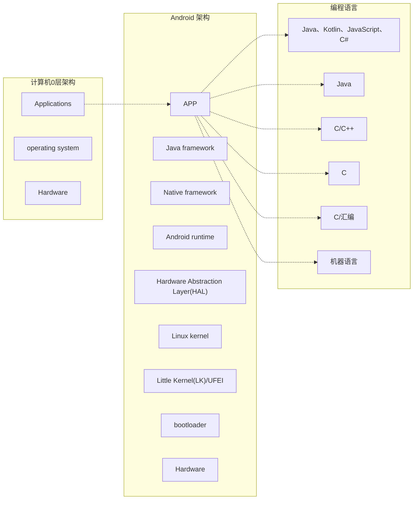

## C语言是最靠近硬件的高级语言

flowchart

```mermaid
graph LR
  subgraph Computer0Layer["计算机0层架构"]
    A["Applications"]
    B["operating system"]
    C["Hardware"]
  end

  subgraph AndroidArchitecture["Android 架构"]
    D["APP"]
    E["Java framework"]
    F["Native framework"]
    G["Android runtime"]
    H["Hardware Abstraction Layer(HAL)"]
    I["Linux kernel"]
    J["Little Kernel(LK)/UFEI"]
    K["bootloader"]
    L["Hardware"]
  end

  subgraph Programming["编程语言"]
    M["Java、Kotlin、JavaScript、C#"]
    N["Java"]
    O["C/C++"]
    P["C"]
    Q["C/汇编"]
    R["机器语言"]
  end

  A -.-> D
  D -.-> M
  D -.-> N
  D -.-> O
  D -.-> P
  D -.-> Q
  D -.-> R
```

