# Ubuntu环境搭建

> **系列**：C语言编程实战
> **项目**：开发环境准备

---

## 学习目标

- 掌握在VMware Workstation Player中创建Ubuntu虚拟机的方法。
- 能够登录Ubuntu系统并打开命令行终端。
- 熟悉ls、cd、mkdir、clear等基本文件与目录操作命令。
- 学会使用apt-get安装编辑器Vim。

---

## 环境准备：VMware与Ubuntu虚拟机

### 安装VMware Workstation Player

本课程的C语言编程全部在Linux环境下进行，选用Ubuntu发行版。整套环境通过VMware虚拟机搭建，因此需要安装VMware Workstation Player和Ubuntu桌面版镜像。

VMware的安装过程十分简便，下载安装包后，保持默认选项一路点击“下一步”即可完成。

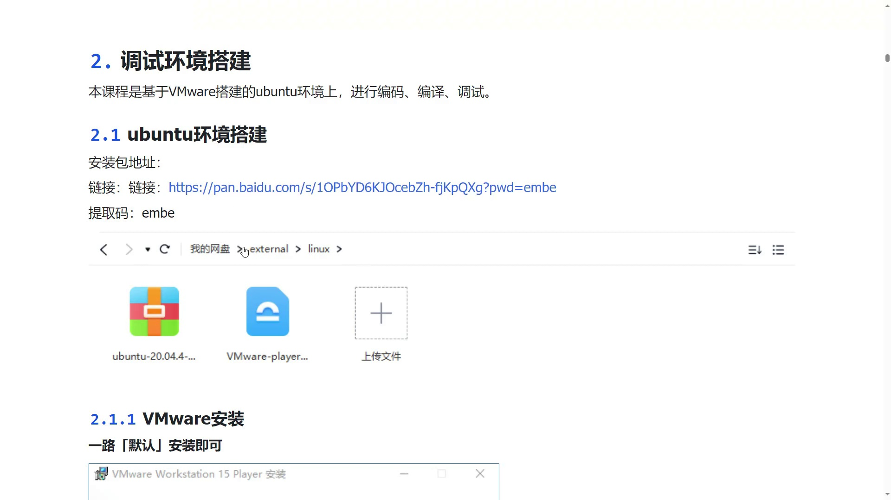

### 创建Ubuntu虚拟机

启动VMware Workstation Player，在主页面中单击“创建新虚拟机”按钮。

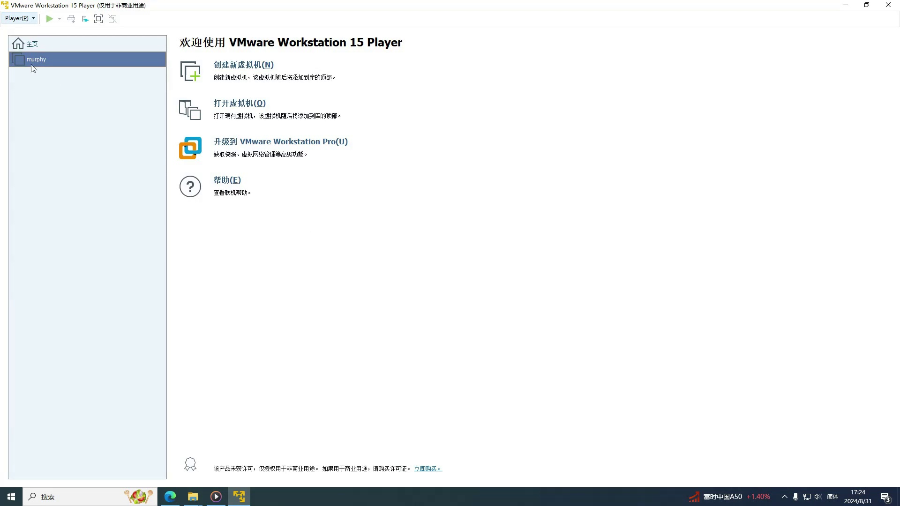

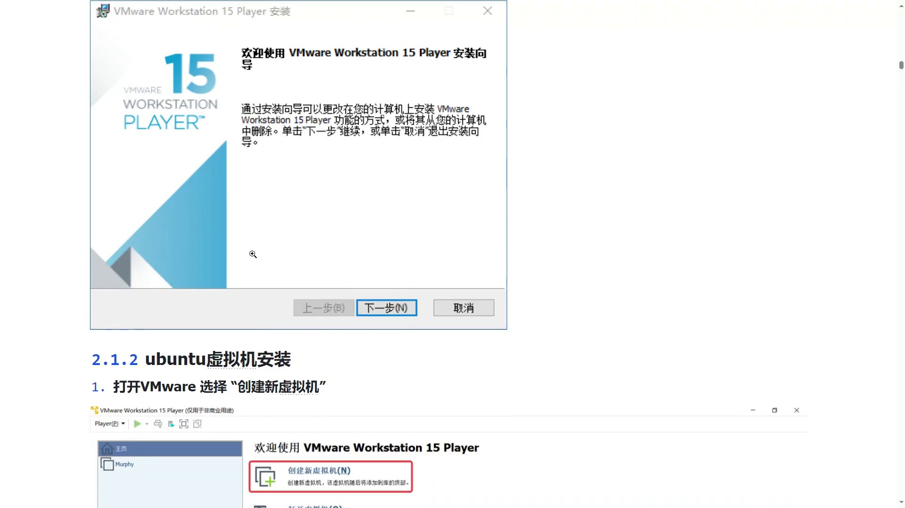

根据向导进行设置，步骤如下：

1. 选择提前下载好的Ubuntu镜像文件（ISO格式）。
2. 填写用户信息：
   - **全名**：可自定义，无实际影响。
   - **用户名**：Linux系统的登录账户名，例如演示中填写了 `murphy`。
   - **密码**与确认密码：务必牢记，后续执行 `sudo` 等提权操作时需要输入。
3. 指定虚拟机名称和存储位置，默认设置即可。
4. 设置磁盘大小：默认20 GB，本课程实验已足够使用。如有编译内核等需求，可适当增加。
5. 在最终摘要界面，点击“自定义硬件”进行性能调整：
   - **内存**：从默认的2 GB修改为 **4 GB** (4096 MB)。
   - **处理器核心数**：修改为 **2 核**。

   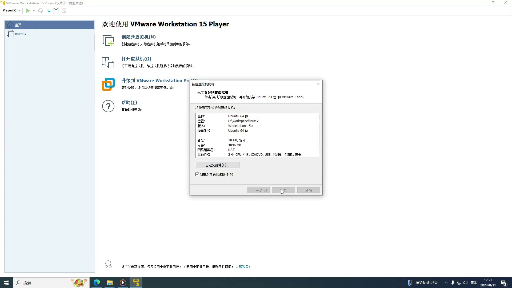

6. 确认无误后点击“完成”，虚拟机将自动开始安装Ubuntu系统。

---

## 系统启动与登录

安装完成后虚拟机自动重启，进入Ubuntu的登录界面。输入之前设置的用户密码即可登录。

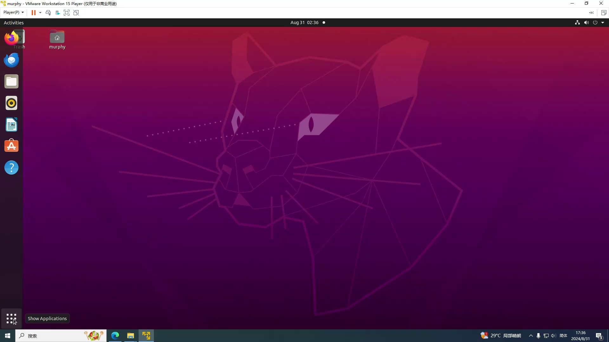

首次进入桌面可能稍慢，稍等片刻后便可看到完整的图形化桌面。

---

## 终端操作

在Linux下进行编程，绝大多数任务通过命令行终端完成，图形化编辑器较少使用。因此，熟练掌握终端的使用是后续学习的基础。

### 打开终端的方式

1. **菜单启动**：点击桌面左下角“菜单”按钮（或按键盘Super键），在搜索框中输入 `term`，或在应用列表中找到 **Terminal** 图标并单击。
2. **右键快捷方式**：在桌面空白处右键，选择 “Open Terminal”。
3. **快捷键**：同时按下 `Ctrl` + `Alt` + `T`。

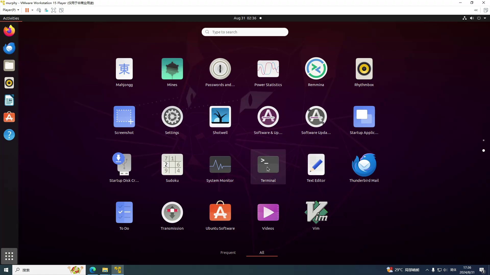

终端打开后，提示符类似于 `murphy@ubuntu:~$`，各部分含义如下：

- `murphy`：当前登录的用户名。
- `ubuntu`：主机名。
- `~`：表示当前位于用户的家目录。
- `$`：表明当前为普通用户权限（超级用户对应 `#`）。

---

## 基本命令演示

### ls：列出文件和目录

`ls` 是查看目录内容的常用命令，支持多种选项。

| 命令 | 说明 |
|------|------|
| `ls` | 列出当前目录中的非隐藏文件和文件夹 |
| `ls -a` | 显示所有文件，包括以 `.` 开头的隐藏文件 |
| `ls -l` | 以长格式显示详细信息，包含权限、所有者、大小、修改时间等 |
| `ls -la` | 组合 `-l` 与 `-a`，同时显示隐藏文件及其详细属性 |

在终端中执行这些命令的示例如下：

```bash
ls
ls -a
ls -l
ls -la
```

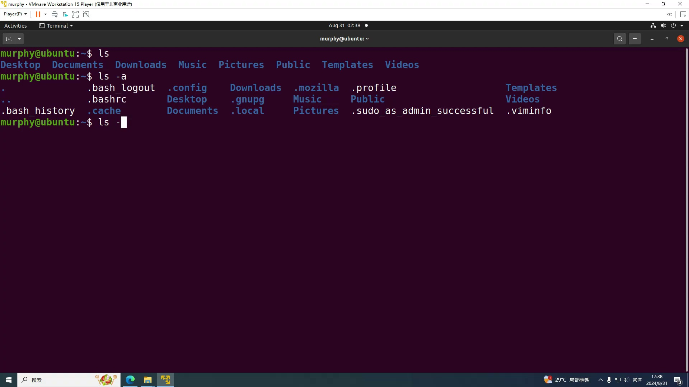

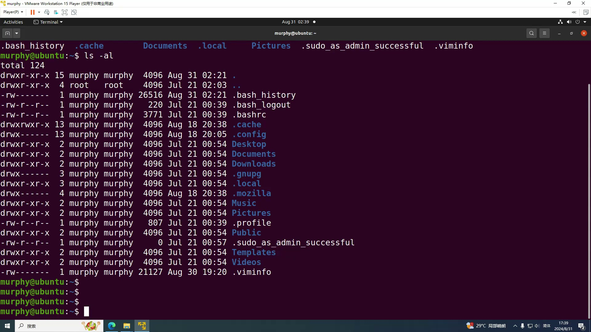

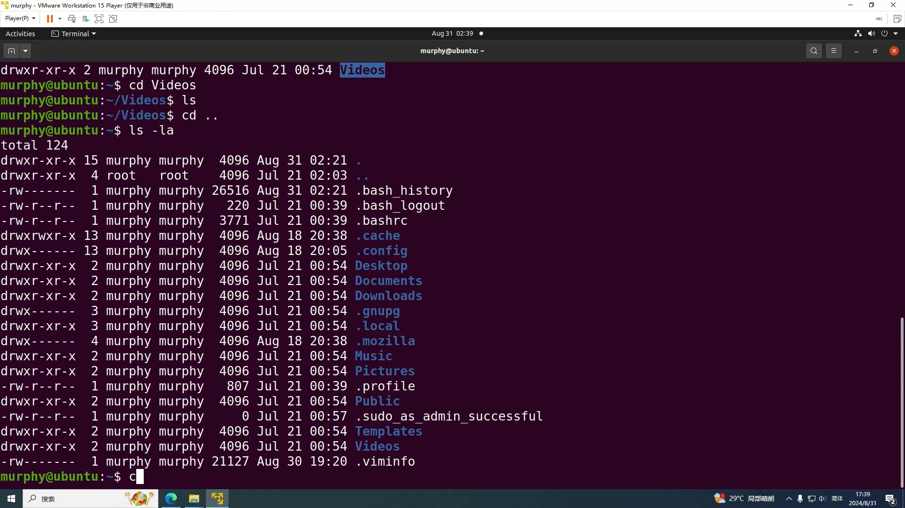

### cd：切换工作目录

`cd` 命令用于在不同目录间切换。

| 命令 | 说明 |
|------|------|
| `cd 目录名` | 进入指定目录（可利用 Tab 键自动补全） |
| `cd ..` | 返回上一级目录 |
| `cd` 或 `cd ~` | 切换到当前用户的家目录 |

示例：

```bash
cd Videos
ls
cd ..
```

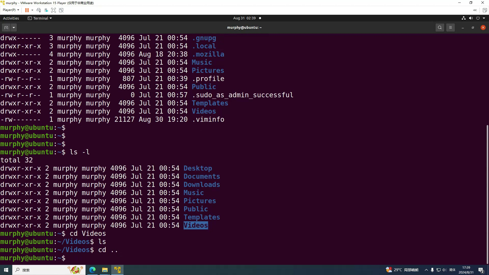

### clear：清屏

当终端显示内容过多时，执行 `clear` 命令可清空屏幕，便于后续操作。

### mkdir：创建目录

`mkdir` 命令用于创建新目录。

```bash
mkdir 123    # 在当前路径下创建名为 123 的目录
ls           # 查看新建的目录
cd 123       # 进入该目录
```

### 安装Vim编辑器

在Ubuntu中，通过包管理工具 `apt` 安装软件是一种标准做法。以安装Vim编辑器为例，执行如下命令：

```bash
sudo apt-get install vim
```

该命令的各部分含义如下：

| 组件 | 说明 |
|------|------|
| `sudo` | 临时提升为超级用户权限 |
| `apt-get` | Debian/Ubuntu 系统的包管理工具 |
| `install` | 指定动作为安装软件包 |
| `vim` | 待安装的软件包名 |

系统会要求输入当前用户密码（密码输入时不会显示任何字符），验证通过后便会自动下载并安装。如果系统中已存在最新版本，则会提示 `vim is already the newest version`。

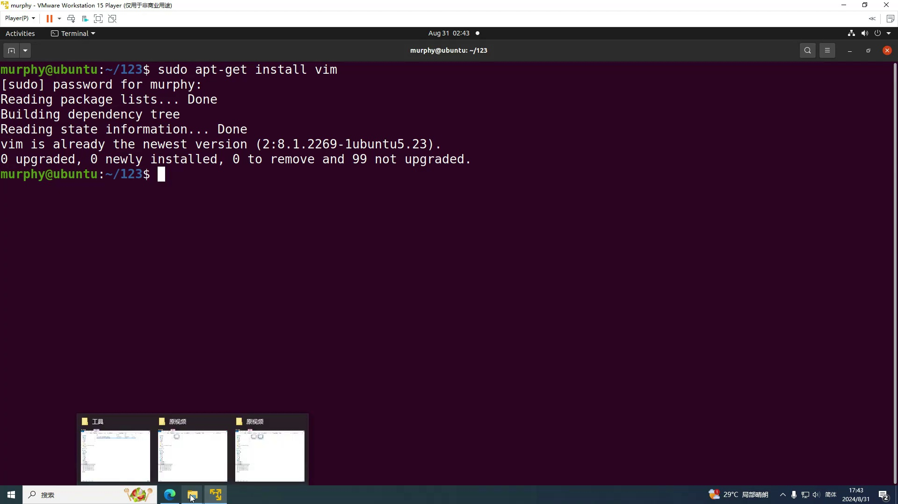

后续需要安装其他开发工具时，只需将 `vim` 替换为对应的包名。

---

## 小结

- 使用VMware虚拟机可以方便地在个人电脑上运行Ubuntu系统，为C语言开发提供Linux环境。
- 终端是Linux下编程的核心界面，可通过菜单、右键、快捷键打开；提示符中的 `~` 和 `$` 分别代表家目录和普通权限。
- `ls`、`cd`、`mkdir` 和 `clear` 是最基本的文件管理命令，灵活运用 `-a`、`-l` 选项可查看更详细的文件信息。
- `apt-get` 配合 `sudo` 能够安装各类系统软件，Vim编辑器便是后续编写代码的主要工具。
- 通过本章引导，学习者已具备开始命令行下编程实践的基本操作能力。