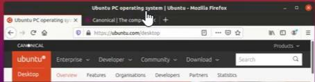

## Aug 31 00:18

## Make the most of the web

## Install

Ubuntu includes Firefox, the web browser used by millions of people around the world. And web applications you use frequently (like Facebook or Gmail, for example) can be pinned to your desktop for faster access, just like apps on your computer.

Included software

Firefox web browser

Thunderbird

Supported software

Chromium

Configuring hardware.

## Ubuntu for desktops

## 加速中≥≥