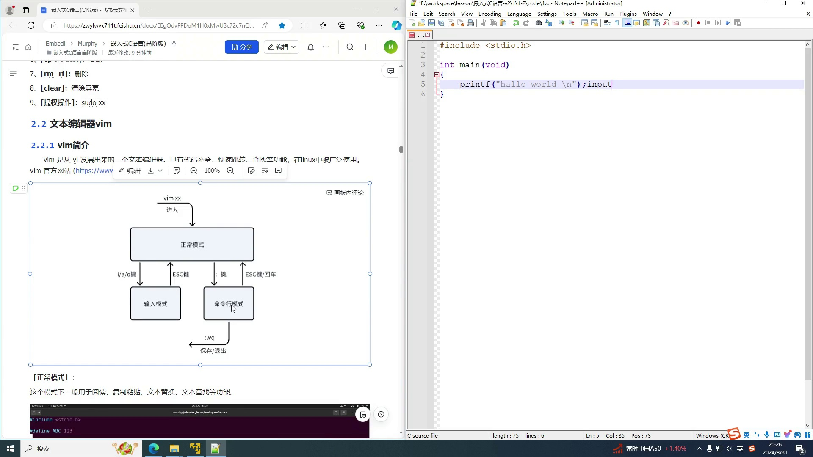
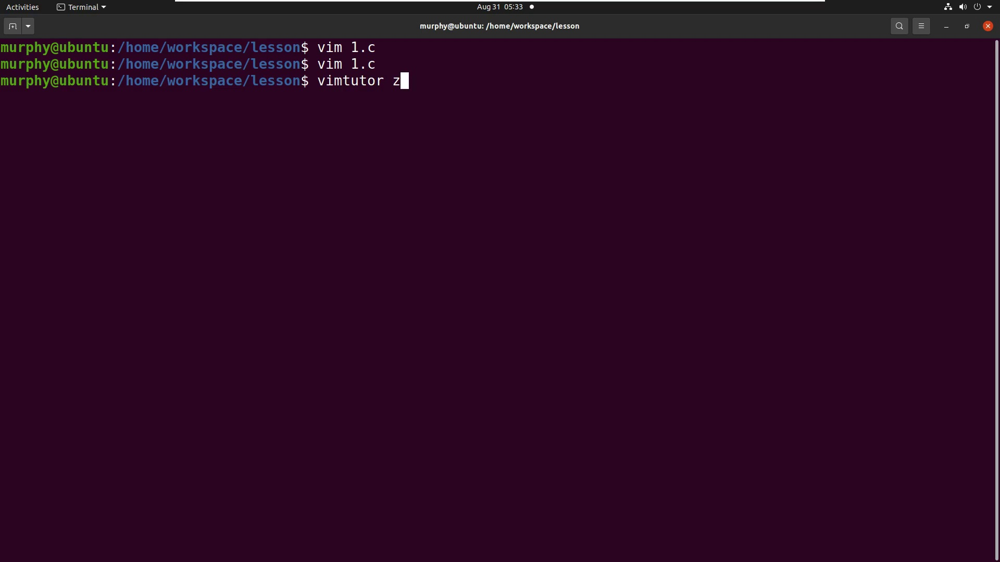

# 第X章 文本编辑器 vim

> **系列**：Linux 工具基础  
> **项目**：vim 文本编辑器

---

## 学习目标

- 了解 vim 的起源与核心特性
- 掌握正常模式、输入模式、命令行模式的作用与切换方式
- 学会使用 vim 创建、编辑文件并保存退出
- 掌握在 vim 中查找文本的基本操作
- 认识 vimtutor 交互式练习工具

---

## 2.1 vim 简介

vim 是由 vi 发展而来的终端文本编辑器。vi 最初在 Unix 系统中被广泛使用，经过多年演进，vim 具备了代码补全、快速跳转、查找替换等强大功能，至今仍是 Linux 环境下的主流编辑工具之一。

---

## 2.2 三种工作模式

vim 将编辑操作划分成三种模式：**正常模式**、**输入模式**和**命令行模式**。刚打开文件时默认处于正常模式。

### 正常模式（Normal）
该模式用于阅读、查找、替换、复制、粘贴等非输入类操作。例如在正常模式下按 `/` 可启动查找，按 `n` 跳转到下一个匹配项。

### 输入模式（Insert）
输入模式用于录入文字。在正常模式下按下 `i` 键（取自 Insert）即可进入，此时编辑器左下角会显示 `INSERT` 字样。按 `ESC` 键可退回到正常模式。

### 命令行模式（Command-line）
命令行模式用来执行保存、退出等全局操作。在正常模式下按下 `:` 键进入，光标移动到屏幕底部的命令行，等待输入命令。执行完成后通常自动回到正常模式。

三种模式的切换关系如下图所示：

  
*图：vim 三种模式的切换关系*

常见切换操作总结如下：

| 切换动作 | 按键 |
|---------|------|
| 正常模式 → 输入模式 | `i`（或其他插入键如 `a`、`o`） |
| 输入模式 → 正常模式 | `ESC` |
| 正常模式 → 命令行模式 | `:` |
| 命令行模式 → 正常模式 | 命令执行完毕自动返回 |

---

## 2.3 实操：安装与基本使用

### 2.3.1 安装 vim
若系统未安装 vim，可在终端中使用以下命令安装：

```bash
sudo apt-get install vim
```

| 命令部分 | 说明 |
|----------|------|
| `sudo` | 以管理员权限执行后续命令 |
| `apt-get` | Debian/Ubuntu 系统的软件包管理工具 |
| `install` | 安装操作 |
| `vim` | 要安装的软件包名称 |

执行后根据提示输入密码即可完成安装。

### 2.3.2 创建并编辑文件
在终端输入：

```bash
vim 1.c
```

该命令会启动 vim 并打开（若文件不存在则新建）名为 `1.c` 的文件。初始画面处于**正常模式**。

按下 `i` 键，左下角出现 `INSERT` 提示，表示已进入输入模式。随后可输入以下 C 语言代码：

```c
#include <stdio.h>

int main(void)
{
    printf("hello world\n");
}
```

### 2.3.3 保存文件并退出

1. 按 `ESC` 键，从输入模式退回到正常模式。
2. 在正常模式下输入 `:`，进入命令行模式（左下角出现冒号及光标）。
3. 输入 `wq`（`w` 表示写入，`q` 表示退出），然后按回车键。  
     
   *图：在命令行模式输入 `wq` 保存并退出*

文件保存后，vim 将关闭并返回终端。若想验证内容，可重新执行 `vim 1.c` 查看代码是否已持久化。

### 2.3.4 在文件中查找文本

1. 在正常模式下按 `/` 键，左下角会出现 `/` 符号。
2. 输入要查找的关键词，例如 `hello`，然后按回车。
3. 光标将跳转到第一个匹配位置。
4. 按 `n` 键可跳转到下一个匹配项（按 `N` 则跳转到上一个）。

---

## 2.4 练习工具 vimtutor

系统通常内置了交互式教程 **vimtutor**，适合初学者系统学习。在终端输入：

```bash
vimtutor
```

（若需中文界面，可尝试 `vimtutor zh`）

该教程大约需要 25–30 分钟，从光标移动（h、j、k、l 键）等基础操作开始，逐步引导练习。教程文件本身是一份可修改的文本，所有命令均可直接在其中实操练习。

  
*图：vimtutor 内置练习环境*

---

## 小结

- vim 是由 vi 演化而来的终端文本编辑器，功能丰富，在 Linux 环境中使用广泛。
- 编辑操作分为**正常模式**（浏览/操作）、**输入模式**（录入文字）、**命令行模式**（执行全局命令），三者通过 `i`、`ESC`、`:` 等键进行切换。
- 创建或编辑文件使用 `vim 文件名`，按 `i` 进入输入模式，编辑完成后按 `ESC`，再输入 `:wq` 保存并退出。
- 在正常模式下按 `/` 可查找文本，`n`/`N` 用于在匹配项之间跳转。
- 使用 `vimtutor` 命令可打开官方交互式教程，是快速上手的推荐方式。