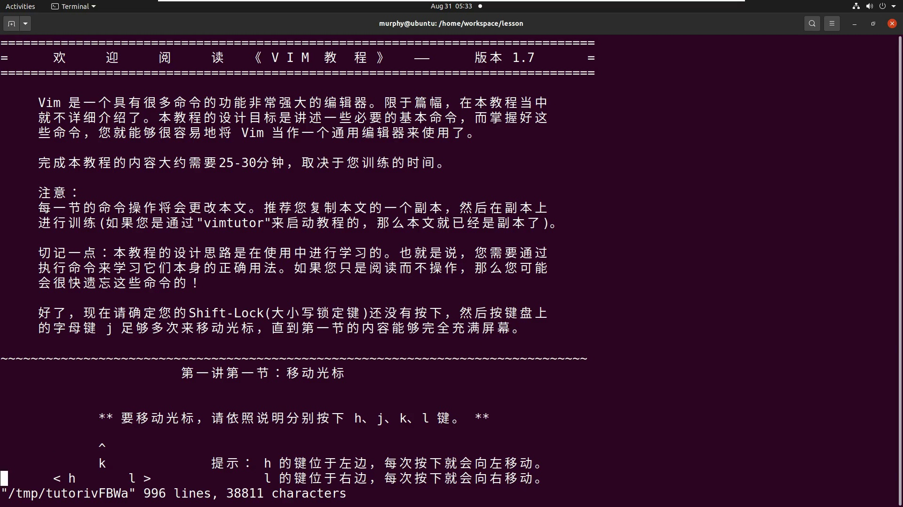

# 文本编辑器vim

> **系列**：Linux开发环境
> **项目**：vim编辑器入门

---

## vim 简介

vim 是从传统的 vi 编辑器发展而来的文本编辑器。经过多年演进，vim 具备了代码补全、快速跳转、查找替换等强大功能，在 Linux 系统中被广泛使用。与图形化编辑器不同，vim 完全基于键盘操作，其独特的模式设计让没有鼠标的环境也能高效编辑文本。

---

## vim 的三种工作模式

vim 的核心设计在于三种模式的分工协作，理解模式切换是掌握 vim 的第一步。

| 模式 | 主要用途 | 进入方式 | 屏幕提示 |
|------|----------|----------|----------|
| 正常模式 | 浏览文件、执行复制粘贴、查找替换等 | 打开文件时默认进入 | 左下角无提示 |
| 输入模式 | 插入、修改文本 | 正常模式下按 `i`、`a` 或 `o` | 左下角显示 `INSERT` |
| 命令行模式 | 执行保存、退出、设置等命令 | 正常模式下按 `:` | 左下角显示 `:` 提示符 |

**模式切换关系**

- 正常模式 → 输入模式：按 `i`（光标前插入）、`a`（光标后插入）、`o`（下一行插入）等键。
- 输入模式 → 正常模式：按 `Esc` 键。
- 正常模式 → 命令行模式：按 `:` 键。
- 命令行模式 → 正常模式：命令执行完毕自动返回，或按 `Esc` 取消。


*上图为 vim 模式切换示意图，箭头展示了从正常模式进入输入模式和命令行模式的路径。*

---

## 安装 vim

在 Ubuntu 等 Debian 系 Linux 发行版中，若系统未预装 vim，可通过终端命令安装：

```bash
sudo apt-get install vim
```

**命令解析**

1. `sudo`：以管理员权限执行后续命令，安装软件通常需要此权限。
2. `apt-get`：Debian 系的高级软件包工具（Advanced Package Tool），用于管理软件包。
3. `install vim`：指定安装名为 vim 的软件包。

执行后需输入用户密码，系统自动完成下载与安装。若已安装最新版，则会提示无需更新。

---

## 使用 vim 编辑文件

### 打开文件

在终端中使用 `vim` 后跟文件名即可：

```bash
vim 1.c
```

若文件 `1.c` 不存在，vim 会创建一个空文件，并直接进入**正常模式**。此时屏幕左下角无特殊提示，光标位于第一行首字符处。

### 进入输入模式并编写代码

在正常模式下按 `i` 键（i 为 insert 首字母）切换到输入模式，左下角出现 `INSERT` 字样，表示可开始输入文本。以一段简单的 C 程序为例：

```c
#include <stdio.h>

int main(void)
{
    printf("hello world\n");
}
```

**代码说明**

1. `#include <stdio.h>`：包含标准输入输出头文件，为 `printf` 函数提供声明。
2. `int main(void)`：C 程序的入口函数，操作系统从这里开始执行。
3. `printf("hello world\n");`：调用库函数在终端打印字符串，`\n` 表示换行。

输入过程中按 `Enter` 换行，按 `Backspace` 删除，操作习惯与普通编辑器基本一致。

### 保存与退出

1. 代码输入完成后，按 `Esc` 键退出输入模式，左下角 `INSERT` 消失，回到正常模式。
2. 输入冒号 `:` 进入命令行模式，左下角出现 `:` 提示符，光标等待命令输入。
3. 键入保存并退出命令 `wq`（`w` 代表 write，写入文件；`q` 代表 quit，退出编辑器），整个命令为 `:wq`，按回车执行。vim 将文件保存并退出，终端回到普通命令行提示符。

---

## 正常模式下的查找

再次用 `vim 1.c` 打开刚才保存的文件，可看到代码已持久化存储。在正常模式下，可以快速查找字符串：

- 输入 `/`，左下角出现 `/`，进入查找输入状态。
- 键入待搜索文本，如 `hello`，按回车。vim 会将光标定位到第一个匹配位置并高亮。
- 按 `n` 键跳转到下一个匹配项（当仅有一个匹配时原地停留）。

查找功能全程无需离开正常模式，体现了 vim 高效的设计理念。


*上图为重新打开 `1.c` 后的终端界面，后续可执行查找等正常模式操作。*

---

## vimtutor 练习工具

vim 功能远比前述丰富，入门后想进一步掌握光标移动、高级编辑等技巧，可使用系统自带的交互式教程 `vimtutor`：

```bash
vimtutor
```

或启动中文版：

```bash
vimtutor zh
```

该工具会打开一份副本教程，引导读者逐步练习各项操作，全程约需 25–30 分钟，是上手 vim 的有效途径。



*上图为 `vimtutor` 启动后的界面，教程文件内嵌了大量练习任务。*

---

## 小结

- vim 的三种模式（正常、输入、命令行）各司其职，模式切换是其核心操作逻辑。
- 通过 `i` 进入输入模式编写文本，`Esc` 返回正常模式，`:wq` 保存退出。
- 正常模式下可通过 `/` 进行文本查找，无需进入其他模式。
- 使用 `sudo apt-get install vim` 可安装 vim（Debian 系发行版）。
- `vimtutor` 是系统内置的教程工具，适合初学者系统练习 vim。