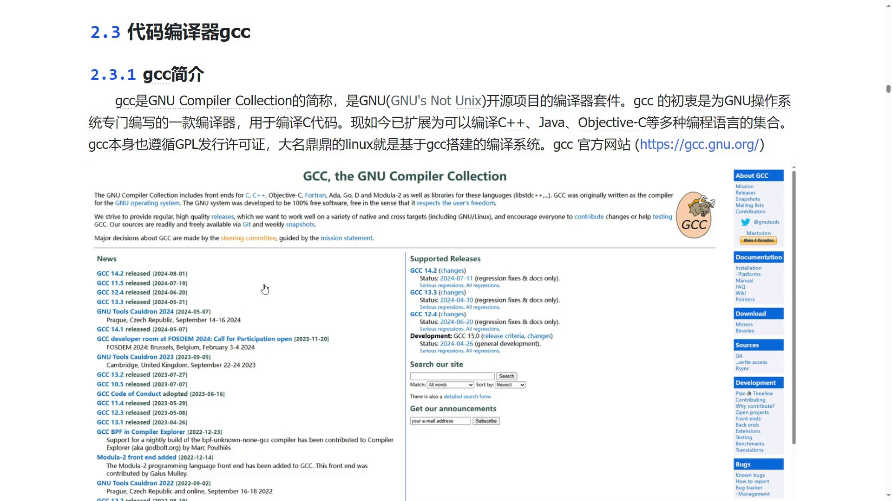
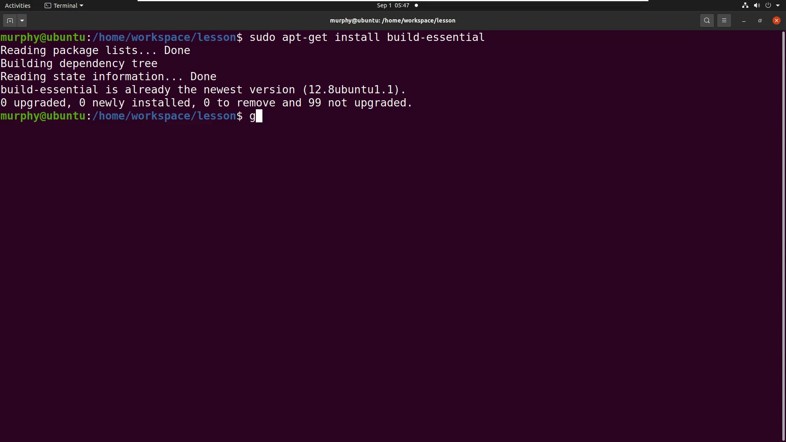
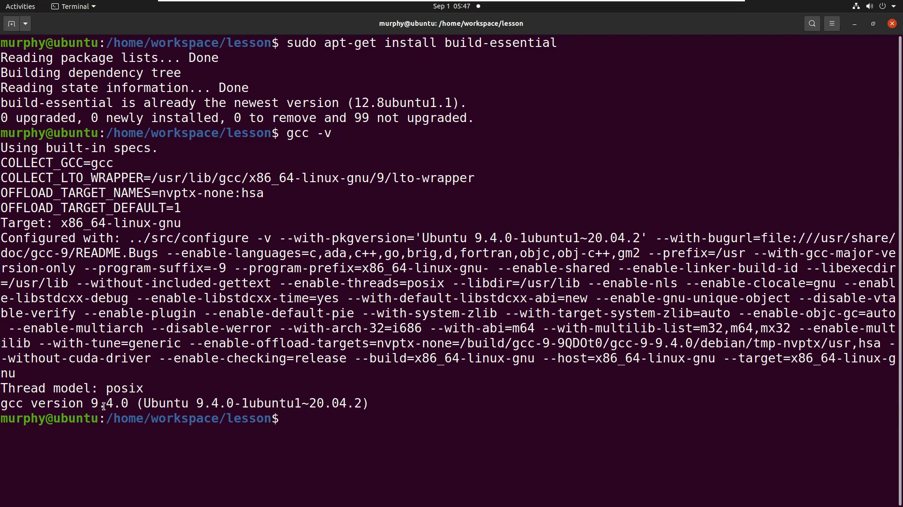

# GCC编译器入门

> **系列**：Linux系统编程基础  
> **项目**：GCC编译器

---

## GCC 简介

GCC 是 GNU Compiler Collection 的简称，属于 GNU 开源项目的编译器套件。它最初是为 GNU 操作系统专门编写的、用于编译 C 代码的编译器。经过多年发展，GCC 已扩展为支持 C++、Java、Objective‑C 等多种编程语言的编译集合。

GCC 本身遵循 GPL 许可证，Linux 操作系统就是基于 GCC 构建其编译系统的。

  
*GCC 简介示意图*

---

## 安装 GCC 编译环境

在 Linux 终端中，使用以下命令安装基础编译工具链：

```bash
sudo apt-get install build-essential
```

该命令会安装 GCC 及相关编译组件。若已安装，系统会提示“已经是最新版本”。

  
*安装 build-essential 过程*

安装完成后，通过 `gcc -v` 检查是否安装成功，并查看当前版本：

```bash
gcc -v
```

示例输出中可以看到目标架构、线程模型以及版本号——视频中安装的版本为 **9.4.0** (Ubuntu 9.4.0-1ubuntu1~20.04.2)。

  
*验证 GCC 安装及版本信息*

---

## GCC 命令基本格式

GCC 的标准命令结构如下：

```bash
gcc -o <输出文件名> <要被编译的源文件> [编译选项]
```

- `-o` 指定输出的可执行文件名称。
- 随后紧跟需要编译的源文件，可以一次指定多个源文件。
- 最后可以添加各种编译选项（例如优化级别、调试信息等），选项也可以省略，此时 GCC 按默认方式编译。

在后续使用中应当严格遵循 `-o 输出 输入` 的顺序，避免混淆。

---

## 编译并运行 Hello World 程序

以下操作演示如何用 GCC 将源代码编译为可执行文件。

1. 使用文本编辑器（例如 vim）创建源代码文件 **1.c**，其内容为：

   ```c
   #include <stdio.h>
   int main() {
       printf("Hello");
       return 0;
   }
   ```

2. 在终端中执行编译命令，将输出文件命名为 **bin**：

   ```bash
   gcc -o bin 1.c
   ```

3. 查看当前目录，确认 **bin** 文件已生成。
4. 运行生成的程序：

   ```bash
   ./bin
   ```

   终端会输出 `Hello`，表明编译和运行均成功。

---

## 编译选项简介（以 `-g` 为例）

GCC 支持众多编译选项，用以控制编译行为的细节。在实际开发中，当需要对程序进行调试时，通常会加入 **`-g`** 选项。该选项会在生成的可执行文件中嵌入调试信息（如符号表、行号映射等）。

一个直观的影响是文件大小：不加 `-g` 编译出的 **bin** 文件大小约为 17 KB；添加 `-g` 后，文件体积会明显增加，因为包含了额外的调试数据。更多高级选项将在后续内容中介绍。

---

## 小结

- GCC 是 GNU 编译器套件，支持 C、C++ 等多种语言，遵循 GPL 许可证，是 Linux 系统的核心编译工具。
- 在 Linux 系统中，通过 `sudo apt-get install build-essential` 即可安装 GCC 编译环境，使用 `gcc -v` 验证安装。
- 基本编译命令为 `gcc -o <输出文件> <源文件> [选项]`，`-o` 用于指定输出文件名。
- 以 `-g` 选项为例，编译选项可以影响生成文件的大小和特性，调试信息会显著增加可执行文件体积。