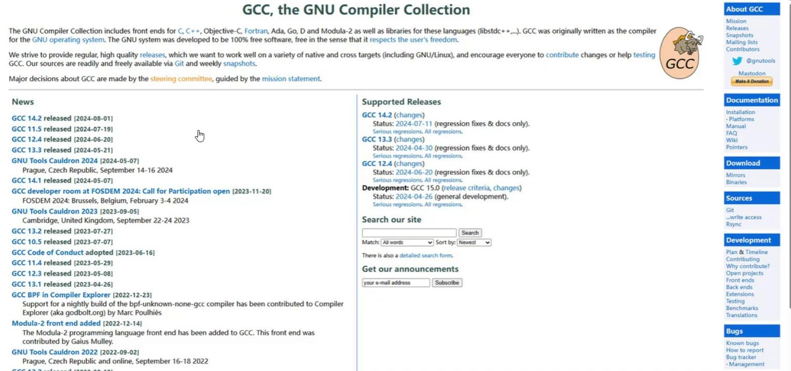

## 2.3 代码编译器gcc

## 2.3.1 gcc简介

gcc是GNU Compiler Collection的简称，是GNU(GNU's Not Unix)开源项目的编译器套件。gcc的初衷是为GNU操作系统专门编写的一款编译器，用于编译C代码。现如今已扩展为可以编译C++、Java、Objective-C等多种编程语言的集合。gcc本身也遵循GPL发行许可证，大名鼎鼎的linux就是基于gcc搭建的编译系统。gcc 官方网站(https://gcc.gnu.org/)

