# GDB调试器入门

> **系列**：C语言开发与调试  
> **项目**：GDB调试器入门  

---

## 学习目标

- 理解GDB的基本功能与应用场景
- 掌握安装GDB及编译带调试信息程序的方法
- 学会启动GDB的几种方式，并能够进行基本的程序调试
- 熟练使用断点、单步执行、变量查看与修改等调试命令
- 初步了解内存地址查看和寄存器状态检查

---

## GDB简介

GDB（GNU Project Debugger）是GNU开源项目中的自由软件，遵循GPL发行许可证。它在Linux系统中被广泛用于C/C++等程序的调试。

GDB主要提供四个方面的功能：

1. **启动程序并指定影响其行为的参数**：自定义程序启动条件，观察特定参数下的执行表现。
2. **设置断点使程序在指定条件处停止**：在任意位置暂停程序，以便观察变量、内存和程序状态。
3. **分析程序停止时（如崩溃）的现场**：当程序发生crash或异常退出时，可离线分析core文件（程序崩溃时的内存快照），检查崩溃瞬间的堆栈、变量等信息。
4. **在程序运行时修改其状态**：动态改变变量的值或程序的控制流，便于在不重新编译的情况下试验不同的修复方案。

  
*图：GDB四大功能示意*

这些功能使GDB成为项目调试的重要工具。掌握调试器有助于开发者独立分析和定位问题。

---

## 安装GDB

在Ubuntu/Debian系统上，可通过apt包管理器安装GDB：

```bash
sudo apt-get install gdb
```

安装完成后，可使用 `--version` 选项查看已安装的版本：

```bash
gdb --version
```

输出示例如下：

```
GNU gdb (Ubuntu 9.2-0ubuntu1~20.04.2) 9.2
Copyright (C) 2020 Free Software Foundation, Inc.
...
```

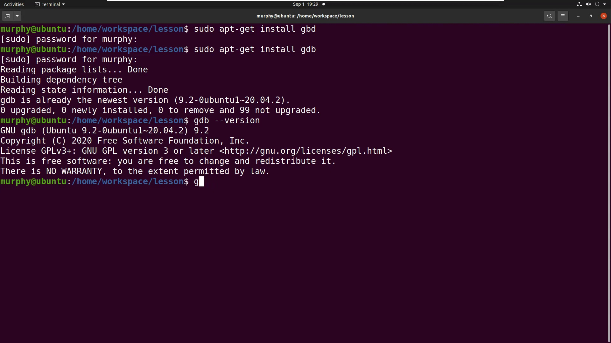  
*图：通过终端安装GDB*

---

## 编译带调试信息的程序

为了让GDB读取符号表并进行源码级调试，使用GCC编译时必须添加 `-g` 选项。以下面的C程序 `1.c` 为例：

```c
#include <stdio.h>

int main(void)
{
    int b;
    b = 20;
    printf("hello world \n");
    return 0;
}
```

编译命令：

```bash
gcc -o bin 1.c -g
```

**关键参数解析**：

| 参数 | 作用 |
|------|------|
| `-o bin` | 指定输出的可执行文件名为 `bin` |
| `-g` | 生成调试信息（符号表），供GDB使用 |

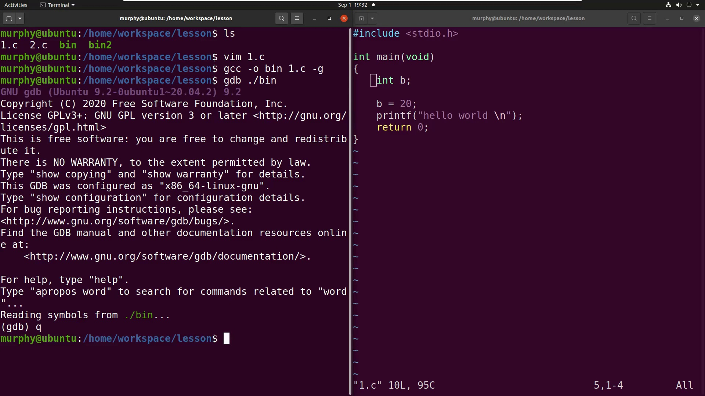  
*图：使用 -g 选项编译程序*

---

## 启动与退出GDB

GDB有三种主要的启动场景：

| 启动方式 | 命令格式 | 适用场景 |
|----------|----------|----------|
| 直接调试可执行文件 | `gdb <可执行文件>` | 程序未启动，需从头调试 |
| 调试正在运行的进程 | `gdb -p <PID>` | 程序已运行，需附加调试 |
| 调试core文件 | `gdb <可执行文件> <core文件>` | 程序崩溃后离线分析 |

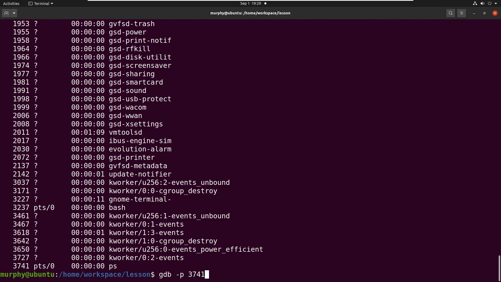  
*图：通过PID附加调试正在运行的进程*

### 启动并加载程序

最常用的方式是直接调试可执行文件：

```bash
gdb ./bin
```

若希望减少启动时的版权信息，可添加 `-q` 选项：

```bash
gdb ./bin -q
```

进入GDB交互界面后，会出现 `(gdb)` 命令提示符。

### 退出GDB

在 `(gdb)` 提示符下输入 `q` 或 `quit` 并回车，即可退出调试器。

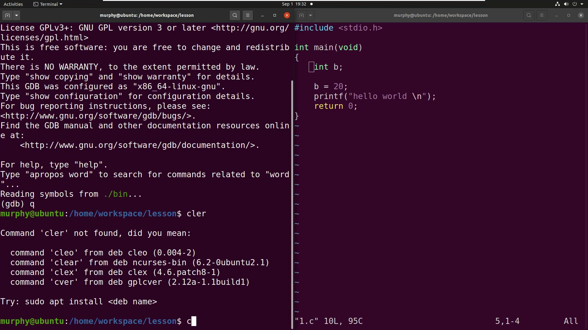  
*图：启动GDB并加载程序*

---

## 基本调试命令

### 运行程序

在 `(gdb)` 提示符下输入 `run`（简写 `r`）即可开始执行程序。若未设置断点，程序将完整执行并输出结果：

```gdb
(gdb) run
Starting program: /home/workspace/lesson/bin
hello world
[Inferior 1 (process ...) exited normally]
```

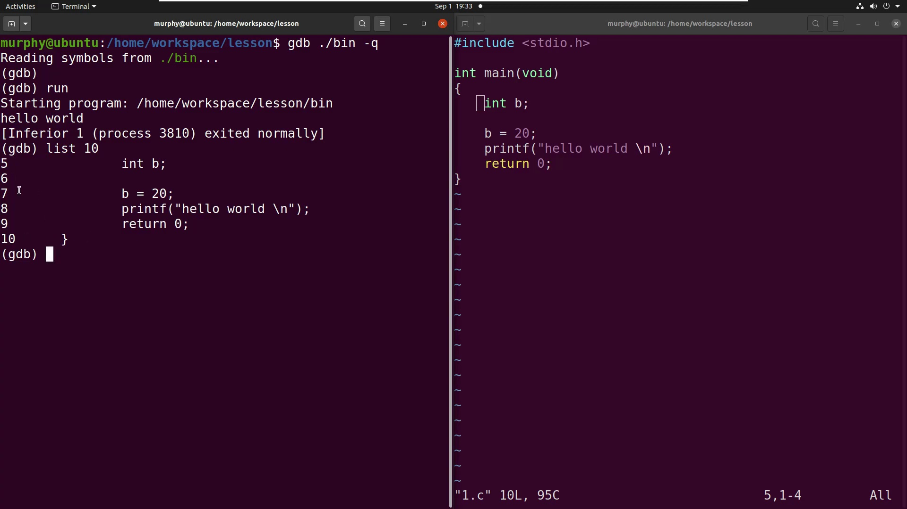  
*图：运行程序后的输出*

### 查看源代码

使用 `list` 命令（简写 `l`）可以显示源代码。指定行号则可显示以该行为中心的上下若干行：

```gdb
(gdb) list 7
```

若需要对照行号，可在编辑器中显示行号（例如Vim中使用 `:set nu`）。

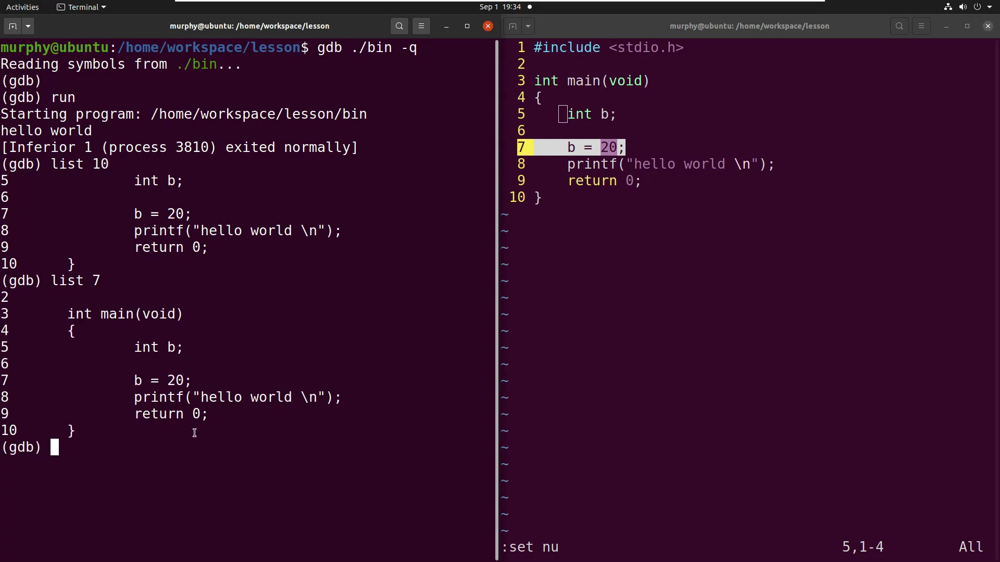  
*图：在编辑器内显示行号*

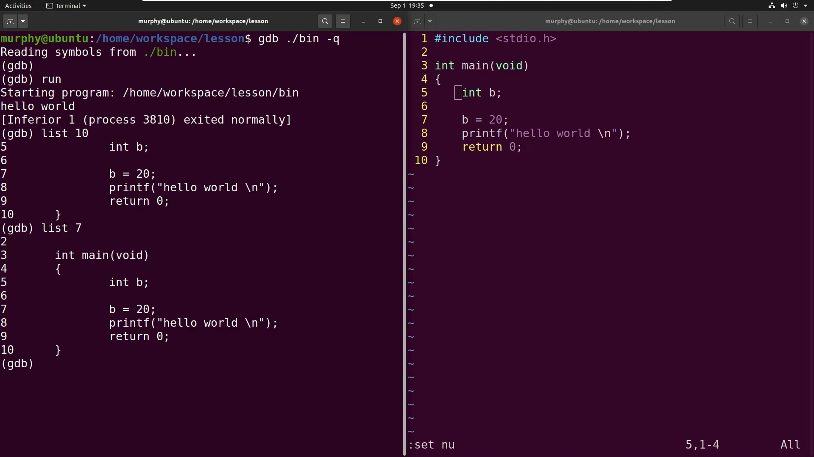  
*图：GDB中执行list命令*

### 清屏

在GDB内部，可按快捷键 `Ctrl+L` 或输入 `shell clear` 清空终端界面，保持视图整洁。

### 设置断点

使用 `break` 命令（简写 `b`）在指定位置设置断点。可指定行号或函数名：

- 按行号：`break 8` 在第8行设置断点
- 按函数名：`break main` 在main函数入口设置断点

设置断点后执行 `run`，程序将在断点处暂停：

```gdb
(gdb) break 8
Breakpoint 1 at 0x55555555515c: file 1.c, line 8.
(gdb) run
Starting program: /home/workspace/lesson/bin
Breakpoint 1, main () at 1.c:8
8	    printf("hello world \n");
```

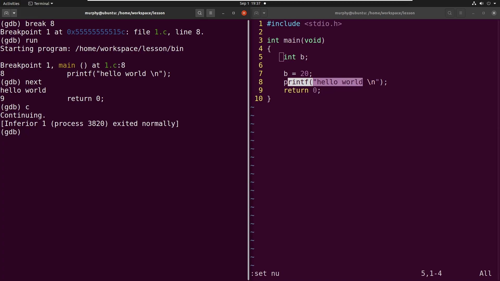  
*图：设置断点并启动程序*

### 单步执行与继续运行

程序暂停后，可使用以下命令进行单步调试：

| 命令 | 简写 | 功能 |
|------|------|------|
| `next` | `n` | 执行下一行代码，不进入函数内部 |
| `step` | `s` | 单步执行，若遇到函数调用则进入该函数内部 |

若要继续运行直到遇到下一个断点或程序结束，使用 `continue`（简写 `c`）：

```gdb
(gdb) next
hello world
9	    return 0;
(gdb) c
Continuing.
[Inferior 1 (process 3820) exited normally]
```

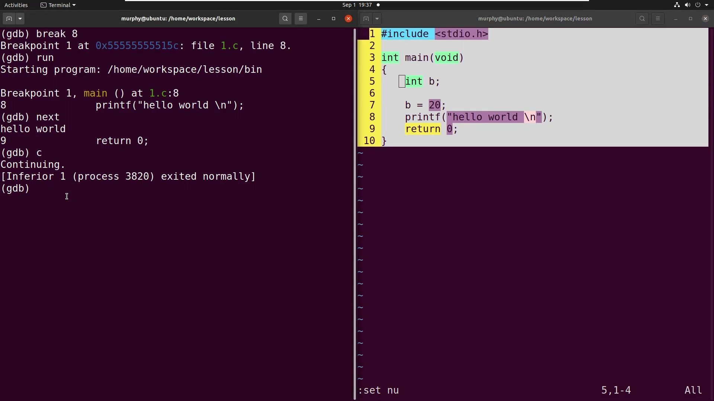  
*图：单步执行并继续运行*

### 打印变量值

程序停在某一行时，使用 `print` 命令（简写 `p`）查看变量当前值：

```gdb
(gdb) print b
$1 = 20
```

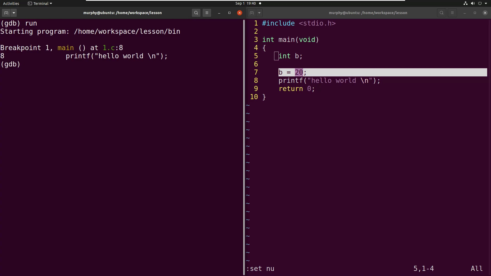  
*图：打印变量b的值*

### 修改变量值

通过 `set var` 命令可在调试时动态修改变量的值，便于测试不同分支：

```gdb
(gdb) set var b = 30
(gdb) print b
$2 = 30
```

### 查看与删除断点

- 查看当前所有断点：`info breakpoints`（简写 `i b`）
- 删除指定断点：`delete <断点编号>`（简写 `d <编号>`）

```gdb
(gdb) info breakpoints
Num     Type           Disp Enb Address            What
1       breakpoint     keep y   0x000055555555515c in main at 1.c:8
(gdb) delete 1
```

再次查看时已无断点。

---

## 查看内存与寄存器

### 获取变量地址

使用 `print &变量名` 可打印变量的内存地址：

```gdb
(gdb) print &b
$3 = (int *) 0x7fffffffe03c
```

### 使用 x 命令检查内存

`x` 命令（examine的缩写）用于查看内存区域的内容，常用格式为 `x /<格式> <地址>`：

- `x /d <地址>`：以十进制显示该地址的内容
- `x /x <地址>`：以十六进制显示

```gdb
(gdb) x /d 0x7fffffffe03c
0x7fffffffe03c: 20
(gdb) x /x 0x7fffffffe03c
0x7fffffffe03c: 0x00000014
```

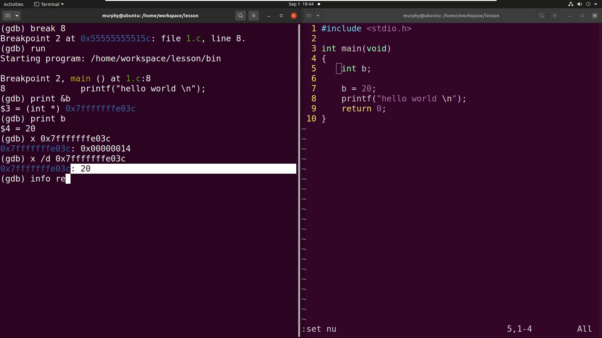  
*图：使用x命令检查内存*

### 查看寄存器

`info registers`（简写 `i r`）可显示当前CPU各寄存器的值：

```gdb
(gdb) info registers
rax            0x555555555149   93824992235849
rbx            0x555555555170   93824992235888
rcx            0x555555555170   93824992235888
rdx            0x7fffffffe148   140737488347464
...
rip            0x55555555515c   0x55555555515c <main+19>
```

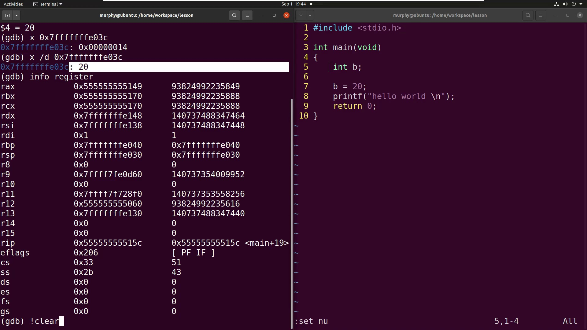  
*图：查看寄存器状态*

---

## 小结

- GDB是强大的源码级调试器，提供断点设置、单步执行、变量查看与修改等功能。
- 编译程序时需使用 `-g` 选项生成调试符号。
- 可通过直接执行文件、附加进程或分析core文件三种方式启动调试。
- 核心调试命令包括：`break`（断点）、`run`（运行）、`next`/`step`（单步）、`continue`（继续）、`print`（查看变量）、`set var`（修改变量）等。
- `x` 命令可检查内存内容，`info registers` 可查看寄存器状态，辅助底层分析。