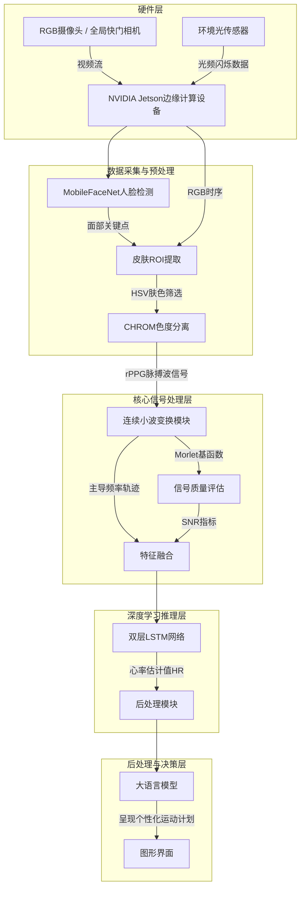

```mermaid
%%{init: {'theme': 'base', 'themeVariables': { 'clusterBkg': '#ffffff' }, 'themeCSS': '

    .cluster-label {

        margin-bottom: 20px !important;

    }

    .cluster-label span {

        display: inline-block;

        padding-bottom: 8px !important;

    }

'}}%%

  
  
  

graph TD

    subgraph 硬件层

        CAM[RGB摄像头 / 全局快门相机] -->|视频流| JETSON[NVIDIA Jetson边缘计算设备]

        ALS[环境光传感器] -->|光频闪烁数据| JETSON

  

    end

  

    subgraph 数据采集与预处理

        ROI[皮肤ROI提取] -->|HSV肤色筛选| CHROM[CHROM色度分离]

        FACENET[MobileFaceNet人脸检测] -->|面部关键点| ROI

    end

  

    subgraph 核心信号处理层

        CHROM -->|rPPG脉搏波信号| CWT[连续小波变换模块]

        CWT -->|Morlet基函数| QUALITY[信号质量评估]

        CWT -->|主导频率轨迹| FUSE[特征融合]

        QUALITY -->|SNR指标| FUSE

    end

  

    subgraph 深度学习推理层

        FUSE --> LSTM[双层LSTM网络]

        LSTM -->|心率估计值HR| POST[后处理模块]

    end

  

    subgraph 后处理与决策层

        POST --> LLM[大语言模型]

        LLM -->|呈现个性化运动计划| GUI[图形界面]

    end

  

    JETSON --> FACENET

    JETSON -->|RGB时序| ROI
```

